# projekt-DE1-2021

# Bike console

### Team members

- Přádka Nikodém 
- Rozboud Jakub
- Rubínek Tomáš
- Ruiner Michal
- Slávik Mark

Link to our GitHub project folder -  https://github.com/xrozbo03/projekt-DE1-2021

### Project objectives

Console for exercise bike/bike, hall sensor, measuring and displaying speed, distance traveled, etc.
 - features like derailleur, average speed, distance during one trip, distance overall, time during one trip were added


## Hardware description

### Board

Arty A7 ( https://store.digilentinc.com/arty-a7-artix-7-fpga-development-board/ )

schematic ( https://reference.digilentinc.com/_media/reference/programmable-logic/arty-a7/arty_a7_sch.pdf )

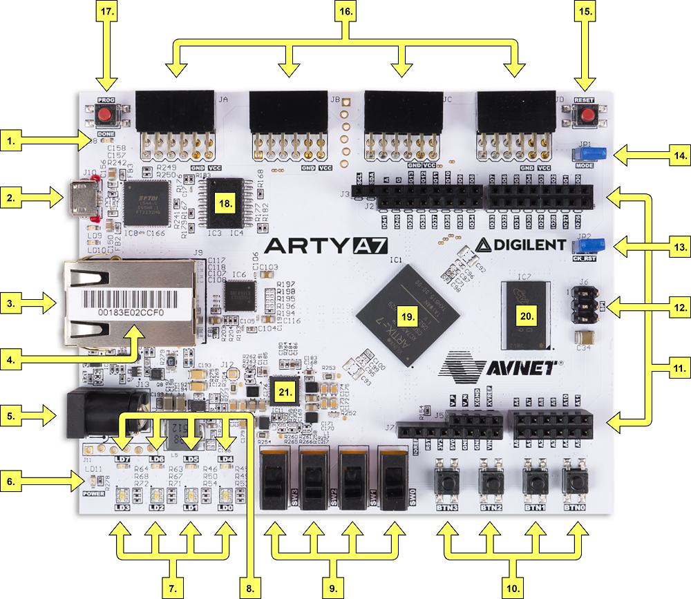

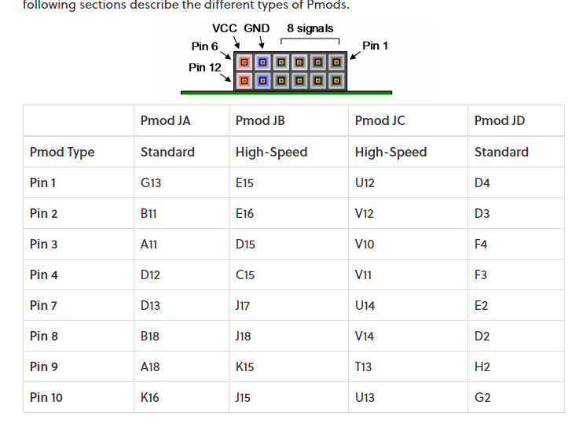

### Components

- 4-digit 7 - segment 0.56" display HS410561K-32, common anode ( https://www.laskarduino.cz/4-mistny--sedmisegmentovy--0-56--displej-hs410561k-32--spolecna-anoda--cerveny/?gclid=Cj0KCQjw-LOEBhDCARIsABrC0TkHNEw1GL7z6yQH_oacR9Hl1ZPOSFJ3biUOZr_8lQqI0rBIFiMJ1xUaAt8FEALw_wcB )
- Hall sensor 44E ( https://dratek.cz/arduino/7735-halluv-senzor-44e.html )
- 330 Ohm resistor ( https://dratek.cz/arduino/7655-rezistor-330r-0.25-w-1.html )
- 10kOhm resistor ( https://dratek.cz/arduino/7650-rezistor-10k-0.25-w-1.html )

### Inspiration for interconnecting componets

7 - seg display

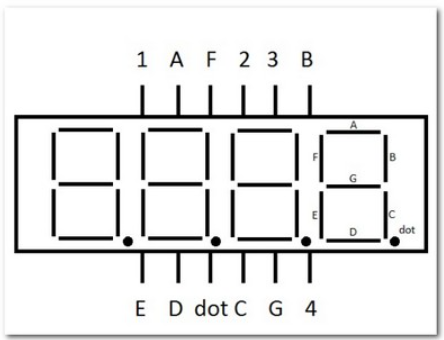

Hall sensor


### Interconnection


Diodes near the 7 - seg display are connected through 200 Ohm resistors which are built-in in the standart Pmod connectors on the board.

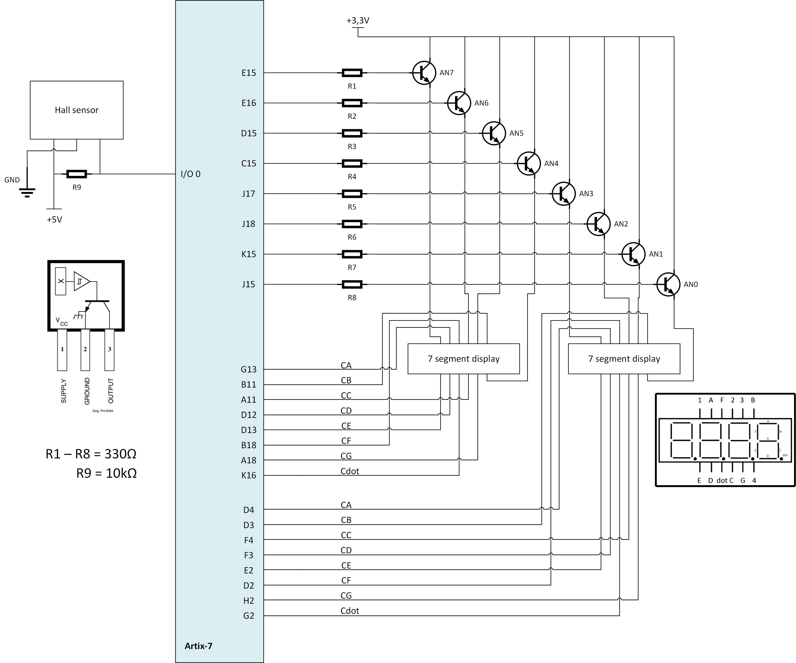

### Table of connections

### 7Segment

|
|Pmod JA (standard)|Connection|Cathodes | Pmod  JD (standard) | Connection |Cathodes| Pmod JB (High-Speed) | Connection | Anodes |
| :--: | :--: | :--: | :--: | :--: | :--: | :--: | :--: | :--: |
| Pin 1 | G13 | CA_1 | Pin 1 | D4 | CA_2 | Pin 1 | E15 | AN7 |
| Pin 2 | B11 | CB_1 | Pin 2 | D3 | CB_2 | Pin 2 | E16 | AN6 |
| Pin 3 | A11 | CC_1 | Pin 3 | F4 | CC_2 | Pin 3 | D15 | AN5 |
| Pin 4 | D12 | CD_1 | Pin 4 | F3 | CD_2 | Pin 4 | C15 | AN4 |
| Pin 7 | D13 | CE_1 | Pin 7 | E2 | CE_2 | Pin 7 | J17 | AN3 |
| Pin 8 | B18 | CF_1 | Pin 8 | D2 | CF_2 | Pin 8 | J18 | AN2 |
| Pin 9 | A18 | CG_1 | Pin 9 | H2 | CG_2 | Pin 9 | K15 | AN1 |
| Pin 10 | K16 | Cdot_1 | Pin 10 | G2 | Cdot_2 | Pin 10 | J15 | AN0 |

### Hall sensor

| Hall sensor | Connection |
| :---------: | :--------: |
|   Supply    |    5V0     |
|   Ground    |    GND     |
|   Output    |   I/O 0    |


## VHDL modules description and simulations

# Bike console

With this bike console, the user can view stats such as: current speed of the bike, average speed of the bike, cycled distance, cycled distance together,  time cycled. It is equipped with two 7-segment displays with 4 digits. The first one shows the users current speed.
On the second one, the user can manually switch between the desired parametres such as average speed of the bike, cycled distance, time cycled.

## Part 1 (tire_diameter, cycle, count_1sec , derailleur) 

## Module: tire_diameter
This is a simple module made for the user to set the bikes wheel diameter before the trip. The user selects the diamter using 3 switches, which are at the same time, the inputs of this module. 
There are 8 possible combinations to choose from : (737 mm) (711 mm) (699 mm) (660 mm) (610 mm)  (508 mm) (406 mm) (305 mm). The output is a vector of a size of 5 which represents the literal size of the diameter in binary. 
```vhdl
architecture testbench of tire_diameter is

begin

    p_diameter : process(sw_i)
    begin
        case sw_i is
            when "000"   =>      
                tire_diameter_o <= "11101";         -- Combination "00" corresponds to the diameter of 29''   (737 mm)
            when "001"   =>      
                tire_diameter_o <= "11100";         -- Combination "01" corresponds to the diameter of 28''   (711 mm)
            when "010"   =>      
                tire_diameter_o <= "11011";         -- Combination "10" corresponds to the diameter of 27,5'' (699 mm)
            when "011"   =>      
                tire_diameter_o <= "11010";         -- Combination "10" corresponds to the diameter of 26''   (660 mm)
            when "100"   =>      
                tire_diameter_o <= "11000";         -- Combination "10" corresponds to the diameter of 24''   (610 mm)
            when "101"   =>      
                tire_diameter_o <= "10100";         -- Combination "10" corresponds to the diameter of 20''   (508 mm)
            when "110"   =>      
                tire_diameter_o <= "10000";         -- Combination "10" corresponds to the diameter of 16''   (406 mm)        
            when others =>      
                tire_diameter_o <= "01100";         -- Combination "11" corresponds to the diameter of 12''   (305 mm)
        end case;
    end process p_diameter;
```
Simulation:
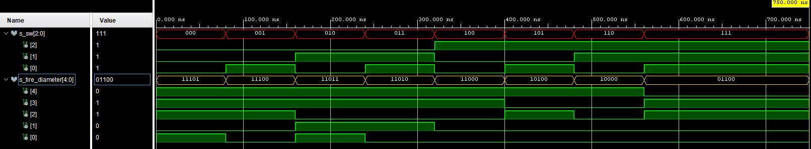

## Module: cycle
This module uses a hall sensor a its input. If the hall sensor detects a pulse , here described as ‘0’ , it sends a signal to the output cycle_o. 
The purpose of the module is to signal other modules that the bike is moving.
```vhdl
architecture Behavioral of cycle is

begin

    p_clk_ena : process(hall_sens_i)
    begin
        if(hall_sens_i = '0') then
            cycle_o <= '1';
        else
            cycle_o <= '0';
        end if;
    end process p_clk_ena;


end Behavioral;
```
Simulation:
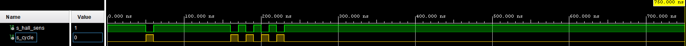

## Module: count_1sec (up counter):
On the input of the module we use a clock signal with a frequency of 100 MHz. There is a local counter signal cnt_1sec which is at the beginning set to zero and a constant which is set to 100 000 000 pulses. 
This means that there are 100 000 000 clock pulses under 1 second in this frequency. 
On the clock signal the process begins. When the local signal is set to 0 (by subtracting 1 from the constant „second“, which is binary) the output cnt_o is set to 1. 
If the output cnt_o is set to 0, we add 1 to the local counter.
```vhdl
architecture Behavioral of count_1sec is

    signal cnt_1sec : unsigned(27 - 1 downto 0) := (others => '0');               -- Local counter
    constant second : unsigned(27 - 1 downto 0) := "101111101011110000100000000"; -- 100000000 clock pulses to 1 sec

begin

    p_clk_ena : process(clk)
    begin
        if(rising_edge(clk)) then
            if (cnt_1sec >= (second-1)) then    -- If local counter value is equal to 100000000
                cnt_o    <= '1';                -- Set output to high
                cnt_1sec <= (others => '0');    -- Reset local counter value
            else
                cnt_o    <= '0';                -- Set output to low
                cnt_1sec <= cnt_1sec+1;         -- Increase local counter by 1
            end if;
        end if;
    end process p_clk_ena;

```
Simulation:
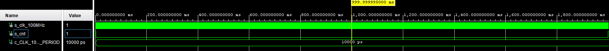

## Module: derailleur
In this module, the user selects the difficulty of the derailleur. It uses a clock signal of 100 MHz and a synchrounous reset. The user selects the difficulty using a button (btn_i) which is one of the inputs of this module. 
There are 3 state of difficulty.  The module uses 2 internal signals to process the alternation of difficulties: s_state – set to TWO as default; s_cnt_btn which signals if the button was released.
 On the clock signal and the reset, these 2 signals are set default. When a user pushes the button and releases it, he cycles among the given difficulties. 
At the end of the cycle, the signal s_cnt_btn, which signals that the button was released, is set to 1. When the button btn_i is released and at the same time s_cnt_button is set to 1, the process ends.
The difficulty is displayed at the output of the module using RGB LEDs. The output is vector of a size of 3 and the lights are alternated with 3 different binary combinations. 
```vhdl
architecture Behavioral of derailleur is

    -- States of difficulty
    type   t_state is (ONE, TWO, THREE);

    -- Define the signal that uses different states
    signal s_state     : t_state   := TWO;      -- Default state is TWO
    signal s_cnt_btn   : std_logic := '0';      -- Signal to proces button

begin

    p_output_derailleur : process(clk)
    begin
        if rising_edge(clk) then
            if (reset = '1') then           -- Synchronous reset
                s_state     <= TWO ;        -- Set initial state
                s_cnt_btn   <= '0';
            elsif (btn_i = '1' and s_cnt_btn = '0') then    -- if button is pushed after release
                case s_state is
                    when ONE =>
                          -- Move to the next state
                          s_state <= TWO;

                    when TWO =>
                          -- Move to the next state
                          s_state <= THREE;

                    when THREE =>
                        -- Move to the next state
                        s_state <= ONE;

                    when others =>
                        s_state <= TWO;  -- Default state if there is different output

                end case;
                s_cnt_btn   <= '1';
            elsif (btn_i = '0' and s_cnt_btn = '1') then    -- if button was released
                s_cnt_btn   <= '0';
            end if;
        end if;   
    end process p_output_derailleur;

    p_output_states : process(s_state)
    begin
        case s_state is
            when ONE =>
                level_of_difficulty_o  <= "100";   -- Red (RGB = 100)
            when TWO =>
                level_of_difficulty_o  <= "010";   -- Green (RGB = 010)
            when THREE =>
                level_of_difficulty_o  <= "001";   -- Blue (RGB = 001)
            when others =>
                level_of_difficulty_o  <= "010";   -- Green (RGB = 010)
        end case;
    end process p_output_states;
```
Simulation:
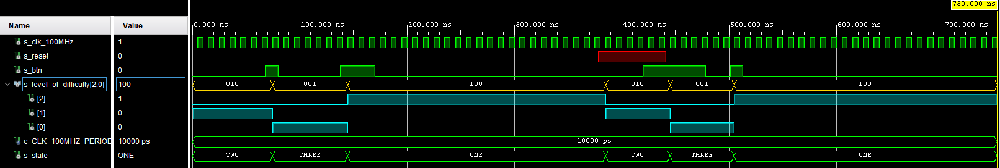

## Part 2 (speed_cur, speed_avg, distance, time_trip):
Module: speed_cur

The purpose of this module is to calculate the speed of the bike.  It consists of 5 inputs (clk, reset, cycle_i, cnt_1sec, tire_diameter_i). The outputs will be dependent on these values. 
The output consists of 4 vector outputs of the size of 4 (speed_cur_dig1_o , speed_cur_dig2_o, speed_cur_dig3_o, speed_cur_dig4_o). 

speed_cur_dig1_o : represents tens of kilometers
speed_cur_dig2_o : represents kilometers
speed_cur_dig3_o : represents hundreds of meters
speed_cur_dig4_o : represents tens of meters

signals set in the architecture:

```vhdl
 signal s_cnt_cycles            : unsigned(12 - 1 downto 0) := (others => '0');  -- Counter of cycles before 1 sec
    signal first2displays       : std_logic := '0';                              -- Signal to count values for first 2 digits
    signal last2displays        : std_logic := '0';                              -- Signal to count values for last 2 digits
    signal tire_diameter_mm     : natural := 0;                                  -- Signal to hold tire diameter in milimeters
    signal calculation          : natural;                                       -- Signal for counting of first 2 digits
    signal remainder            : natural;                                       -- Signal for counting of last 2 digits
    signal s_cnt_seconds        : natural := 1;                                  -- Counter of seconds

    -- Local signals
    signal tens_of_kilometers   : unsigned(4 - 1 downto 0) := (others => '0');
    signal kilometers           : unsigned(4 - 1 downto 0) := (others => '0');
    signal hundreds_of_meters   : unsigned(4 - 1 downto 0) := (others => '0');
    signal tens_of_meters       : unsigned(4 - 1 downto 0) := (others => '0');

```

Set diameter:

```vhdl
 p_speed_cur : process(clk, cycle_i, cnt_1sec_i)
    begin

        case tire_diameter_i is
            when "11101" =>                 -- Diameter of 29'' (737 mm)
                tire_diameter_mm <= 737;    
            when "11100" =>                 -- Diameter of 28'' (711 mm)
                tire_diameter_mm <= 711;
            when "11011" =>                 -- Diameter of 27,5'' (699 mm)
                tire_diameter_mm <= 699;
            when "11010" =>                 -- Diameter of 26'' (660 mm)
                tire_diameter_mm <= 660;
            when "11000" =>                 -- Diameter of 24'' (610 mm)
                tire_diameter_mm <= 610;
            when "10100" =>                 -- Diameter of 20'' (508 mm)
                tire_diameter_mm <= 508;
            when "10000" =>                 -- Diameter of 16'' (406 mm)
                tire_diameter_mm <= 406;
            when others =>                  -- Diameter of 12'' (305 mm)
                tire_diameter_mm <= 305;
        end case;

```
Increase local coutner of cycles if there is a cycle

```vhdl
       if(cycle_i = '1' and cycle_temp = '0') then     -- If the new cycle value is generated
           s_cnt_cycles <= s_cnt_cycles+1;
           cycle_temp   <= '1';
        elsif(cycle_i = '0' and cycle_temp = '1') then
            cycle_temp   <= '0';
        end if;

```

Reset values:

```vhdl
       if rising_edge(clk) then                            -- Increase local coutner of cycles if there is a cycle
            if (reset = '1') then                           -- Synchronous reset
                s_cnt_cycles        <= (others => '0');     -- Clear local counter of cycles
                first2displays      <= '0';                 -- Reset counting for first 2 displays
                last2displays       <= '0';                 -- Reset counting for last 2 displays
                calculation         <=  0;                   -- Reset signal for counting of first 2 digits
                remainder           <=  0;                   -- Reset signal for counting of last 2 digits
                tens_of_kilometers  <= (others => '0');     -- Reset tens of kilometers
                kilometers          <= (others => '0');     -- Reset kilometers
                hundreds_of_meters  <= (others => '0');     -- Reset hundrerds of meters
                tens_of_meters      <= (others => '0');     -- Reset tens of meters

```
Signal from the cnt_1sec input:

```vhdl
          elsif (cnt_1sec_i = '1') then                   -- If 1 second pulse is generared
                if (s_cnt_cycles = 0) then                  -- If there was no cycle during the 1 sec time
                    s_cnt_seconds       <= s_cnt_seconds+1; -- Increase seconds counter by 1
                    calculation         <= 0;
                    remainder           <= 0;
                    tens_of_kilometers  <= (others => '0');
                    kilometers          <= (others => '0');
                    hundreds_of_meters  <= (others => '0');
                    tens_of_meters      <= (others => '0');
                else
                    tens_of_kilometers  <= (others => '0');     -- Reset tens of kilometers every 1 sec time (if there were cycles)
                    kilometers          <= (others => '0');     -- Reset kilometers every 1 sec time (if there were cycles)
                    hundreds_of_meters  <= (others => '0');     -- Reset hundrerds of meters every 1 sec time (if there were cycles)
                    tens_of_meters      <= (others => '0');     -- Reset tens of meters every 1 sec time (if there were cycles)


```
Calculating the signal for counting the first 2 digits:

```vhdl
                    -- The whole formula for calculation is 0,1885 * Wheel RPM * Diameter of the tire
                    -- 0,1885 -> 377/2000; s_cnt_cycles*60 -> Wheel rpm; tire_diameter_mm -> Diameter of the tire
                    calculation <= (to_integer(unsigned(s_cnt_cycles))*60*tire_diameter_mm*377);
                   if(cycle_i = '1' and cycle_temp = '0') then
                        s_cnt_cycles <= "000000000001";                               -- Add 1 cycle if the cycle is generated at 1 sec pulse
                        cycle_temp   <= '1';
                    else
                        s_cnt_cycles <= (others => '0');                              -- Reset cycles value
                    end if;
                    first2displays <= '1';                                            -- At the end of the counting enable signal for counting of first 2 digits
                end if;

```
Enabling the first display:
```vhdl
                   elsif (first2displays = '1') then                                         -- Calculations to replace dividing operations
                if(calculation >= (2000000*s_cnt_seconds)) then                       -- 2000 * 1000 * (number of seconds before cycle was generated)  
                   kilometers <= kilometers+1;                                        -- Increase kilometers value by 1
                   calculation <= calculation - (2000000*s_cnt_seconds);              -- Subtract the divisor
                   if(kilometers = "1001") then                                        
                        tens_of_kilometers <= tens_of_kilometers+1;                   -- Increase tens of kilometers by 1 if kilometers get to 10
                        kilometers <= (others => '0');                                -- Reset kilometers
                   end if;               
                else
                   remainder <= calculation*100;                                       -- Next counting will be for the last 2 digits (2 decimal places)
                   first2displays <= '0';
                   last2displays <= '1';
                end if;

```
Second diplay enabled:

```vhdl
            elsif (last2displays = '1') then                                           -- Calculations to replace dividing operations
               if(remainder >= (2000000*s_cnt_seconds)) then                           -- 2000 * 1000 * (number of seconds before cycle was generated)
                   tens_of_meters <= tens_of_meters+1;                                 -- Increase tens of meters value by 1
                   remainder <= remainder - (2000000*s_cnt_seconds);                   -- Subtract the divisor
                   if(tens_of_meters = "1001") then
                       hundreds_of_meters <= hundreds_of_meters+1;                     -- Increase hundreds of meters by 1 if tens of meters get to 10
                       tens_of_meters <= (others => '0');                              -- Reset tens of meters
                   end if;         
               else
                   s_cnt_seconds <= 1;                                                 -- Reset seconds counter
                   last2displays <= '0';                                               -- End counting operations
               end if;
            end if;
        end if;
    end process p_speed_cur;
```

Displaying results at the outputs:

```vhdl
    speed_cur_dig1_o <= std_logic_vector(tens_of_kilometers);
    speed_cur_dig2_o <= std_logic_vector(kilometers);
    speed_cur_dig3_o <= std_logic_vector(hundreds_of_meters);
    speed_cur_dig4_o <= std_logic_vector(tens_of_meters);

```
Simulation:
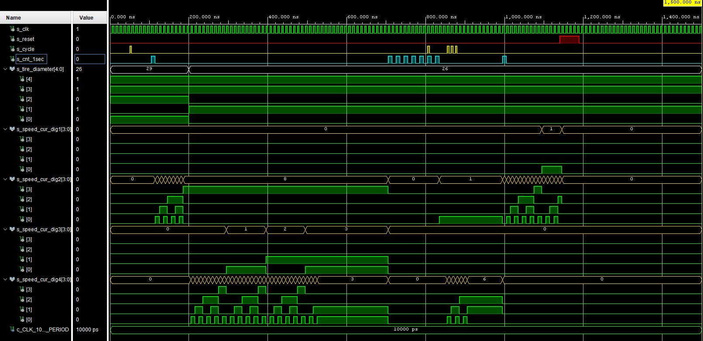
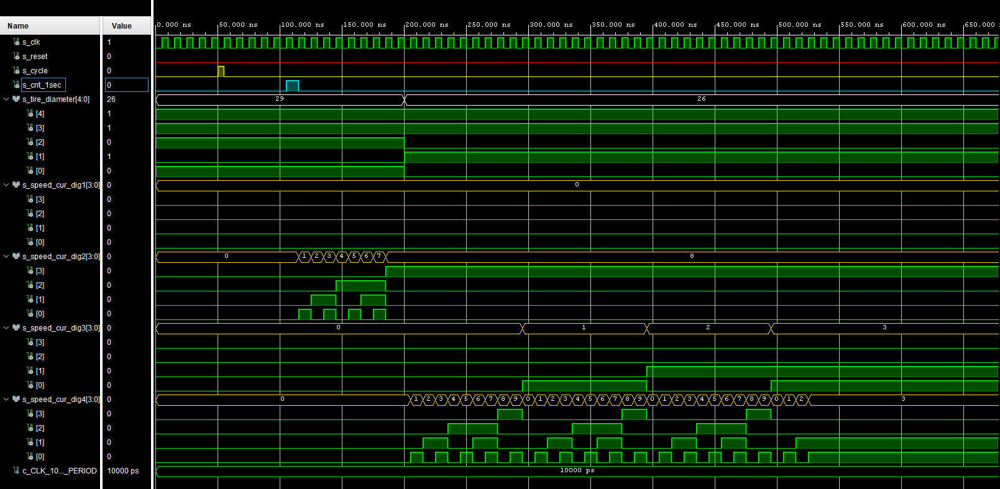


## Module: speed_avg
This module calculates the average speed during one trip.
Inputs, outputs and signals:

```vhdl
 entity speed_avg is
    Port (
          clk               : in std_logic;                            -- 100HMz clock        
          reset             : in std_logic;                            -- reset trip button
          cnt_1sec_i        : in std_logic;                            -- 1 second count
          time_count_i      : in std_logic_vector(19 - 1 downto 0);    -- time for trip in seconds
          distance_i        : in std_logic_vector (19 - 1 downto 0);   -- distance for trip in meters
          speed_avg_dig1_o  : out std_logic_vector(4 - 1 downto 0);    -- average speed tens of km/h
          speed_avg_dig2_o  : out std_logic_vector(4 - 1 downto 0);    -- average speed km/h
          speed_avg_dig3_o  : out std_logic_vector(4 - 1 downto 0);    -- average speed first decimal place
          speed_avg_dig4_o  : out std_logic_vector(4 - 1 downto 0)     -- average speed second decimal place
    );
end speed_avg;

------------------------------------------------------------------------
-- Architecture declaration for speed average
------------------------------------------------------------------------
architecture Behavioral of speed_avg is

    -- local sinals  
    signal s_enable_conversion : std_logic; -- release conversion from m/s to km/h
    signal s_enable_new_value  : std_logic; -- release new value for distance and time
    
    signal s_time              : natural;  -- signal with time value
    signal s_distance          : natural;  -- signal with distance value
    signal s_cnt_result        : natural;  -- result in m/s
    signal s_final_result      : natural;   -- unit conversion to km/h
    signal s_result_in_natural : natural;   -- result in KM/H
    
    signal s_cnt4   : unsigned(4 - 1 downto 0);  -- average speed tens of km/h
    signal s_cnt3   : unsigned(4 - 1 downto 0);  -- average speed km/h
    signal s_cnt2   : unsigned(4 - 1 downto 0);  -- average speed first decimal place
    signal s_cnt1   : unsigned(4 - 1 downto 0);  -- average speed second decimal place
    
    -- local constants to compare specific values of counters
    constant c_NINE      : unsigned(4 - 1 downto 0) := b"1001";

```
Reset when the counter is counting and if the release of new value for distance and time is set:

```vhdl
       if rising_edge(clk) then
             
             if (reset = '1') or ((s_enable_new_value = '1') and (cnt_1sec_i = '1')) then        -- reset counters value and set new distance and time.
                 s_cnt_result        <= 0;
                 s_distance          <= (TO_INTEGER(unsigned(distance_i))) * 100;                --  *100 to second decimal result
                 s_time              <= (TO_INTEGER(unsigned(time_count_i)));
                 s_final_result      <= 0;
                 s_cnt1              <= (others => '0');
                 s_cnt2              <= (others => '0');
                 s_cnt3              <= (others => '0');
                 s_cnt4              <= (others => '0');
                 s_enable_conversion <= '0';
                 s_enable_new_value  <= '0';

```
When there's no signal from the counter and the release of the values for distance and time are disabled, we enable the values:
```vhdl
          elsif (cnt_1sec_i = '0') and (s_enable_new_value = '0') then 
                 s_enable_new_value  <= '1';

```

When the value of the distance is larger than the time after conversion, a new value is set to the distance by subtracting the time value from the distance. The result is increased by 1.
```vhdl
              elsif (s_distance >= s_time) then
                 s_distance   <= s_distance - s_time;
                 s_cnt_result <= s_cnt_result + 1;

```
Enablig conversion:

```vhdl
     
             elsif (s_enable_conversion = '0') then
                 s_result_in_natural <= s_cnt_result;
                 s_final_result <= s_result_in_natural * 18;                   -- 3,6x m/s -> km/h *100 to second decimal
                 s_enable_conversion <= '1';

```

Setting the final result:

```vhdl
               elsif (s_final_result >= 5) then
                 s_final_result <= s_final_result - 5;
                 s_cnt1   <= s_cnt1 + 1;            -- counting second decimal place
                 if (s_cnt1 = c_NINE) then         -- move to tens of minute
                     s_cnt1 <= (others => '0');    -- back to 0 in minutes
                     s_cnt2 <= s_cnt2 + 1;
                       
                     if (s_cnt2 = c_NINE) then          -- move from minutes to hours
                         s_cnt2 <= (others => '0');    -- back to 0 in tens of minutes
                         s_cnt3 <= s_cnt3 + 1;
                           
                         if (s_cnt3 = c_NINE) then         -- move to tens of hours
                             s_cnt3 <= (others => '0');    -- back to 0 in hours
                             s_cnt4 <= s_cnt4 + 1;
                               
                             if(s_cnt4 = c_NINE) then
                                 s_cnt4 <= (others => '0'); -- back to 0 in tens of hours

```
Setting the outputs:

```vhdl
          -- Outputs retype to std_logic_vector
             speed_avg_dig1_o <= std_logic_vector(s_cnt4);
             speed_avg_dig2_o <= std_logic_vector(s_cnt3);
             speed_avg_dig3_o <= std_logic_vector(s_cnt2);
             speed_avg_dig4_o <= std_logic_vector(s_cnt1);

```
Simulation:
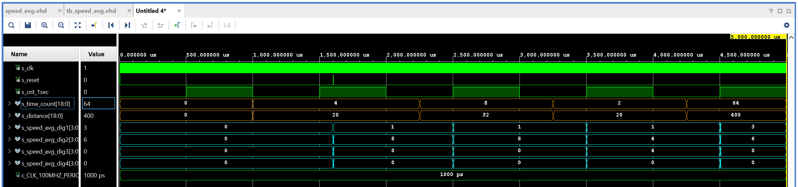


## Module: distance
This module measures the time during one trip and all trips together
Inputs, outputs and signals:

```vhdl
entity distance is
    Port ( 
           clk              : in STD_LOGIC;
           size_i           : in STD_LOGIC_VECTOR (5 - 1 downto 0);           -- size of the bike 
           cycle_i          : in STD_LOGIC;                                  -- 1 when theres signal from sond, 0 others
           reset            : in STD_LOGIC;                                   -- to reset trip
           dis_trip_o       : out STD_LOGIC_VECTOR (19 - 1 downto 0);     -- distance in km trip
      --   dis_all_o        : out STD_LOGIC_VECTOR (14 - 1 downto 0);     -- total distance in km   -- only for testing
           
           trip_dig1_o        : out STD_LOGIC_VECTOR  (4 - 1 downto 0);     -- 1 trip distance value for 1. digit (100)
           trip_dig2_o        : out STD_LOGIC_VECTOR  (4 - 1 downto 0);     -- 1 trip distance value for 2. digit (10)
           trip_dig3_o        : out STD_LOGIC_VECTOR  (4 - 1 downto 0);     -- 1 trip distance value for 3. digit (1)
           trip_dig4_o        : out STD_LOGIC_VECTOR  (4 - 1 downto 0);     -- 1 trip distance value for 4. digit (.1)
           
           all_dig1_o         : out STD_LOGIC_VECTOR  (4 - 1 downto 0);     -- Total distance value for 1. digit (1000)
           all_dig2_o         : out STD_LOGIC_VECTOR  (4 - 1 downto 0);     -- Total distance value for 2. digit (100)
           all_dig3_o         : out STD_LOGIC_VECTOR  (4 - 1 downto 0);     -- Total distance value for 3. digit (10)
           all_dig4_o         : out STD_LOGIC_VECTOR  (4 - 1 downto 0)      -- Total distance value for 4. digit (1)
          
          );
           
       
end distance;

architecture Behavioral of distance is

      
        signal s_size_local             : unsigned (11 - 1 downto 0);   
        signal s_size_local_trip        : unsigned (11 - 1 downto 0);                        -- local number, how many cycles are needed to one km distance
        signal s_count                  : unsigned (11 - 1 downto 0) := "00000000000";          -- counting cycles
        signal s_count_trip             : unsigned (11 - 1 downto 0) := "00000000000"; 


        signal s_dis_trip_local    : unsigned (19 - 1 downto 0) := "0000000000000000000";     -- local signal for trip dist (output to avg speed) and for local testing and other use)
     -- signal s_dis_all_local     : unsigned (14 - 1 downto 0) := "00000000000000";    -- local signal for all dist    (-||-)
        
        signal s_trip_dig1_o        : unsigned (4 - 1 downto 0) := "0000";              -- local outputs fot digits on 7-seg
        signal s_trip_dig2_o        : unsigned (4 - 1 downto 0) := "0000";
        signal s_trip_dig3_o        : unsigned (4 - 1 downto 0) := "0000";
        signal s_trip_dig4_o        : unsigned (4 - 1 downto 0) := "0000";

        signal s_all_dig1_o        : unsigned (4 - 1 downto 0) := "0000";
        signal s_all_dig2_o        : unsigned (4 - 1 downto 0) := "0000";
        signal s_all_dig3_o        : unsigned (4 - 1 downto 0) := "0000";
        signal s_all_dig4_o        : unsigned (4 - 1 downto 0) := "0000";

```

Selecting wheel size

```vhdl
p_distance : process(cycle_i, size_i)  
    begin
            case size_i is                                              
            when "11101" =>            -- 29
                s_size_local <= "00110110000";   -- how many turns takes to 1 km of ride (when bike size 29) -- 432 turns
            when "11100" =>            -- 28
                s_size_local <= "00111000000";   -- 448
            when "11011" =>            -- 27,5
                s_size_local <= "00111001000";   -- 456
            when "11010" =>            -- 26
                s_size_local <= "00111100010";   -- 482
            when "11000" =>            -- 24
                s_size_local <= "01000001010";   --  522
            when "10100" =>            -- 20
                s_size_local <= "01001110011";   --  627
            when "10000" =>            -- 16
                s_size_local <= "01100001111";   -- 783
            when "01100" =>            -- 12
                s_size_local <= "10000010100";   -- 1044
            when others =>
                s_size_local <= "00111000000";   -- 448  

```

Setting the segments:

```vhdl 
 if rising_edge(cycle_i) then
            
            if (s_count < s_size_local) then                        -- add one to count, when cycle_i
                s_count <= s_count + 1;
                
            else                                                    -- when counter is full, resets counter and increase the local distance signals
                s_count <= (others => '0');
        
                s_dis_all_local   <= s_dis_all_local   + 1;                 
                s_dis_trip_local  <= s_dis_trip_local  + 1;
                
                if (s_trip_dig1_o < "1001") then                    -- twice the same (ones for "trip" and ones for "all"), counting for 7-seg displays, 
                    s_trip_dig1_o <= s_trip_dig1_o +1;              -- counts from "0000" to "9999" and solves overflow for  decimal system
                else
                    s_trip_dig1_o <= "0000";                        -- when a digit is more than 9 it goes back to 0
                    
                    if (s_trip_dig2_o < "1001") then
                        s_trip_dig2_o <= s_trip_dig2_o +1;
                    else
                        s_trip_dig2_o <= "0000";
                        
                        if (s_trip_dig3_o < "1001") then
                            s_trip_dig3_o <= s_trip_dig3_o +1;
                        else
                            s_trip_dig3_o <= "0000";
                            if (s_trip_dig4_o < "1001") then
                                s_trip_dig4_o <= s_trip_dig4_o +1;
                            else
                                s_trip_dig4_o <= "0000";
                                
                            end if;
                        end if;
                    end if;
                end if;
           
            
            
                if (s_all_dig1_o < "1001") then             -- the same only for all trip
                    s_all_dig1_o <= s_all_dig1_o +1;
                else
                    s_all_dig1_o <= "0000";
                    
                    if (s_all_dig2_o < "1001") then
                        s_all_dig2_o <= s_all_dig2_o +1;
                    else
                        s_all_dig2_o <= "0000";
                        
                        if (s_all_dig3_o < "1001") then
                            s_all_dig3_o <= s_all_dig3_o +1;
                        else
                            s_all_dig3_o <= "0000";
                            if (s_all_dig4_o < "1001") then
                                s_all_dig4_o <= s_all_dig4_o +1;
                            else
                                s_all_dig4_o <= "0000";

```

Reseting the cycled distance. The cycled distance together cannot be reset by the user.

```vhdl
if rising_edge(rst_i) then                     -- when rst singal from user resets trip singal and digits (all signal and digits can not be reset)

            s_dis_trip_local  <=  (others => '0');
            
            s_trip_dig1_o   <=  (others => '0');
            s_trip_dig2_o   <=  (others => '0');
            s_trip_dig3_o   <=  (others => '0');
            s_trip_dig4_o   <=  (others => '0');

```

Setting local signals to logic vector outputs:

```vhdl
          dis_trip_o <= std_logic_vector(s_dis_trip_local);
         -- dis_all_o <= std_logic_vector(s_dis_all_local);  -- only for testing
        
        
        trip_dig1_o   <= std_logic_vector(s_trip_dig1_o);
        trip_dig2_o   <= std_logic_vector(s_trip_dig2_o);
        trip_dig3_o   <= std_logic_vector(s_trip_dig3_o);
        trip_dig4_o   <= std_logic_vector(s_trip_dig4_o);
   
        all_dig1_o    <= std_logic_vector(s_all_dig1_o);
        all_dig2_o    <= std_logic_vector(s_all_dig2_o);
        all_dig3_o    <= std_logic_vector(s_all_dig3_o);
        all_dig4_o    <= std_logic_vector(s_all_dig4_o); 
```
Simulation:
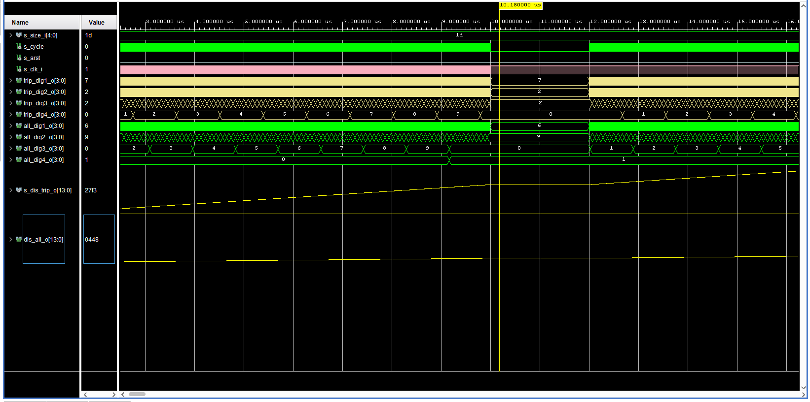
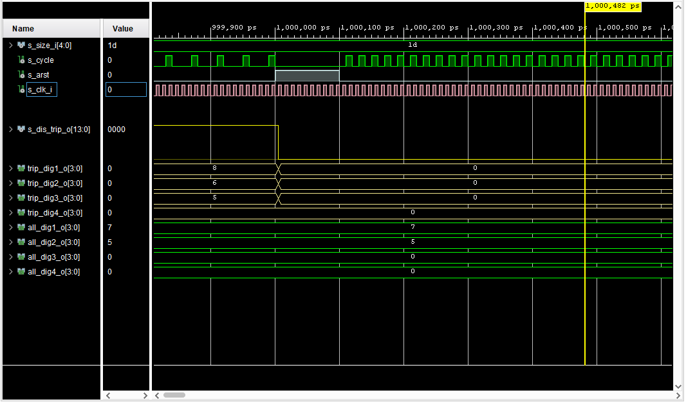
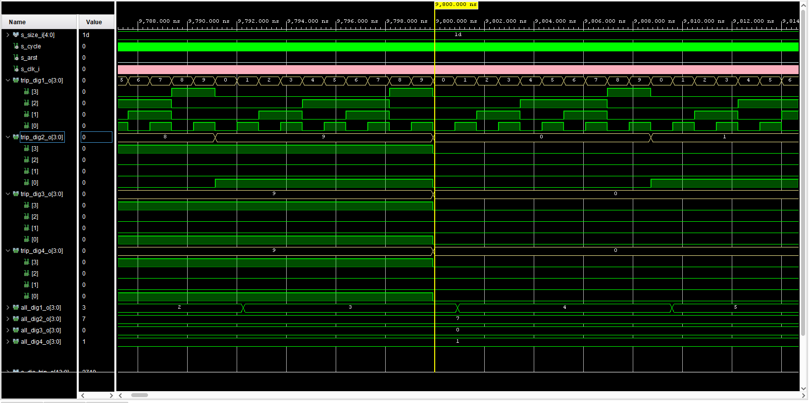


## Module: time_trip
This module calculates the time during one trip. 
Inputs, outputs and signals:

```vhdl
entity time_trip is

    Port ( 
          clk               : in std_logic;                            -- 100HMz clock
          cycle_i           : in std_logic;                            -- input for driving verification
          cnt_1sec_i        : in std_logic;                            -- 1 second counter
          reset             : in std_logic;                            -- reset trip button
          time_count_o      : out std_logic_vector (19 - 1 downto 0);  -- sumary number of minutes on trip
          time_trip_dig1_o  : out std_logic_vector (4 - 1 downto 0);   -- data output for tens of hour digit
          time_trip_dig2_o  : out std_logic_vector (4 - 1 downto 0);   -- data output for hour digit
          time_trip_dig3_o  : out std_logic_vector (4 - 1 downto 0);   -- data output for tens of minute digit
          time_trip_dig4_o  : out std_logic_vector (4 - 1 downto 0)    -- data output for minute digit
          );
end time_trip;

------------------------------------------------------------------------
-- Architecture declaration for time trip
------------------------------------------------------------------------
architecture Behavioral of time_trip is

    -- local counter
    signal s_cnt4   : unsigned(4 - 1 downto 0);  -- tens of hours counter
    signal s_cnt3   : unsigned(4 - 1 downto 0);  -- hours counter
    signal s_cnt2   : unsigned(4 - 1 downto 0);  -- tens of minutes counter
    signal s_cnt1   : unsigned(4 - 1 downto 0);  -- minutes counter
    signal s_cnt0   : unsigned(6 - 1 downto 0);  -- seconds to determine the minute
    signal s_cntall : unsigned(19 - 1 downto 0); -- sum of all seconds
    
    signal s_enable      : std_logic;               -- enable counting process
    signal s_cnt_enable  : unsigned (4-1 downto 0); -- counter 10s to control s_enable

    -- local constants to compare specific values of counters
    constant c_NINE      : unsigned(4 - 1 downto 0) := b"1001";
    constant c_FIVE      : unsigned(4 - 1 downto 0) := b"0101";
    constant c_FIVTYNINE : unsigned(6 - 1 downto 0) := b"11_1011";

```

Wheel rotation verification:
```vhdl
 if (cnt_1sec_i = '1') then                             -- when the module of count_1sec is counting, we enable the s_cnt_enable signal
            s_cnt_enable <= s_cnt_enable + 1;
            
            if (cycle_i = '1') then                     -- at the same time if there is a signal from the hall sensor, we disable the bits at s_cnt_enable and at the same time enable the counting process
                s_cnt_enable <= (others => '0');
                s_enable <= '1';
            elsif (s_cnt_enable = 10) then              -- when s_cnt_enable has reached 10 we disable the counting process
                s_enable <= '0';
            end if;
        
        end if;

```
Rising edge and reset
```vhdl
 if rising_edge(clk) then

            -- counting process
            if(reset = '1') then
                -- reset counter
                s_cnt0   <= (others => '0');
                s_cnt1   <= (others => '0');
                s_cnt2   <= (others => '0');
                s_cnt3   <= (others => '0');
                s_cnt4   <= (others => '0');
                s_cntall <= (others => '0');
                
            elsif (s_enable = '1') then             -- turn on the counter while moving
                if (cnt_1sec_i = '1') then
                    s_cntall <= s_cntall + 1;          -- counting all seconds
                    s_cnt0   <= s_cnt0 + 1;            -- counting seconds to minutes
                    
                    if (s_cnt0 = c_FIVTYNINE) then         -- move to minutes
                        s_cnt1 <= s_cnt1 + 1;
                        s_cnt0 <= (others => '0');     -- clean seconds
                        
                        if (s_cnt1 = c_NINE) then         -- move to tens of minute
                            s_cnt1 <= (others => '0');    -- back to 0 in minutes
                            s_cnt2 <= s_cnt2 + 1;
                            
                            if (s_cnt2 = c_FIVE) then          -- move from minutes to hours
                                s_cnt2 <= (others => '0');    -- back to 0 in tens of minutes
                                s_cnt3 <= s_cnt3 + 1;
                                
                                if (s_cnt3 = c_NINE) then         -- move to tens of hours
                                    s_cnt3 <= (others => '0');    -- back to 0 in hours
                                    s_cnt4 <= s_cnt4 + 1;
                                    
                                    if(s_cnt4 = c_NINE) then
                                       s_cnt4 <= (others => '0'); -- back to 0 in tens of hours

```

Outputs retype to std_logic_vector
```vhdl
    time_trip_dig4_o <= std_logic_vector(s_cnt1);
    time_trip_dig3_o <= std_logic_vector(s_cnt2);
    time_trip_dig2_o <= std_logic_vector(s_cnt3);
    time_trip_dig1_o <= std_logic_vector(s_cnt4);
    time_count_o     <= std_logic_vector(s_cntall);

```
Simulation:
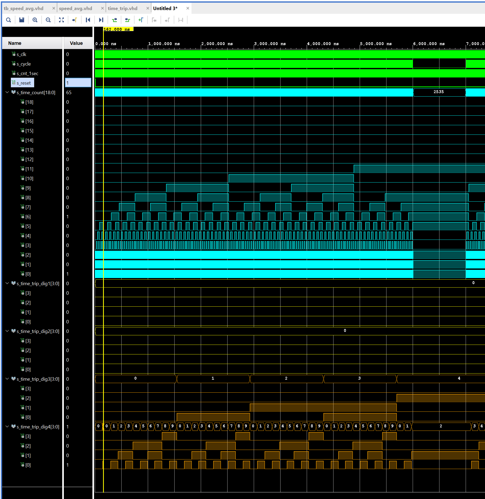
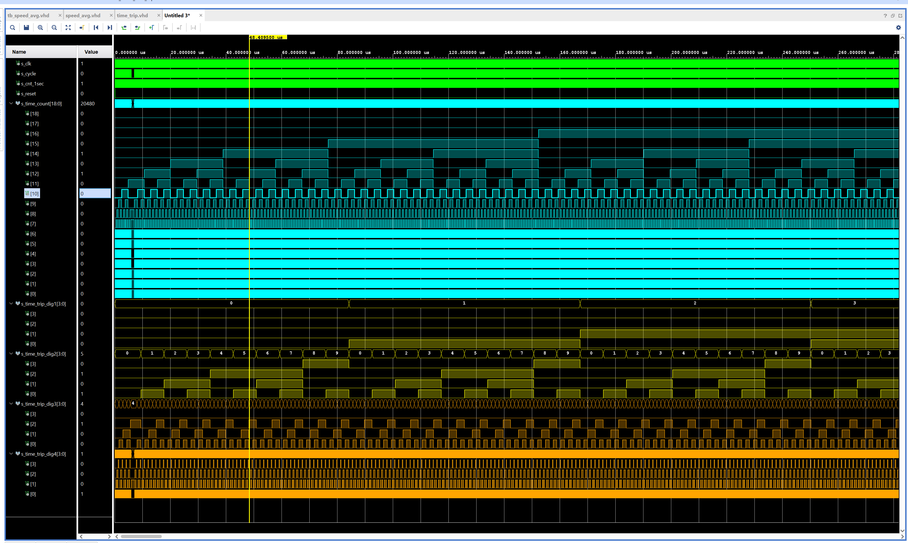


## Part 3 (driver_7seg_4digits_speed_cur, driver_7seg_4digits_mode)

## Module: driver_7seg_4digits_speed_cur
Intupts and outputh of the whole module:
```vhdl
   entity driver_7seg_4digits_speed_cur is
    port(
        clk              : in  std_logic;                           -- Main clock
        reset            : in  std_logic;                           -- Synchronous reset
        -- 4-bit input values for individual digits
        speed_cur_dig1_i : in  std_logic_vector(4 - 1 downto 0);    -- Current speed value for 1. digit (tens of kilometers)
        speed_cur_dig2_i : in  std_logic_vector(4 - 1 downto 0);    -- Current speed value for 2. digit (kilometers)
        speed_cur_dig3_i : in  std_logic_vector(4 - 1 downto 0);    -- Current speed value for 3. digit (hundreds of meters)
        speed_cur_dig4_i : in  std_logic_vector(4 - 1 downto 0);    -- Current speed value for 4. digit (tens of meters)
        -- Cathode values for individual segments
        seg_o            : out std_logic_vector(7 - 1 downto 0);
        -- Common anode signals to individual displays
        dig_o            : out std_logic_vector(4 - 1 downto 0);
        -- Decimal point for specific digit
        dp_o             : out std_logic
    );
end entity driver_7seg_4digits_speed_cur;

------------------------------------------------------------------------
-- Architecture declaration for display driver
------------------------------------------------------------------------
architecture Behavioral of driver_7seg_4digits_speed_cur is

    -- Internal clock enable
    signal s_en  : std_logic;
    -- Internal 2-bit counter for multiplexing 4 digits
    signal s_cnt : std_logic_vector(2 - 1 downto 0);
    -- Internal 4-bit value for 7-segment decoder
    signal s_hex : std_logic_vector(4 - 1 downto 0);
    -- Internal decimal point value
    signal dp    : std_logic_vector(4 - 1 downto 0);


```

Submodule (clock_enable):
Generates 400 000 clk pulses.
```vhdl
    p_clk_ena : process(clk)
        begin

        if rising_edge(clk) then                    -- Synchronous process
            if (reset = '1') then                   -- High active reset
                s_cnt_local <= 0;                   -- Clear local counter
                ce_o        <= '0';                 -- Set output to low
            -- Test number of clock periods
            elsif (s_cnt_local >= (g_MAX - 1)) then
                s_cnt_local <= 0;                   -- Clear local counter
                ce_o        <= '1';                 -- Generate clock enable pulse
            else
                s_cnt_local <= s_cnt_local + 1;
                ce_o        <= '0';
            end if;
        end if;
    end process p_clk_ena;

```


Submodule (cnt_up):
Counts only up.
```vhdl
architecture behavioral of cnt_up is

    -- Local counter
    signal s_cnt_local : unsigned(g_CNT_WIDTH - 1 downto 0) := (others => '0'); -- default value of "00"

begin
    --------------------------------------------------------------------
    -- p_cnt_up:
    -- Clocked process with synchronous reset which implements 2-bit
    -- up counter.
    --------------------------------------------------------------------
    p_cnt_up : process(clk)
    begin

        if rising_edge(clk) then
            if (reset = '1') then                  -- Synchronous reset
                s_cnt_local <= (others => '0');    -- Clear all bits
            elsif (en_i = '1') then                -- Test if counter is enabled
                s_cnt_local <= s_cnt_local + 1;    -- Increase local counter by 1
            end if;
        end if;
    end process p_cnt_up;

    -- Output must be retyped from "unsigned" to "std_logic_vector"
    cnt_o <= std_logic_vector(s_cnt_local);
```


Process (p_mux):
The displayed value on the 7 - segment display is set by the combination of bits on s_cnt. Decimal point is displayed for the second digit.
dig_o displays the common anode signal to individual displays.

```vhdl
 p_mux : process(s_cnt, speed_cur_dig1_i, speed_cur_dig2_i, speed_cur_dig3_i, speed_cur_dig4_i)
    begin
        dp            <= "1011";        --enable decimal point
        case s_cnt is
            when "11" =>
                s_hex <= speed_cur_dig4_i;
                dig_o <= "0001";
                dp_o  <= dp(0);

            when "10" =>
                s_hex <= speed_cur_dig3_i;
                dig_o <= "0010";
                dp_o  <= dp(1);

            when "01" =>
                s_hex <= speed_cur_dig2_i;
                dig_o <= "0100";
                dp_o  <= dp(2);

            when others =>
                s_hex <= speed_cur_dig1_i;
                dig_o <= "1000";
                dp_o  <= dp(3);

        end case;
    end process p_mux;

```


Submodule (hex_7seg):
A four bit value arrives to the display. According to its value, the number in decimal is displayed. When a 0 arrives at the cathod, its displayed, when 1 its not displayed.

```vhdl
 p_7seg_decoder : process(hex_i)
    begin
        case hex_i is
            when "0000" =>
                seg_o <= "0000001";     -- 0
            when "0001" =>
                seg_o <= "1001111";     -- 1
            when "0010" =>
                seg_o <= "0010010";     -- 2
            when "0011" =>
                seg_o <= "0000110";     -- 3
            when "0100" =>
                seg_o <= "1001100";     -- 4        
            when "0101" =>
                seg_o <= "0100100";     -- 5
            when "0110" =>
                seg_o <= "0100000";     -- 6
            when "0111" =>
                seg_o <= "0001111";     -- 7
            when "1000" =>
                seg_o <= "0000000";     -- 8  
            when others =>
                seg_o <= "0000100";     -- 9
        end case;
    end process p_7seg_decoder;
```
Simulation:
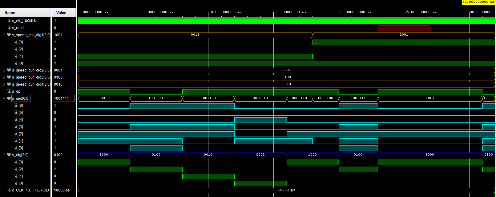

## Module: driver_7seg_4digits_mode
In this module, multiplexer is used so the user can alternated, what data is displayed on the 7- segment display. It consists of several submodules listed below.
Inputs and outputs used in the whole module:
```vhdl
  entity driver_7seg_4digits_mode is
    Port (
           clk                : in  std_logic;                             -- Main clock
           reset              : in  std_logic;                             -- Synchronous reset
           en_i               : in  std_logic;                             -- Button to select mode
           speed_avg_dig1_i   : in STD_LOGIC_VECTOR  (4 - 1 downto 0);     -- Speed average value for 1. digit (tens of kilometers)
           speed_avg_dig2_i   : in STD_LOGIC_VECTOR  (4 - 1 downto 0);     -- Speed average value for 2. digit (kilometers)
           speed_avg_dig3_i   : in STD_LOGIC_VECTOR  (4 - 1 downto 0);     -- Speed average value for 3. digit (hundreds of meters)
           speed_avg_dig4_i   : in STD_LOGIC_VECTOR  (4 - 1 downto 0);     -- Speed average value for 4. digit (tens of meters)
           trip_dig1_i        : in STD_LOGIC_VECTOR  (4 - 1 downto 0);     -- 1 trip distance value for 1. digit (hundreds of kilometers)
           trip_dig2_i        : in STD_LOGIC_VECTOR  (4 - 1 downto 0);     -- 1 trip distance value for 2. digit (tens of kilometers)
           trip_dig3_i        : in STD_LOGIC_VECTOR  (4 - 1 downto 0);     -- 1 trip distance value for 3. digit (kilometers)
           trip_dig4_i        : in STD_LOGIC_VECTOR  (4 - 1 downto 0);     -- 1 trip distance value for 4. digit (hundreds of meters)
           all_dig1_i         : in STD_LOGIC_VECTOR  (4 - 1 downto 0);     -- Total distance value for 1. digit (thousands of kilometers)
           all_dig2_i         : in STD_LOGIC_VECTOR  (4 - 1 downto 0);     -- Total distance value for 2. digit (hundreds of kilometers)
           all_dig3_i         : in STD_LOGIC_VECTOR  (4 - 1 downto 0);     -- Total distance value for 3. digit (tens of kilometers)
           all_dig4_i         : in STD_LOGIC_VECTOR  (4 - 1 downto 0);     -- Total distance value for 4. digit (kilometers)
           time_trip_dig1_i   : in STD_LOGIC_VECTOR  (4 - 1 downto 0);     -- Current time of 1 trip value for 1. digit (tens of hours)
           time_trip_dig2_i   : in STD_LOGIC_VECTOR  (4 - 1 downto 0);     -- Current time of 1 trip value for 2. digit (hours)
           time_trip_dig3_i   : in STD_LOGIC_VECTOR  (4 - 1 downto 0);     -- Current time of 1 trip value for 3. digit (tens of minutes)
           time_trip_dig4_i   : in STD_LOGIC_VECTOR  (4 - 1 downto 0);     -- Current time of 1 trip value for 4. digit (minutes)
           seg_o              : out std_logic_vector (7 - 1 downto 0);     -- Cathode values for individual segments
           LED_o              : out STD_LOGIC_VECTOR (4 - 1 downto 0);     -- LEDs on board to display which mode is selected
           dig_o              : out STD_LOGIC_VECTOR (4 - 1 downto 0);     -- Choose which digit will be active (enable anode)
           dp_o               : out std_logic                              -- Choose decimal point of the digit
    );
end driver_7seg_4digits_mode;

architecture Behavioral of driver_7seg_4digits_mode is

    -- Internal clock enable
    signal s_en        : std_logic;
    -- Internal 2-bit counter for multiplexing 4 digits
    signal s_cnt       : std_logic_vector(2 - 1 downto 0);
    -- Internal signal to select mode
    signal s_cnt_mode  : std_logic_vector(2 - 1 downto 0);
    -- Internal 4-bit value for 7-segment decoder
    signal s_hex       : std_logic_vector(4 - 1 downto 0);
    -- Internal decimal point value
    signal dp          : std_logic_vector(4 - 1 downto 0);

```

Submodule (clock_enable):
Generates 400 000 clk pulses.
```vhdl
    p_clk_ena : process(clk)
        begin

        if rising_edge(clk) then                    -- Synchronous process
            if (reset = '1') then                   -- High active reset
                s_cnt_local <= 0;                   -- Clear local counter
                ce_o        <= '0';                 -- Set output to low
            -- Test number of clock periods
            elsif (s_cnt_local >= (g_MAX - 1)) then
                s_cnt_local <= 0;                   -- Clear local counter
                ce_o        <= '1';                 -- Generate clock enable pulse
            else
                s_cnt_local <= s_cnt_local + 1;
                ce_o        <= '0';
            end if;
        end if;
    end process p_clk_ena;

```


Submodule (cnt_up):
Counts only up.
```vhdl
architecture behavioral of cnt_up is

    -- Local counter
    signal s_cnt_local : unsigned(g_CNT_WIDTH - 1 downto 0) := (others => '0'); -- default value of "00"

begin
    --------------------------------------------------------------------
    -- p_cnt_up:
    -- Clocked process with synchronous reset which implements 2-bit
    -- up counter.
    --------------------------------------------------------------------
    p_cnt_up : process(clk)
    begin

        if rising_edge(clk) then
            if (reset = '1') then                  -- Synchronous reset
                s_cnt_local <= (others => '0');    -- Clear all bits
            elsif (en_i = '1') then                -- Test if counter is enabled
                s_cnt_local <= s_cnt_local + 1;    -- Increase local counter by 1
            end if;
        end if;
    end process p_cnt_up;

    -- Output must be retyped from "unsigned" to "std_logic_vector"
    cnt_o <= std_logic_vector(s_cnt_local);
```

Process (p_mux):


```vhdl
p_mux : process(s_cnt, s_cnt_mode,
                    speed_avg_dig1_i, speed_avg_dig2_i, speed_avg_dig3_i, speed_avg_dig4_i,
                    trip_dig1_i, trip_dig2_i, trip_dig3_i, trip_dig4_i,
                    all_dig1_i, all_dig2_i, all_dig3_i, all_dig4_i,
                    time_trip_dig1_i, time_trip_dig2_i, time_trip_dig3_i, time_trip_dig4_i)
    begin
    begin
        case s_cnt_mode is
            when "00" =>                            -- Average speed is assigned to the mode combination "00"
                dp      <= "1011";                  -- Enabled decimal point for average speed (second digit - kilometers)
                LED_o   <= "1000";                  -- Turn on LED 4
                if (s_cnt = "00") then
                    s_hex <= speed_avg_dig1_i;      -- Display tens of kilometers if counter combination is "00"
                    dig_o <= "1000";                -- Enable 1. digit from the left
                    dp_o  <= dp(3);
                elsif (s_cnt = "01") then
                    s_hex <= speed_avg_dig2_i;      -- Display kilometers if counter combination is "01"
                    dig_o <= "0100";                -- Enable 2. digit from the left
                    dp_o  <= dp(2);
                elsif (s_cnt = "10") then
                    s_hex <= speed_avg_dig3_i;      -- Display hundreds of meters if counter combination is "10"
                    dig_o <= "0010";                -- Enable 3. digit from the left
                    dp_o  <= dp(1);
                else
                    s_hex <= speed_avg_dig4_i;      -- Display tens of meters if counter combination is "11"
                    dig_o <= "0001";                -- Enable 4. digit from the left
                    dp_o  <= dp(0);
                end if;

            when "01" =>                            -- Trip distance is assigned to the mode combination "01"
                dp      <= "1101";                  -- Enabled decimal point for trip distance (third digit - kilometers)
                LED_o   <= "0100";                  -- Turn on LED 5
                if (s_cnt = "00") then
                    s_hex <= trip_dig1_i;           -- Display hundreds of kilometers if counter combination is "00"
                    dig_o <= "1000";                -- Enable 1. digit from the left
                    dp_o  <= dp(3);
                elsif (s_cnt = "01") then
                    s_hex <= trip_dig2_i;           -- Display tens of kilometers if counter combination is "01"
                    dig_o <= "0100";                -- Enable 2. digit from the left
                    dp_o  <= dp(2);
                elsif (s_cnt = "10") then
                    s_hex <= trip_dig3_i;           -- Display kilometers if counter combination is "10"
                    dig_o <= "0010";                -- Enable 3. digit from the left
                    dp_o  <= dp(1);
                else
                    s_hex <= trip_dig4_i;           -- Display hundreds of meters if counter combination is "11"
                    dig_o <= "0001";                -- Enable 4. digit from the left
                    dp_o  <= dp(0);
                end if;

            when "10" =>                            -- Total distance is assigned to the mode combination "10"
                dp      <= "1111";                  -- Disabled decimal point for total distance
                LED_o   <= "0010";                  -- Turn on LED 6
                if (s_cnt = "00") then
                    s_hex <= all_dig1_i;            -- Display thousands of kilometers if counter combination is "00"
                    dig_o <= "1000";                -- Enable 1. digit from the left
                    dp_o  <= dp(3);
                elsif (s_cnt = "01") then
                    s_hex <= all_dig2_i;            -- Display hundreds of kilometers if counter combination is "01"
                    dig_o <= "0100";                -- Enable 2. digit from the left
                    dp_o  <= dp(2);
                elsif (s_cnt = "10") then
                    s_hex <= all_dig3_i;            -- Display tens of kilometers if counter combination is "10"
                    dig_o <= "0010";                -- Enable 3. digit from the left
                    dp_o  <= dp(1);
                else
                    s_hex <= all_dig4_i;            -- Display kilometers if counter combination is "11"
                    dig_o <= "0001";                -- Enable 4. digit from the left
                    dp_o  <= dp(0);
                end if;

            when others =>                          -- Time trip is assigned to the mode combination "11"
                dp      <= "1011";                  -- Enabled decimal point for time trip (hours)
                LED_o   <= "0001";                  -- Turn on LED 7
                if (s_cnt = "00") then
                    s_hex <= time_trip_dig1_i;      -- Display tens of hours if counter combination is "00"
                    dig_o <= "1000";                -- Enable 1. digit from the left
                    dp_o  <= dp(3);
                elsif (s_cnt = "01") then
                    s_hex <= time_trip_dig2_i;      -- Display hours if counter combination is "01"
                    dig_o <= "0100";                -- Enable 2. digit from the left
                    dp_o  <= dp(2);
                elsif (s_cnt = "10") then
                    s_hex <= time_trip_dig3_i;      -- Display tens of minutes if counter combination is "10"
                    dig_o <= "0010";                -- Enable 3. digit from the left
                    dp_o  <= dp(1);
                else
                    s_hex <= time_trip_dig4_i;      -- Display minutes if counter combination is "11"
                    dig_o <= "0001";                -- Enable 4. digit from the left
                    dp_o  <= dp(0);
                end if;
        end case;
    end process p_mux;
```


Submodule (hex_7seg):
A four bit value arrives to the display. According to its value, the number in decimal is displayed. When a 0 arrives at the cathod, its displayed, when 1 its not displayed.

```vhdl
 p_7seg_decoder : process(hex_i)
    begin
        case hex_i is
            when "0000" =>
                seg_o <= "0000001";     -- 0
            when "0001" =>
                seg_o <= "1001111";     -- 1
            when "0010" =>
                seg_o <= "0010010";     -- 2
            when "0011" =>
                seg_o <= "0000110";     -- 3
            when "0100" =>
                seg_o <= "1001100";     -- 4        
            when "0101" =>
                seg_o <= "0100100";     -- 5
            when "0110" =>
                seg_o <= "0100000";     -- 6
            when "0111" =>
                seg_o <= "0001111";     -- 7
            when "1000" =>
                seg_o <= "0000000";     -- 8  
            when others =>
                seg_o <= "0000100";     -- 9
        end case;
    end process p_7seg_decoder;
```


Submodule (cnt_up_mode):
This module serves as an address input for the multiplexer. We work with a local signal s_cnt_btn. When the counter is enabled and at the same time the button is pushed after release (s_cnt_btn = 0), the counter counts. If the button
was released, it stops counting.
```vhdl
p_cnt_up : process(clk)
    begin

        if rising_edge(clk) then
            if (reset = '1') then                       -- Synchronous reset
                s_cnt_local <= (others => '0');         -- Clear all bits
                s_cnt_btn   <= '0';
            elsif (en_i = '1' and s_cnt_btn = '0') then -- if button is pushed after release
                s_cnt_local <= s_cnt_local + 1;
                s_cnt_btn   <= '1';
            elsif (en_i = '0' and s_cnt_btn = '1') then -- if button was released
                s_cnt_btn   <= '0';   
            end if;
        end if;
    end process p_cnt_up;

    -- Output must be retyped from "unsigned" to "std_logic_vector"
    cnt_o <= std_logic_vector(s_cnt_local);

```

Simulation:
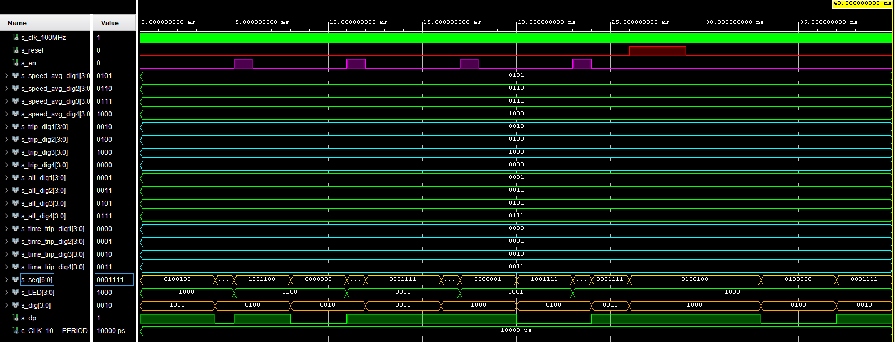


## TOP module description and simulations

Top module shows how are signals connected module and interconnected between submodules.

```vhdl
entity top is
    Port 
    (
     -- Inputs
     SW             : in STD_LOGIC_VECTOR(3 - 1 downto 0);
     hall_sens_i    : in STD_LOGIC;
     clk            : in STD_LOGIC;
     reset          : in STD_LOGIC;
     button_mode_i  : in STD_LOGIC;
     button_diff_i  : in STD_LOGIC;
     -- Speed_cur display
     CA             : out STD_LOGIC;
     CB             : out STD_LOGIC;
     CC             : out STD_LOGIC;
     CD             : out STD_LOGIC;
     CE             : out STD_LOGIC;
     CF             : out STD_LOGIC;
     CG             : out STD_LOGIC;
     dig_o          : out STD_LOGIC_VECTOR(4 - 1 downto 0);
     dp_o           : out STD_LOGIC;
     -- mode display
     CA_mode        : out STD_LOGIC;                       
     CB_mode        : out STD_LOGIC;                       
     CC_mode        : out STD_LOGIC;                       
     CD_mode        : out STD_LOGIC;                       
     CE_mode        : out STD_LOGIC;                       
     CF_mode        : out STD_LOGIC;                       
     CG_mode        : out STD_LOGIC;                       
     dig_mode_o     : out STD_LOGIC_VECTOR(4 - 1 downto 0);
     dp_mode_o      : out STD_LOGIC; 
     LED_o          : out STD_LOGIC_VECTOR(4 - 1 downto 0);
     -- difficult LED display
     Tri_color_LED  : out STD_LOGIC_VECTOR(3 - 1 downto 0)
    );
end top;

architecture Behavioral of top is

    signal s_diameter         : STD_LOGIC_VECTOR(5 - 1 downto 0);
    
    signal s_cycle            : STD_LOGIC;
    
    signal s_count            : STD_LOGIC;
    
    signal s_speed_cur_dig1   : STD_LOGIC_VECTOR(4 - 1 downto 0);
    signal s_speed_cur_dig2   : STD_LOGIC_VECTOR(4 - 1 downto 0);
    signal s_speed_cur_dig3   : STD_LOGIC_VECTOR(4 - 1 downto 0);
    signal s_speed_cur_dig4   : STD_LOGIC_VECTOR(4 - 1 downto 0);
    
    signal s_time_count       : STD_LOGIC_VECTOR(19 - 1 downto 0);
    signal s_time_trip_dig1   : STD_LOGIC_VECTOR(4 - 1 downto 0);
    signal s_time_trip_dig2   : STD_LOGIC_VECTOR(4 - 1 downto 0);
    signal s_time_trip_dig3   : STD_LOGIC_VECTOR(4 - 1 downto 0);
    signal s_time_trip_dig4   : STD_LOGIC_VECTOR(4 - 1 downto 0);
    
    signal s_trip_dig1        : STD_LOGIC_VECTOR(4 - 1 downto 0);   
    signal s_trip_dig2        : STD_LOGIC_VECTOR(4 - 1 downto 0);  
    signal s_trip_dig3        : STD_LOGIC_VECTOR(4 - 1 downto 0);   
    signal s_trip_dig4        : STD_LOGIC_VECTOR(4 - 1 downto 0);   
    signal s_all_dig1         : STD_LOGIC_VECTOR(4 - 1 downto 0);
    signal s_all_dig2         : STD_LOGIC_VECTOR(4 - 1 downto 0);
    signal s_all_dig3         : STD_LOGIC_VECTOR(4 - 1 downto 0);
    signal s_all_dig4         : STD_LOGIC_VECTOR(4 - 1 downto 0);
    signal s_distance         : STD_LOGIC_VECTOR(19 - 1 downto 0);

    signal s_speed_avg_dig1   : STD_LOGIC_VECTOR(4 - 1 downto 0);
    signal s_speed_avg_dig2   : STD_LOGIC_VECTOR(4 - 1 downto 0);
    signal s_speed_avg_dig3   : STD_LOGIC_VECTOR(4 - 1 downto 0);
    signal s_speed_avg_dig4   : STD_LOGIC_VECTOR(4 - 1 downto 0);
    

begin
    -----------------------------------------------------------------------------------
    -- Instance (copy) of tire_diameter entity
    tire_diameter : entity work.tire_diameter
        port map
        (
            sw_i                   =>  SW,
            tire_diameter_o        =>  s_diameter
        );
     ----------------------------------------------------------------------------------
     -- Instance (copy) of cycle entity
     cycle : entity work.cycle
        port map
        (
            hall_sens_i            =>  hall_sens_i,
            cycle_o                =>  s_cycle
        );
     ----------------------------------------------------------------------------------
     -- Instance (copy) of count_1sec entity
     count_1sec : entity work.count_1sec
        port map
        (
            clk                    =>  clk,
            cnt_o                  =>  s_count
        );
     ----------------------------------------------------------------------------------
     -- Instance (copy) of speed_cur entity
     speed_cur : entity work.speed_cur
        port map
        (
            clk                    =>  clk,
            reset                  =>  reset,
            cycle_i                =>  s_cycle,
            cnt_1sec_i             =>  s_count,
            tire_diameter_i        =>  s_diameter,
            speed_cur_dig1_o       =>  s_speed_cur_dig1,
            speed_cur_dig2_o       =>  s_speed_cur_dig2,
            speed_cur_dig3_o       =>  s_speed_cur_dig3,
            speed_cur_dig4_o       =>  s_speed_cur_dig4      
        );
     ----------------------------------------------------------------------------------
     -- Instance (copy) of driver_7seg_4digits_speed_cur entity
     driver_7seg_4digits_speed_cur : entity work.driver_7seg_4digits_speed_cur
        port map
        (
            clk                    =>  clk,
            reset                  =>  reset,
            speed_cur_dig1_i       =>  s_speed_cur_dig1,
            speed_cur_dig2_i       =>  s_speed_cur_dig2,
            speed_cur_dig3_i       =>  s_speed_cur_dig3,
            speed_cur_dig4_i       =>  s_speed_cur_dig4,
            seg_o(6)               =>  CA,
            seg_o(5)               =>  CB,
            seg_o(4)               =>  CC,
            seg_o(3)               =>  CD,
            seg_o(2)               =>  CE,
            seg_o(1)               =>  CF,
            seg_o(0)               =>  CG,
            dig_o                  =>  dig_o,
            dp_o                   =>  dp_o     
        );
     ----------------------------------------------------------------------------------
     -- Instance (copy) of time_trip entity
     time_trip : entity work.time_trip
        port map
        (
            clk                    =>  clk,
            cycle_i                =>  s_cycle,
            cnt_1sec_i             =>  s_count,
            reset                  =>  reset,
            time_count_o           =>  s_time_count,
            time_trip_dig1_o       =>  s_time_trip_dig1,
            time_trip_dig2_o       =>  s_time_trip_dig2,
            time_trip_dig3_o       =>  s_time_trip_dig3,
            time_trip_dig4_o       =>  s_time_trip_dig4
        );
     ----------------------------------------------------------------------------------
     -- Instance (copy) of distance entity
     distance : entity work.distance
        port map
        (
            clk                    =>  clk, 
            size_i                 =>  s_diameter,
            cycle_i                =>  s_cycle,    
            reset                  =>  reset,
            dis_trip_o             =>  s_distance,         

                                     
            trip_dig1_o            =>  s_trip_dig1,
            trip_dig2_o            =>  s_trip_dig2,
            trip_dig3_o            =>  s_trip_dig3,
            trip_dig4_o            =>  s_trip_dig4,
                                   
            all_dig1_o             =>  s_all_dig1,
            all_dig2_o             =>  s_all_dig2,
            all_dig3_o             =>  s_all_dig3,
            all_dig4_o             =>  s_all_dig4 


        );
     ----------------------------------------------------------------------------------
     -- Instance (copy) of speed_avg entity
     speed_avg : entity work.speed_avg
        port map
        (
            clk                    =>  clk,
            reset                  =>  reset,
            cnt_1sec_i             =>  s_count,
            time_count_i           =>  s_time_count,
            distance_i             =>  s_distance, 
            speed_avg_dig1_o       =>  s_speed_avg_dig1,
            speed_avg_dig2_o       =>  s_speed_avg_dig2,
            speed_avg_dig3_o       =>  s_speed_avg_dig3,
            speed_avg_dig4_o       =>  s_speed_avg_dig4
        );
--     ----------------------------------------------------------------------------------
     -- Instance (copy) of driver_7seg_4digits_mode entity
     driver_7seg_4digits_mode : entity work.driver_7seg_4digits_mode
        port map
        (
            clk                    =>  clk,
            reset                  =>  reset,
            en_i                   =>  button_mode_i,
            
            speed_avg_dig1_i       =>  s_speed_avg_dig1,
            speed_avg_dig2_i       =>  s_speed_avg_dig2,
            speed_avg_dig3_i       =>  s_speed_avg_dig3,
            speed_avg_dig4_i       =>  s_speed_avg_dig4,
             
            trip_dig1_i            =>  s_trip_dig1,
            trip_dig2_i            =>  s_trip_dig2,
            trip_dig3_i            =>  s_trip_dig3,
            trip_dig4_i            =>  s_trip_dig4,
            
            all_dig1_i             =>  s_all_dig1,  
            all_dig2_i             =>  s_all_dig2,  
            all_dig3_i             =>  s_all_dig3,  
            all_dig4_i             =>  s_all_dig4,  
             
            time_trip_dig1_i       =>  s_time_trip_dig1,
            time_trip_dig2_i       =>  s_time_trip_dig2,
            time_trip_dig3_i       =>  s_time_trip_dig3,
            time_trip_dig4_i       =>  s_time_trip_dig4, 
            
            seg_o(6)               =>  CA_mode,
            seg_o(5)               =>  CB_mode,
            seg_o(4)               =>  CC_mode,
            seg_o(3)               =>  CD_mode,
            seg_o(2)               =>  CE_mode,
            seg_o(1)               =>  CF_mode,
            seg_o(0)               =>  CG_mode,  
            LED_o                  =>  LED_o,
            dig_o                  =>  dig_mode_o,
            dp_o                   =>  dp_mode_o
        );                    
     ----------------------------------------------------------------------------------
     -- Instance (copy) of derailleur entity
     derailleur : entity work.derailleur
        port map
        (
            clk                    =>  clk,
            reset                  =>  reset,
            btn_i                  =>  button_diff_i,
            level_of_difficulty_o  =>  Tri_color_LED
        );
     ----------------------------------------------------------------------------------
                              
end Behavioral;
```
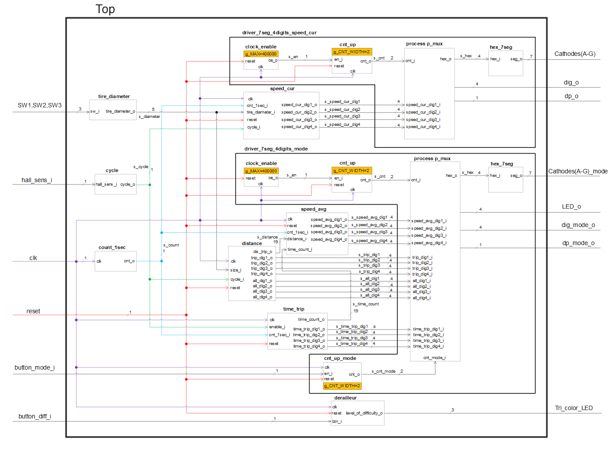
## Tb_top
Below are test input signals mostly in loop, which generates data for counters
```vhdl
    --------------------------------------------------------------------
    -- Clock generation process
    --------------------------------------------------------------------
    p_clk_gen : process
    begin
        while now < 20000 ms loop
            s_clk_100MHz <= '0';
            wait for c_CLK_100MHZ_PERIOD / 2;
            s_clk_100MHz <= '1';
            wait for c_CLK_100MHZ_PERIOD / 2;
        end loop;
        wait;
    end process p_clk_gen;
    
    --------------------------------------------------------------------
    -- Data generation process
    --------------------------------------------------------------------
    p_stimulus : process
    begin
        report "Stimulus process started" severity note;
        report "Stimulus process finished" severity note;
        wait;
    end process p_stimulus;        

    --------------------------------------------------------------------
    -- Data generation process for tire_diameter inputs
    --------------------------------------------------------------------
    p_diameter : process
    begin
        report "tire_diameter process started" severity note;
        while now < 20000 ms loop
        s_SW <= "000";
        wait for 1500ms;

        s_SW <= "001";
        wait for 1500ms;

        s_SW <= "010";
        wait for 1500ms;

        s_SW <= "011";
        wait for 1500ms;

        s_SW <= "100";
        wait for 1500ms;

        s_SW <= "101";
        wait for 1500ms;

        s_SW <= "110";
        wait for 1500ms;

        s_SW <= "111";
        wait for 1500ms;
        end loop;
        wait;
        report "tire_diameter process finished" severity note;
    end process p_diameter;
    
    --------------------------------------------------------------------
    -- Data generation process for cycle inputs
    --------------------------------------------------------------------
    p_cycle : process
    begin
        report "Cycle process started" severity note;
        while now < 20000 ms loop

        s_hall_sens_i <= '1';
        wait for 1 ms;

        s_hall_sens_i <= '0';
        wait for 1 ms;
               
        end loop;
        wait;
        report "Cycle process finished" severity note;
    end process p_cycle;
    
    --------------------------------------------------------------------
    -- Data generation process for reset inputs
    --------------------------------------------------------------------
    p_reset : process
    begin
        report "Reset process started" severity note;

        s_reset <= '0';
        wait for 100 ms;

        s_reset <= '1';
        wait for 100 ms;

        s_reset <= '0';
        wait for 14400 ms;

--        s_reset <= '1';
--        wait for 100 ms;
        
--        s_reset <= '0';
--        wait for 100 ms;
        
        s_reset <= '1';
        wait for 100 ms;
        
        s_reset <= '0';
--        wait for 100 ms;
        
--        report "Reset process finished" severity note;
        wait;
    end process p_reset;
    
    -------------------------------------------------------------------
    -- Data generation process for mode buttons
    --------------------------------------------------------------------
    p_button_mode : process
    begin
        while now < 20000 ms loop        
        s_button_mode_i <= '0';
        wait for 300 ms;

        s_button_mode_i <= '1';
        wait for 10 ms;
        end loop;
        wait;
    end process p_button_mode;
    
    --------------------------------------------------------------------
    -- Data generation process for button_difficulty input
    --------------------------------------------------------------------
    p_button_difficulty : process
    begin
        report "button_difficulty process started" severity note;
        while now < 20000 ms loop
        s_button_diff_i <= '0';
        wait for 68 ms;

        s_button_diff_i <= '1';
        wait for 12 ms;

        s_button_diff_i <= '0';
        wait for 58 ms;

        s_button_diff_i <= '1';
        wait for 32 ms;

        s_button_diff_i <= '0';
        wait for 250 ms;

        s_button_diff_i <= '1';
        wait for 58 ms;

        s_button_diff_i <= '0';
        wait for 23 ms;

        s_button_diff_i <= '1';
        wait for 12 ms;

        s_button_diff_i <= '0';
        end loop;
        report "button_difficulty process finished" severity note;
        wait;
    end process p_button_difficulty;
```

## Video

*Write your text here*


## References

   1. Write your text here.
