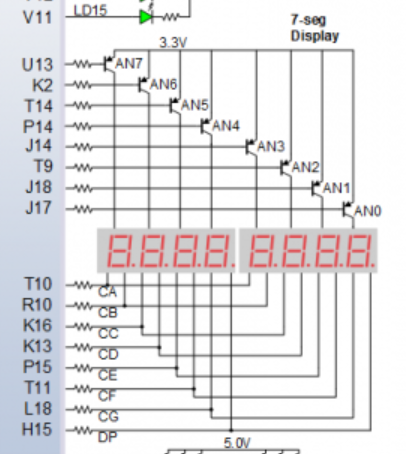
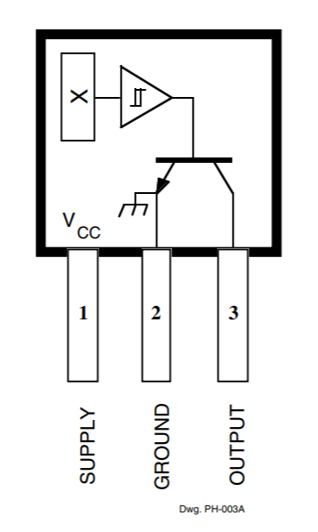

# projekt-DE1-2021

# Your project title

### Team members

- Přádka Nikodém 
- Rozboud Jakub
- Rubínek Tomáš
- Ruiner Michal
- Slávik Mark

Link to our GitHub project folder -  https://github.com/xrozbo03/projekt-DE1-2021

### Project objectives

Write your text here.

## Hardware description

## Board

Arty A7 ( https://store.digilentinc.com/arty-a7-artix-7-fpga-development-board/ )

schematic ( https://reference.digilentinc.com/_media/reference/programmable-logic/arty-a7/arty_a7_sch.pdf )

## Components

- 4-digit 7 - segment 0.56" display HS410561K-32, společná anoda ( https://www.laskarduino.cz/4-mistny--sedmisegmentovy--0-56--displej-hs410561k-32--spolecna-anoda--cerveny/?gclid=Cj0KCQjw-LOEBhDCARIsABrC0TkHNEw1GL7z6yQH_oacR9Hl1ZPOSFJ3biUOZr_8lQqI0rBIFiMJ1xUaAt8FEALw_wcB )
- Hall sensor 44E ( https://dratek.cz/arduino/7735-halluv-senzor-44e.html )
- 330 Ohm resistor ( https://dratek.cz/arduino/7655-rezistor-330r-0.25-w-1.html )
- 10kOhm resistor ( https://dratek.cz/arduino/7650-rezistor-10k-0.25-w-1.html )

## Inspiration for interconnecting componets

7 - seg display

Hall sensor

## Interconnection

Diodes near the 7 - seg display are connected through 200 Ohm resistors which are built-in in the standart Pmod connectors on the board.

## Table of connections

### 7Segment

|Pmod JA (standard)|Connection|Cathodes | Pmod  JD (standard) | Connection |Cathodes| Pmod JB (High-Speed) | Connection | Anodes |
| :--: | :--: | :--: | :--: | :--: | :--: | :--: | :--: | :--: |
| Pin 1 | G13 | CA | Pin 1 | D4 | CA | Pin 1 | E15 | AN7 |
| Pin 2 | B11 | CB | Pin 2 | D3 | CB | Pin 2 | E16 | AN6 |
| Pin 3 | A11 | CC | Pin 3 | F4 | CC | Pin 3 | D15 | AN5 |
| Pin 4 | D12 | CD | Pin 4 | F3 | CD | Pin 4 | C15 | AN4 |
| Pin 7 | D13 | CE | Pin 7 | E2 | CE | Pin 7 | J17 | AN3 |
| Pin 8 | B18 | CF | Pin 8 | D2 | CF | Pin 8 | J18 | AN2 |
| Pin 9 | A18 | CG | Pin 9 | H2 | CG | Pin 9 | K15 | AN1 |
| Pin 10 | K16 | Cdot | Pin 10 | G2 | Cdot | Pin 10 | J15 | AN0 |

### Hall sensor

| Hall sensor | Connection |
| :---------: | :--------: |
|   Supply    |    5V0     |
|   Ground    |    GND     |
|   Output    |   I/O 0    |

## VHDL modules description and simulations

Write your text here.

## TOP module description and simulations

Write your text here.

## Video

*Write your text here*

## References

   1. Write your text here.