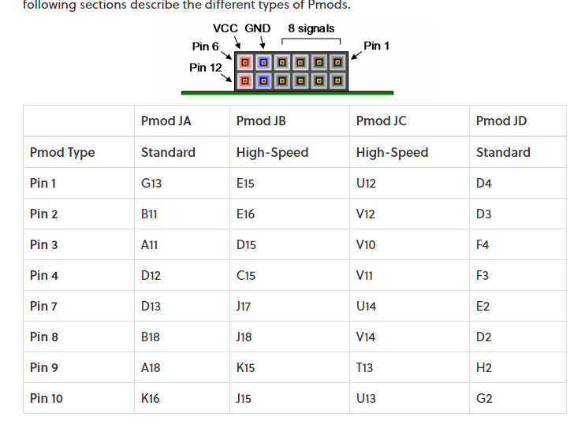
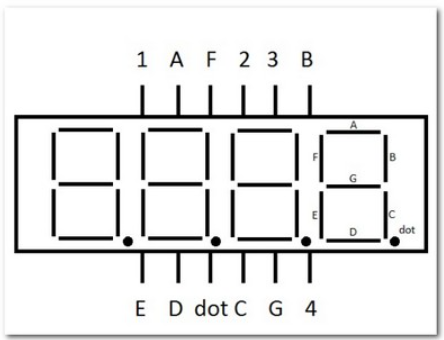
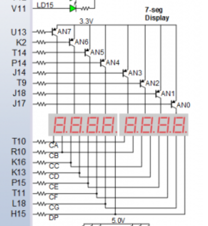
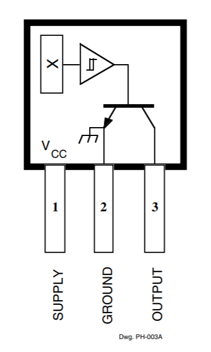
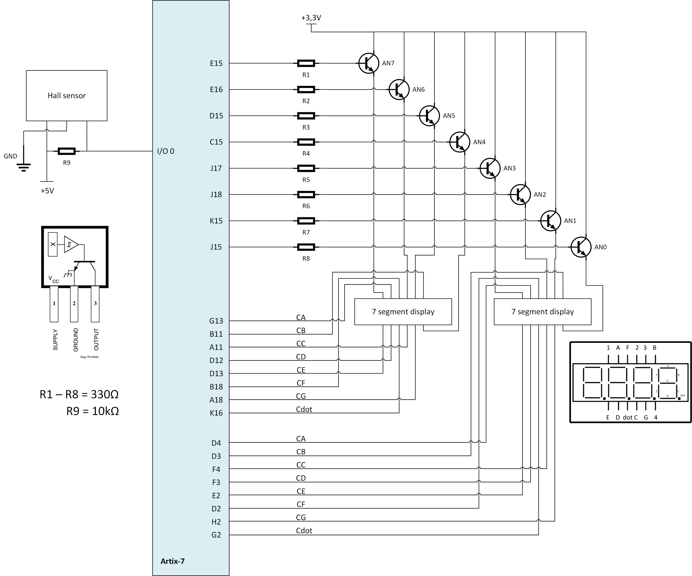

# Hardware

## deska

Arty A7 ( https://store.digilentinc.com/arty-a7-artix-7-fpga-development-board/ )

schematic ( https://reference.digilentinc.com/_media/reference/programmable-logic/arty-a7/arty_a7_sch.pdf )

## součástky

- 4-místný sedmisegmentový 0.56" displej HS410561K-32, společná anoda ( https://www.laskarduino.cz/4-mistny--sedmisegmentovy--0-56--displej-hs410561k-32--spolecna-anoda--cerveny/?gclid=Cj0KCQjw-LOEBhDCARIsABrC0TkHNEw1GL7z6yQH_oacR9Hl1ZPOSFJ3biUOZr_8lQqI0rBIFiMJ1xUaAt8FEALw_wcB )
- Hallův senzor 44E ( https://dratek.cz/arduino/7735-halluv-senzor-44e.html )

## inspirace zapojení součástek

sedmisegmentový displaj

Hallův senzor

## zapojeni

diody u 7seg jsou ošetřené pomocí 200 Ohm rezistorů které jsou zabudované ve standartních Pmod konektorech

