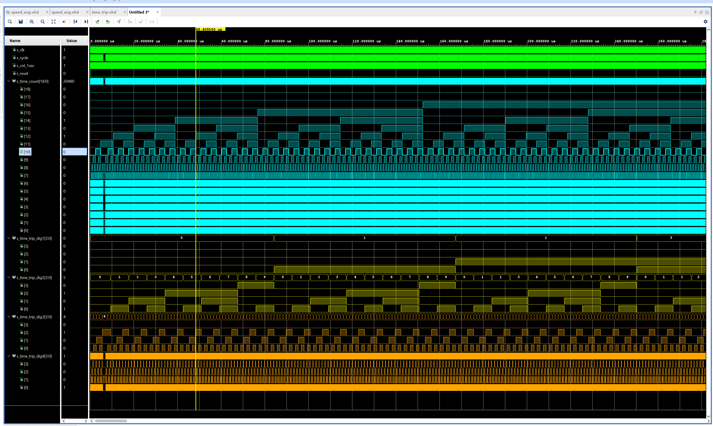

# time_trip

##  Design file

```vhdl
----------------------------------------------------------------------------------
-- Company: 
-- Engineer: 
-- 
-- Create Date: 15.04.2021 15:03:32
-- Design Name: 
-- Module Name: time_trip - Behavioral
-- Project Name: 
-- Target Devices: 
-- Tool Versions: 
-- Description: 
-- 
-- Dependencies: 
-- 
-- Revision:
-- Revision 0.01 - File Created
-- Additional Comments:
-- 
----------------------------------------------------------------------------------


library IEEE;
use IEEE.STD_LOGIC_1164.ALL;
use IEEE.NUMERIC_STD.ALL;

-- Uncomment the following library declaration if instantiating
-- any Xilinx leaf cells in this code.
--library UNISIM;
--use UNISIM.VComponents.all;

entity time_trip is

    Port ( 
          clk               : in std_logic;                            -- 100HMz clock
          enable_i          : in std_logic;                            -- input for driving verification
          cnt_1sec_i        : in std_logic;                            -- 1 second counter
          reset             : in std_logic;                            -- reset trip button
          time_count_o      : out std_logic_vector (19 - 1 downto 0);  -- sumary number of minutes on trip
          time_trip_dig1_o  : out std_logic_vector (4 - 1 downto 0);   -- data output for tens of hour digit
          time_trip_dig2_o  : out std_logic_vector (4 - 1 downto 0);   -- data output for hour digit
          time_trip_dig3_o  : out std_logic_vector (4 - 1 downto 0);   -- data output for tens of minute digit
          time_trip_dig4_o  : out std_logic_vector (4 - 1 downto 0)    -- data output for minute digit
          );
end time_trip;

------------------------------------------------------------------------
-- Architecture declaration for time trip
------------------------------------------------------------------------
architecture Behavioral of time_trip is

    -- local counter
    signal s_cnt4   : unsigned(4 - 1 downto 0);  -- tens of hours counter
    signal s_cnt3   : unsigned(4 - 1 downto 0);  -- hours counter
    signal s_cnt2   : unsigned(4 - 1 downto 0);  -- tens of minutes counter
    signal s_cnt1   : unsigned(4 - 1 downto 0);  -- minutes counter
    signal s_cnt0   : unsigned(6 - 1 downto 0);  -- seconds to determine the minute
    signal s_cntall : unsigned(19 - 1 downto 0); -- sum of all seconds

    -- local constants to compare specific values of counters
    constant c_NINE      : unsigned(4 - 1 downto 0) := b"1001";  -- 
    constant c_FIVE      : unsigned(4 - 1 downto 0) := b"0101";
    constant c_FIVTYNINE : unsigned(6 - 1 downto 0) := b"11_1011";

begin

p_time_trip : process(clk)
    begin

        if rising_edge(clk) then
            if(reset = '1') then
                -- reset counter
                s_cnt0   <= (others => '0');
                s_cnt1   <= (others => '0');
                s_cnt2   <= (others => '0');
                s_cnt3   <= (others => '0');
                s_cnt4   <= (others => '0');
                s_cntall <= (others => '0');
                
            elsif (enable_i = '1') then             -- turn on the counter while moving
                if (cnt_1sec_i = '1') then
                    s_cntall <= s_cntall + 1;          -- counting all seconds
                    s_cnt0   <= s_cnt0 + 1;            -- counting seconds to minutes
                    
                    if (s_cnt0 = c_FIVTYNINE) then         -- move to minutes
                        s_cnt1 <= s_cnt1 + 1;
                        s_cnt0 <= (others => '0');     -- clean seconds
                        
                        if (s_cnt1 = c_NINE) then         -- move to tens of minute
                            s_cnt1 <= (others => '0');    -- back to 0 in minutes
                            s_cnt2 <= s_cnt2 + 1;
                            
                            if (s_cnt2 = c_FIVE) then          -- move from minutes to hours
                                s_cnt2 <= (others => '0');    -- back to 0 in tens of minutes
                                s_cnt3 <= s_cnt3 + 1;
                                
                                if (s_cnt3 = c_NINE) then         -- move to tens of hours
                                    s_cnt3 <= (others => '0');    -- back to 0 in hours
                                    s_cnt4 <= s_cnt4 + 1;
                                    
                                    if(s_cnt4 = c_NINE) then
                                       s_cnt4 <= (others => '0'); -- back to 0 in tens of hours
                                        
                                    end if;
                                end if;
                            end if;
                        end if;
                    end if;
                end if;          
            end if;
        end if;
        
        
    end process p_time_trip;
  
    -- Outputs retype to std_logic_vector
    time_trip_dig4_o <= std_logic_vector(s_cnt1);
    time_trip_dig3_o <= std_logic_vector(s_cnt2);
    time_trip_dig2_o <= std_logic_vector(s_cnt3);
    time_trip_dig1_o <= std_logic_vector(s_cnt4);
    time_count_o     <= std_logic_vector(s_cntall);
end Behavioral;

```

##  Testbench file

```vhdl
----------------------------------------------------------------------------------
-- Company: 
-- Engineer: 
-- 
-- Create Date: 17.04.2021 11:30:12
-- Design Name: 
-- Module Name: tb_speed_avg - Behavioral
-- Project Name: 
-- Target Devices: 
-- Tool Versions: 
-- Description: 
-- 
-- Dependencies: 
-- 
-- Revision:
-- Revision 0.01 - File Created
-- Additional Comments:
-- 
----------------------------------------------------------------------------------


library IEEE;
use IEEE.STD_LOGIC_1164.ALL;

-- Uncomment the following library declaration if using
-- arithmetic functions with Signed or Unsigned values
--use IEEE.NUMERIC_STD.ALL;

-- Uncomment the following library declaration if instantiating
-- any Xilinx leaf cells in this code.
--library UNISIM;
--use UNISIM.VComponents.all;

entity tb_speed_avg is
--  Port ( );
end tb_speed_avg;

architecture Behavioral of tb_speed_avg is
    
    -- Local constants
    constant c_CLK_100MHZ_PERIOD   : time    := 1 ns; -- 1ns for faster simulation

    -- local signals
    signal s_clk           : std_logic;
    signal s_cnt_1sec      : std_logic;
    signal s_time_count    : std_logic_vector(19 - 1 downto 0);
    signal s_distance      : std_logic_vector (19 - 1 downto 0);
    
    signal s_test : std_logic_vector(19 - 1 downto 0);          

begin
    -- Unit under test
    uut_speed_avg : entity work.speed_avg
        port map (
            clk_i        => s_clk,
            cnt_1sec_i   => s_cnt_1sec,
            time_count_i => s_time_count,
            distance_i   => s_distance,
            test_o       => s_test
        );
        
  --------------------------------------------------------------------
  -- Generation process for 1 sec counter simulation
  --------------------------------------------------------------------
    p_clk_1sec_gen : process
    begin
        -- 1000 ns sequence
        s_cnt_1sec <= '0';
        wait for 100ns;
        s_cnt_1sec <= '1';
        wait for 100ns;
        s_cnt_1sec <= '0';
        wait for 100ns;
        s_cnt_1sec <= '1';
        wait for 100ns;
        s_cnt_1sec <= '0';
        wait for 100ns;
        s_cnt_1sec <= '1';
        wait for 100ns;
        s_cnt_1sec <= '0';
        wait for 100ns;
        s_cnt_1sec <= '1';
        wait for 100ns;
        s_cnt_1sec <= '0';
        wait for 100ns;
        s_cnt_1sec <= '1';
        wait for 100ns;
        -- end sequence

        
    end process p_clk_1sec_gen;
    
  --------------------------------------------------------------------
  -- Clock generation process
  --------------------------------------------------------------------
    p_clk_gen : process
    begin
        while now < 1000 ns loop
            s_clk <= '0';
            wait for c_CLK_100MHZ_PERIOD / 2;
            s_clk <= '1';
            wait for c_CLK_100MHZ_PERIOD / 2;
        end loop;
        wait;
    end process p_clk_gen;
    
  --------------------------------------------------------------------
  -- Data generation process
  --------------------------------------------------------------------
    p_stimulus : process
    begin
        report "Stimulus process started" severity note;

        s_distance <= "0000000000001100100";   -- 100
        s_time_count <= "0000000000000001000"; -- 8
        wait for 200ns;
        
        s_distance <= "0000000000000110010";   -- 50
        s_time_count <= "0000000000000000010"; -- 2
        wait for 200ns;

        s_distance <= "0000000110001001110";   -- 3150
        s_time_count <= "0000000000000110010"; -- 50
        wait for 200ns;
        
        s_distance <= "0000000000000110010";   -- 50
        s_time_count <= "0000000000000000010"; -- 2
        wait for 400ns;
        
        s_distance <= "0000000110001001110";   -- 3150
        s_time_count <= "0000000000000001000"; -- 8
        wait for 200ns;
        
        report "Stimulus process finished" severity note;
        wait;
    end process p_stimulus;

end Behavioral;

```
### full simulation



### enable and reset function 


### next digit function 


# speed_avg

##  Design file

```vhdl

```


##  Testbench file

```vhdl

```

