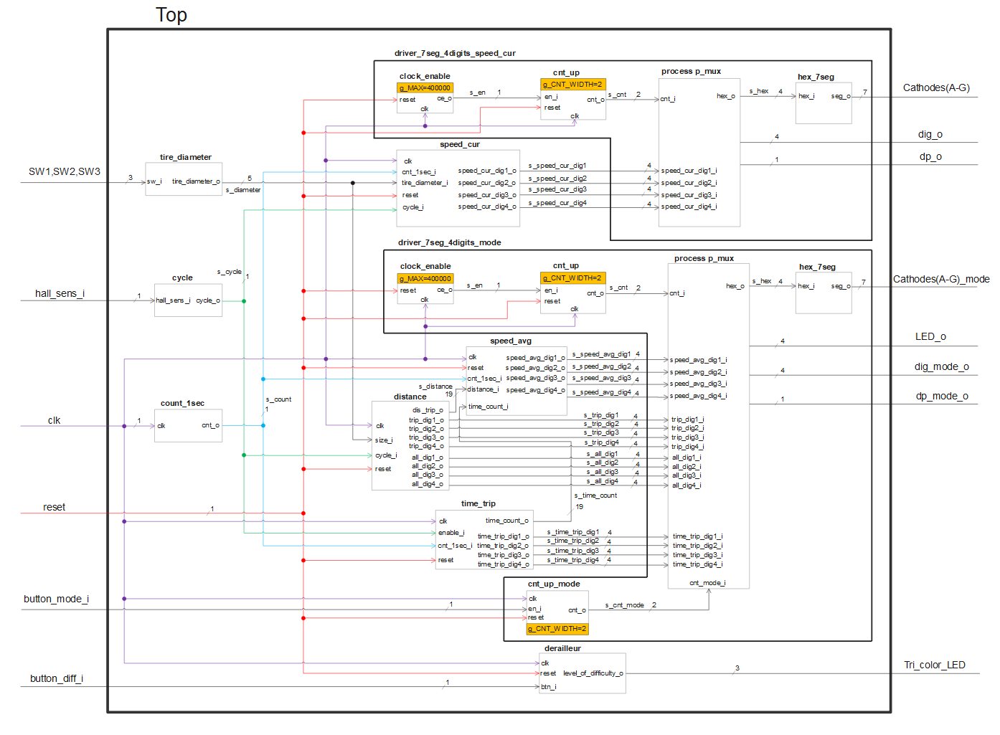

# multiplexer+counters+display

## Seven-segment display

The display type used in this project is **KW4-56NABA-P** with common anode ([datasheet](https://cdn-shop.adafruit.com/datasheets/812datasheet.pdf))

## Diagram

