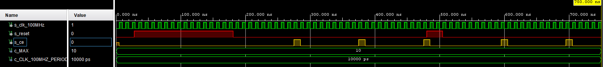

# clock_enable

## Design

```vhdl
------------------------------------------------------------------------
-- Copyright (c) 2021-Present Michal Ruiner
-- This work is licensed under the terms of the MIT license.
------------------------------------------------------------------------

library ieee;                   -- Standard library
use ieee.std_logic_1164.all;    -- Package for data types and logic operations
use ieee.numeric_std.all;       -- Package for arithmetic operations

------------------------------------------------------------------------
-- Entity declaration for clock enable
------------------------------------------------------------------------
entity clock_enable is
    generic(
        g_MAX : natural := 400000       -- Number of clk pulses to generate
                                        -- one enable signal period
                                        -- 400 000 for 4 ms period (for 4 digit 7 segment display)
    );

    port(
        clk   : in  std_logic;          -- Main clock
        reset : in  std_logic;          -- Synchronous reset
        ce_o  : out std_logic           -- Clock enable pulse signal
    );
end entity clock_enable;

------------------------------------------------------------------------
-- Architecture body for clock enable
------------------------------------------------------------------------
architecture Behavioral of clock_enable is

    -- Local counter
    signal s_cnt_local : natural;

begin
    --------------------------------------------------------------------
    -- p_clk_ena:
    -- Generate clock enable signal. By default, enable signal is low
    -- and generated pulse is always one clock long.
    --------------------------------------------------------------------
    p_clk_ena : process(clk)
    begin

        if rising_edge(clk) then                    -- Synchronous process
            if (reset = '1') then                   -- High active reset
                s_cnt_local <= 0;                   -- Clear local counter
                ce_o        <= '0';                 -- Set output to low
            -- Test number of clock periods
            elsif (s_cnt_local >= (g_MAX - 1)) then
                s_cnt_local <= 0;                   -- Clear local counter
                ce_o        <= '1';                 -- Generate clock enable pulse
            else
                s_cnt_local <= s_cnt_local + 1;
                ce_o        <= '0';
            end if;
        end if;
    end process p_clk_ena;

end architecture Behavioral;
```

## Testbench

```vhdl
------------------------------------------------------------------------
-- Copyright (c) 2021-Present Michal Ruiner
-- This work is licensed under the terms of the MIT license.
------------------------------------------------------------------------

library ieee;
use ieee.std_logic_1164.all;
use ieee.numeric_std.all;

------------------------------------------------------------------------
-- Entity declaration for testbench
------------------------------------------------------------------------
entity tb_clock_enable is
end entity tb_clock_enable;

------------------------------------------------------------------------
-- Architecture body for testbench
------------------------------------------------------------------------
architecture testbench of tb_clock_enable is

    constant c_MAX               : natural := 10;
    constant c_CLK_100MHZ_PERIOD : time    := 10 ns;

    --Local signals
    signal s_clk_100MHz : std_logic;    -- 100 MHz clock signal
    signal s_reset      : std_logic;    -- Synchronous reset
    signal s_ce         : std_logic;    -- Clock enable pulse signal

begin
    -- Connecting testbench signals with clock_enable entity
    -- (Unit Under Test)
    uut_ce : entity work.clock_enable
        generic map(
            g_MAX => c_MAX
        )
        port map(
            clk    => s_clk_100MHz,
            reset  => s_reset,
            ce_o   => s_ce
        );

    --------------------------------------------------------------------
    -- Clock generation process
    --------------------------------------------------------------------
    p_clk_gen : process
    begin
        while now < 750 ns loop         -- 75 periods of 100MHz clock
            s_clk_100MHz <= '0';
            wait for c_CLK_100MHZ_PERIOD / 2;
            s_clk_100MHz <= '1';
            wait for c_CLK_100MHZ_PERIOD / 2;
        end loop;
        wait;                           -- Process is suspended forever
    end process p_clk_gen;

    --------------------------------------------------------------------
    -- Reset generation process
    --------------------------------------------------------------------
    p_reset_gen : process
    begin
        s_reset <= '0';
        wait for 28 ns;

        -- Reset activated
        s_reset <= '1';
        wait for 153 ns;
        assert(s_ce = '0')
        report "Test failed for reset value 1" severity error;

        -- Reset deactivated
        s_reset <= '0';
        wait for 299 ns;

        -- Reset activated
        s_reset <= '1';
        wait for 25 ns;
        assert(s_ce = '0')
        report "Test failed for reset value 1" severity error;

        -- Reset deactivated
        s_reset <= '0';

        wait;
    end process p_reset_gen;

    --------------------------------------------------------------------
    -- Data generation process
    --------------------------------------------------------------------
    p_stimulus : process
    begin
        report "Stimulus process started" severity note;

        report "Stimulus process finished" severity note;
        wait;
    end process p_stimulus;

end architecture testbench;
```

## Screenshot of the simulation


