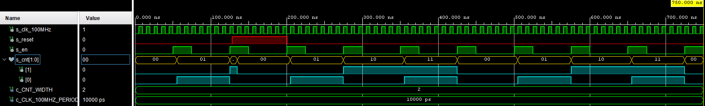
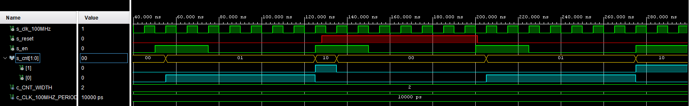

# cnt_up_mode

## Design

```vhdl
------------------------------------------------------------------------
-- Copyright (c) 2032-Present Michal Ruiner
-- This work is licensed under the terms of the MIT license.
------------------------------------------------------------------------

library ieee;
use ieee.std_logic_1164.all;
use ieee.numeric_std.all;

------------------------------------------------------------------------
-- Entity declaration for n-bit counter
------------------------------------------------------------------------
entity cnt_up_mode is
    generic(
        g_CNT_WIDTH : natural := 2      -- Number of bits for counter
    );
    port(
        arst     : in  std_logic;       -- Asynchronous reset
        en_i     : in  std_logic;       -- Push button input
        cnt_o    : out std_logic_vector(g_CNT_WIDTH - 1 downto 0)
    );
end cnt_up_mode;

------------------------------------------------------------------------
-- Architecture body for n-bit counter
------------------------------------------------------------------------
architecture Behavioral of cnt_up_mode is

    -- Local counter
    signal s_cnt_local : unsigned(g_CNT_WIDTH - 1 downto 0) := (others => '0'); -- default value of "00"

begin
   --------------------------------------------------------------------
    -- p_cnt_up:
    -- Clocked process with asynchronous reset which implements n-bit
    -- up counter.
    --------------------------------------------------------------------
    p_cnt_up : process(en_i, arst)
    begin
         if (arst = '1') then               -- Synchronous reset
                s_cnt_local <= (others => '0'); -- Clear all bits

         elsif rising_edge(en_i) then

                if (en_i = '1') then       -- Test if counter is enabled
                    s_cnt_local <= s_cnt_local + 1;

            end if;
        end if;
    end process p_cnt_up;

    -- Output must be retyped from "unsigned" to "std_logic_vector"
    cnt_o <= std_logic_vector(s_cnt_local);


end Behavioral;
```

## Testbench

```vhdl
------------------------------------------------------------------------
-- Copyright (c) 2020-Present Michal Ruiner
-- This work is licensed under the terms of the MIT license.
------------------------------------------------------------------------

library IEEE;
use IEEE.STD_LOGIC_1164.ALL;

entity tb_cnt_up_mode is
end tb_cnt_up_mode;

------------------------------------------------------------------------
-- Architecture body for testbench
------------------------------------------------------------------------
architecture Behavioral of tb_cnt_up_mode is

    -- Number of bits for testbench counter
    constant c_CNT_WIDTH         : natural := 2;

    --Local signals
    signal s_arst       : std_logic;
    signal s_en         : std_logic;
    signal s_cnt        : std_logic_vector(c_CNT_WIDTH - 1 downto 0);

begin
    -- Connecting testbench signals with cnt_up entity
    -- (Unit Under Test)
    uut_cnt : entity work.cnt_up_mode
        generic map(
            g_CNT_WIDTH  => c_CNT_WIDTH
        )
        port map(
            arst     => s_arst,
            en_i     => s_en,
            cnt_o    => s_cnt
        );

    --------------------------------------------------------------------
    -- Reset generation process
    --------------------------------------------------------------------
    p_reset_gen : process
    begin
        s_arst <= '0';
        wait for 135 ns;

        -- Reset activated
        s_arst <= '1';
        wait for 73 ns;
        assert(s_cnt = "00")
        report "Test failed for reset value 1" severity error;

        -- Reset deactivated
        s_arst <= '0';
        wait;
    end process p_reset_gen;

    --------------------------------------------------------------------
    -- Data generation process
    --------------------------------------------------------------------
    p_stimulus : process
    begin
        report "Stimulus process started" severity note;

        s_en     <= '0';
        wait for 50 ns;
        assert(s_cnt = "00")
        report "Test failed for default state" severity error;

        -- Push button
        s_en     <= '1';
        wait for 25 ns;
        assert(s_cnt = "01")
        report "Test failed for 1. button push" severity error;

        -- Release button
        s_en     <= '0';
        wait for 50 ns;

        -- Push button
        s_en     <= '1';
        wait for 25 ns;
        assert(s_cnt = "00")
        report "Test failed for 2. button push" severity error;

        -- Release button
        s_en     <= '0';
        wait for 50 ns;

        -- Push button
        s_en     <= '1';
        wait for 25 ns;
        assert(s_cnt = "00")
        report "Test failed for 3. button push" severity error;

        -- Release button
        s_en     <= '0';
        wait for 50 ns;

        -- Push button
        s_en     <= '1';
        wait for 25 ns;
        assert(s_cnt = "01")
        report "Test failed for 4. button push" severity error;

        -- Release button
        s_en     <= '0';
        wait for 50 ns;

        -- Push button
        s_en     <= '1';
        wait for 25 ns;
        assert(s_cnt = "10")
        report "Test failed for 5. button push" severity error;

        -- Release button
        s_en     <= '0';
        wait for 50 ns;

        -- Push button
        s_en     <= '1';
        wait for 25 ns;
        assert(s_cnt = "11")
        report "Test failed for 6. button push" severity error;

        -- Release button
        s_en     <= '0';
        wait for 50 ns;

        -- Push button
        s_en     <= '1';
        wait for 25 ns;
        assert(s_cnt = "00")
        report "Test failed for 7. button push" severity error;

        -- Release button
        s_en     <= '0';
        wait for 50 ns;

        -- Push button
        s_en     <= '1';
        wait for 25 ns;
        assert(s_cnt = "01")
        report "Test failed for 8. button push" severity error;

        -- Release button
        s_en     <= '0';
        wait for 50 ns;

        -- Push button
        s_en     <= '1';
        wait for 25 ns;
        assert(s_cnt = "10")
        report "Test failed for 9. button push" severity error;

        -- Release button
        s_en     <= '0';
        wait for 50 ns;

        -- Push button
        s_en     <= '1';
        wait for 25 ns;
        assert(s_cnt = "11")
        report "Test failed for 10. button push" severity error;

        -- Release button
        s_en     <= '0';

        report "Stimulus process finished" severity note;
        wait;
    end process p_stimulus;

end Behavioral;
```

## Screenshot of the simulation



  - 40-300 ns
    
