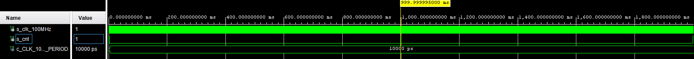

# count_1sec

## design

```vhdl
------------------------------------------------------------------------
-- Copyright (c) 2032-Present Michal Ruiner
-- This work is licensed under the terms of the MIT license.
------------------------------------------------------------------------

library ieee;
use ieee.std_logic_1164.all;
use ieee.numeric_std.all;

entity count_1sec is
    Port (
        clk           : in STD_LOGIC;       -- Main clock
        cnt_o         : out STD_LOGIC       -- 1 second output
    );
end count_1sec;

architecture Behavioral of count_1sec is

    signal cnt_1sec : unsigned(27 - 1 downto 0) := (others => '0');               -- Local counter
    constant second : unsigned(27 - 1 downto 0) := "101111101011110000100000000"; -- 100000000 clock pulses to 1 sec

begin

    p_clk_ena : process(clk)
    begin
        if(rising_edge(clk)) then
            if (cnt_1sec >= (second-1)) then
                cnt_o    <= '1';
                cnt_1sec <= (others => '0');
            else
                cnt_o    <= '0';
                cnt_1sec <= cnt_1sec+1;
            end if;
        end if;
    end process p_clk_ena;

end Behavioral;
```

## testbench

```vhdl
------------------------------------------------------------------------
-- Copyright (c) 2020-Present Michal Ruiner
-- This work is licensed under the terms of the MIT license.
------------------------------------------------------------------------

library ieee;
use ieee.std_logic_1164.all;

entity tb_count_1sec is
end tb_count_1sec;

architecture testbench of tb_count_1sec is

    constant c_CLK_100MHZ_PERIOD : time    := 10 ns;

    --Local signals
    signal s_clk_100MHz : std_logic;
    signal s_cnt        : std_logic;

begin

    uut_cnt : entity work.count_1sec
        port map(
            clk      => s_clk_100MHz,
            cnt_o    => s_cnt
        );

    --------------------------------------------------------------------
    -- Clock generation process
    --------------------------------------------------------------------
    p_clk_gen : process
    begin
        while now < 2000 ms loop
            s_clk_100MHz <= '0';
            wait for c_CLK_100MHZ_PERIOD / 2;
            s_clk_100MHz <= '1';
            wait for c_CLK_100MHZ_PERIOD / 2;
        end loop;
        wait;
    end process p_clk_gen;

    --------------------------------------------------------------------
    -- Data generation process
    --------------------------------------------------------------------
    p_stimulus : process
    begin
        report "Stimulus process started" severity note;
        report "Stimulus process finished" severity note;
        wait;
    end process p_stimulus;

end testbench;
```

## Screenshot of the simulation


