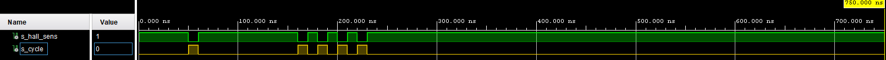

# cycle

## design

```vhdl
------------------------------------------------------------------------
-- Copyright (c) 2032-Present Michal Ruiner
-- This work is licensed under the terms of the MIT license.
------------------------------------------------------------------------

library ieee;
use ieee.std_logic_1164.all;
use ieee.numeric_std.all;

entity cycle is
    Port (
        hall_sens_i           : in STD_LOGIC;
        cycle_o               : out STD_LOGIC
    );
end cycle;

architecture Behavioral of cycle is

begin

    p_clk_ena : process(hall_sens_i)
    begin
        if(hall_sens_i = '0') then
            cycle_o <= '1';
        else
            cycle_o <= '0';
        end if;
    end process p_clk_ena;

end Behavioral;
```

## testbench

```vhdl
------------------------------------------------------------------------
-- Copyright (c) 2020-Present Michal Ruiner
-- This work is licensed under the terms of the MIT license.
------------------------------------------------------------------------

library ieee;
use ieee.std_logic_1164.all;

------------------------------------------------------------------------
-- Entity declaration for testbench
------------------------------------------------------------------------
entity tb_cycle is
end entity tb_cycle;

------------------------------------------------------------------------
-- Architecture body for testbench
------------------------------------------------------------------------
architecture testbench of tb_cycle is

    signal s_hall_sens  : std_logic;
    signal s_cycle      : std_logic;

begin
    -- Connecting testbench signals with cnt_up entity
    -- (Unit Under Test)
    uut_cnt : entity work.cycle
        port map(
            hall_sens_i => s_hall_sens,
            cycle_o     => s_cycle
        );

    --------------------------------------------------------------------
    -- Data generation process
    --------------------------------------------------------------------
    p_stimulus : process
    begin
        report "Stimulus process started" severity note;

        -- Default value for Hall sensor
        s_hall_sens <= '1';
        wait for 50 ns;

        -- 1 cycle
        s_hall_sens <= '0';
        wait for 10 ns;

        -- Return to default state
        s_hall_sens <= '1';
        wait for 100 ns;

        -- 1 cycle
        s_hall_sens <= '0';
        wait for 10 ns;

        -- Return to default state
        s_hall_sens <= '1';
        wait for 10 ns;

        -- 1 cycle
        s_hall_sens <= '0';
        wait for 10 ns;

        -- Return to default state
        s_hall_sens <= '1';
        wait for 10 ns;

        -- 1 cycle
        s_hall_sens <= '0';
        wait for 10 ns;

        -- Return to default state
        s_hall_sens <= '1';
        wait for 10 ns;

        -- 1 cycle
        s_hall_sens <= '0';
        wait for 10 ns;

        s_hall_sens <= '1';
        report "Stimulus process finished" severity note;
        wait;
    end process p_stimulus;

end architecture testbench;
```

## Screenshots of the simulation


