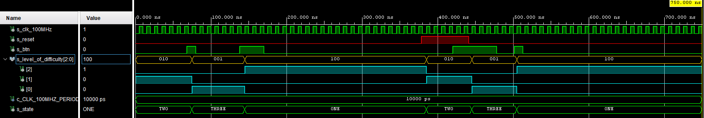

# derailleur

## Design

```vhdl
------------------------------------------------------------------------
-- Copyright (c) 2032-Present Michal Ruiner
-- This work is licensed under the terms of the MIT license.
------------------------------------------------------------------------

library ieee;
use ieee.std_logic_1164.all;
use ieee.numeric_std.all;

entity derailleur is
    Port (
        clk                   : in STD_LOGIC;                           -- Main clock
        reset                 : in STD_LOGIC;                           -- Synchronous reset
        btn_i                 : in STD_LOGIC;                           -- Input button to set level of difficulty
        level_of_difficulty_o : out STD_LOGIC_VECTOR (3 - 1 downto 0)   -- Output to display on tri-color LED which level of difficulty is active
    );
end derailleur;

architecture Behavioral of derailleur is

    -- States of difficulty
    type   t_state is (ONE, TWO, THREE);

    -- Define the signal that uses different states
    signal s_state     : t_state   := TWO;      -- Default state is TWO
    signal s_cnt_btn   : std_logic := '0';      -- Signal to proces button

begin

    p_output_derailleur : process(clk)
    begin
        if rising_edge(clk) then
            if (reset = '1') then           -- Synchronous reset
                s_state     <= TWO ;        -- Set initial state
                s_cnt_btn   <= '0';
            elsif (btn_i = '1' and s_cnt_btn = '0') then    -- if button is pushed after release
                case s_state is
                    when ONE =>
                          -- Move to the next state
                          s_state <= TWO;

                    when TWO =>
                          -- Move to the next state
                          s_state <= THREE;

                    when THREE =>
                        -- Move to the next state
                        s_state <= ONE;

                    when others =>
                        s_state <= TWO;  -- Default state if there is different output

                end case;
                s_cnt_btn   <= '1';
            elsif (btn_i = '0' and s_cnt_btn = '1') then    -- if button was released
                s_cnt_btn   <= '0';
            end if;
        end if;   
    end process p_output_derailleur;

    p_output_states : process(s_state)
    begin
        case s_state is
            when ONE =>
                level_of_difficulty_o  <= "100";   -- Red (RGB = 100)
            when TWO =>
                level_of_difficulty_o  <= "010";   -- Green (RGB = 010)
            when THREE =>
                level_of_difficulty_o  <= "001";   -- Blue (RGB = 001)
            when others =>
                level_of_difficulty_o  <= "010";   -- Green (RGB = 010)
        end case;
    end process p_output_states;

end Behavioral;
```

## Testbench

```vhdl
------------------------------------------------------------------------
-- Copyright (c) 2021-Present Michal Ruiner
-- This work is licensed under the terms of the MIT license.
------------------------------------------------------------------------

library IEEE;
use IEEE.STD_LOGIC_1164.ALL;

entity tb_derailleur is
end tb_derailleur;

architecture testbench of tb_derailleur is

    constant c_CLK_100MHZ_PERIOD : time    := 10 ns;

    signal s_clk_100MHz               : STD_LOGIC;       
    signal s_reset                    : STD_LOGIC;
    signal s_btn                      : STD_LOGIC;
    signal s_level_of_difficulty      : STD_LOGIC_VECTOR (3 - 1 downto 0);

begin

  uut_ce : entity work.derailleur
        port map(
            clk                     => s_clk_100MHz,       
            reset                   => s_reset,
            btn_i                   => s_btn,
            level_of_difficulty_o   => s_level_of_difficulty
        );  

  --------------------------------------------------------------------
  -- Clock generation process
  --------------------------------------------------------------------
  p_clk_gen : process
  begin
      while now < 750 ns loop         -- 75 periods of 100MHz clock
          s_clk_100MHz <= '0';
          wait for c_CLK_100MHZ_PERIOD / 2;
          s_clk_100MHz <= '1';
          wait for c_CLK_100MHZ_PERIOD / 2;
      end loop;
      wait;
  end process p_clk_gen;

  --------------------------------------------------------------------
    -- Reset generation process
    --------------------------------------------------------------------
    p_reset_gen : process
    begin
        s_reset <= '0';
        wait for 378 ns;

        -- Reset activated
        s_reset <= '1';
        wait for 63 ns;
        assert(s_level_of_difficulty = "010")
        report "Test failed for reset value 1" severity error;

        -- Reset deactivated
        s_reset <= '0';
        wait;
    end process p_reset_gen;

    --------------------------------------------------------------------
    -- Data generation process
    --------------------------------------------------------------------
    p_stimulus : process
    begin
        report "Stimulus process started" severity note;

        s_btn <= '0';
        wait for 68 ns;

        s_btn <= '1';
        wait for 12 ns;
        assert(s_level_of_difficulty = "001")
        report "Test failed for 1st push button" severity error;

        s_btn <= '0';
        wait for 58 ns;

        s_btn <= '1';
        wait for 32 ns;
        assert(s_level_of_difficulty = "100")
        report "Test failed for 2nd push button" severity error;

        s_btn <= '0';
        wait for 250 ns;

        s_btn <= '1';
        wait for 58 ns;
        assert(s_level_of_difficulty = "001")
        report "Test failed for 3rd push button" severity error;

        s_btn <= '0';
        wait for 23 ns;

        s_btn <= '1';
        wait for 12 ns;
        assert(s_level_of_difficulty = "100")
        report "Test failed for 4th push button" severity error;

        s_btn <= '0';
        report "Stimulus process finished" severity note;
        wait;
    end process p_stimulus;

end architecture testbench;
```

## Screenshot of the simulation


