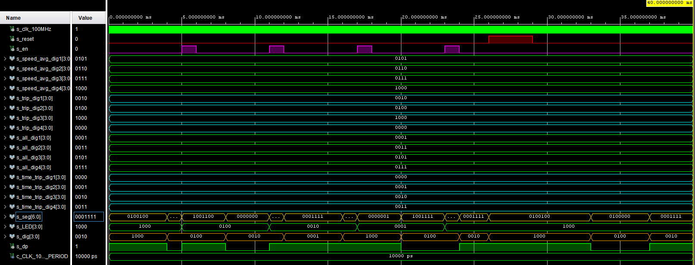

# driver_7seg_4digits_mode

## Design

```vhdl
------------------------------------------------------------------------
-- Copyright (c) 2021-Present Michal Ruiner
-- This work is licensed under the terms of the MIT license.
------------------------------------------------------------------------

library ieee;               -- Standard library
use ieee.std_logic_1164.all;-- Package for data types and logic operations
use ieee.numeric_std.all;   -- Package for arithmetic operations

entity driver_7seg_4digits_mode is
    Port (
           clk                : in  std_logic;                             -- Main clock
           reset              : in  std_logic;                             -- Synchronous reset
           en_i               : in  std_logic;                             -- Button to select mode
           speed_avg_dig1_i   : in STD_LOGIC_VECTOR  (4 - 1 downto 0);     -- Speed average value for 1. digit (tens of kilometers)
           speed_avg_dig2_i   : in STD_LOGIC_VECTOR  (4 - 1 downto 0);     -- Speed average value for 2. digit (kilometers)
           speed_avg_dig3_i   : in STD_LOGIC_VECTOR  (4 - 1 downto 0);     -- Speed average value for 3. digit (hundreds of meters)
           speed_avg_dig4_i   : in STD_LOGIC_VECTOR  (4 - 1 downto 0);     -- Speed average value for 4. digit (tens of meters)
           trip_dig1_i        : in STD_LOGIC_VECTOR  (4 - 1 downto 0);     -- 1 trip distance value for 1. digit (hundreds of kilometers)
           trip_dig2_i        : in STD_LOGIC_VECTOR  (4 - 1 downto 0);     -- 1 trip distance value for 2. digit (tens of kilometers)
           trip_dig3_i        : in STD_LOGIC_VECTOR  (4 - 1 downto 0);     -- 1 trip distance value for 3. digit (kilometers)
           trip_dig4_i        : in STD_LOGIC_VECTOR  (4 - 1 downto 0);     -- 1 trip distance value for 4. digit (hundreds of meters)
           all_dig1_i         : in STD_LOGIC_VECTOR  (4 - 1 downto 0);     -- Total distance value for 1. digit (thousands of kilometers)
           all_dig2_i         : in STD_LOGIC_VECTOR  (4 - 1 downto 0);     -- Total distance value for 2. digit (hundreds of kilometers)
           all_dig3_i         : in STD_LOGIC_VECTOR  (4 - 1 downto 0);     -- Total distance value for 3. digit (tens of kilometers)
           all_dig4_i         : in STD_LOGIC_VECTOR  (4 - 1 downto 0);     -- Total distance value for 4. digit (kilometers)
           time_trip_dig1_i   : in STD_LOGIC_VECTOR  (4 - 1 downto 0);     -- Current time of 1 trip value for 1. digit (tens of hours)
           time_trip_dig2_i   : in STD_LOGIC_VECTOR  (4 - 1 downto 0);     -- Current time of 1 trip value for 2. digit (hours)
           time_trip_dig3_i   : in STD_LOGIC_VECTOR  (4 - 1 downto 0);     -- Current time of 1 trip value for 3. digit (tens of minutes)
           time_trip_dig4_i   : in STD_LOGIC_VECTOR  (4 - 1 downto 0);     -- Current time of 1 trip value for 4. digit (minutes)
           seg_o              : out std_logic_vector (7 - 1 downto 0);     -- Cathode values for individual segments
           LED_o              : out STD_LOGIC_VECTOR (4 - 1 downto 0);     -- LEDs on board to display which mode is selected
           dig_o              : out STD_LOGIC_VECTOR (4 - 1 downto 0);     -- Choose which digit will be active (enable anode)
           dp_o               : out STD_LOGIC_VECTOR (4 - 1 downto 0)      -- Choose decimal point of the digit
    );
end driver_7seg_4digits_mode;

architecture Behavioral of driver_7seg_4digits_mode is

    -- Internal clock enable
    signal s_en        : std_logic;
    -- Internal 2-bit counter for multiplexing 4 digits
    signal s_cnt       : std_logic_vector(2 - 1 downto 0);
    -- Internal signal to select mode
    signal s_cnt_mode  : std_logic_vector(2 - 1 downto 0);
    -- Internal 4-bit value for 7-segment decoder
    signal s_hex       : std_logic_vector(4 - 1 downto 0);

begin

    --------------------------------------------------------------------
    -- Instance (copy) of clock_enable entity generates an enable pulse
    -- every 4 ms
    clk_en0 : entity work.clock_enable
        generic map(
            g_MAX => 400000
        )
        port map(
            clk => clk,
            reset => reset,
            ce_o => s_en
        );

    --------------------------------------------------------------------
    -- Instance (copy) of cnt_up entity performs a 2-bit up
    -- counter
    bin_cnt0 : entity work.cnt_up
        generic map(
            g_CNT_WIDTH => 2
        )
        port map(
            clk         => clk,
            reset       => reset,
            en_i        => s_en,
            cnt_o       => s_cnt
        );

     --------------------------------------------------------------------
     -- Instance (copy) of cnt_up_mode entity performs a 2-bit up
     -- counter
     bin_cnt1 : entity work.cnt_up_mode
         generic map(
             g_CNT_WIDTH => 2
         )
         port map(
             clk         => clk,
             reset       => reset,
             en_i        => en_i,
             cnt_o       => s_cnt_mode
         );

    --------------------------------------------------------------------
    -- Instance (copy) of hex_7seg entity performs a 7-segment display
    -- decoder
    hex2seg : entity work.hex_7seg
        port map(
            hex_i => s_hex,
            seg_o => seg_o
        );

    --------------------------------------------------------------------
    -- p_mux:
    -- A combinational process that implements a multiplexer for
    -- selecting data for a single digit, a decimal point signal and
    -- switches the common anodes of each display.
    --------------------------------------------------------------------       
    p_mux : process(s_cnt, s_cnt_mode,
                    speed_avg_dig1_i, speed_avg_dig2_i, speed_avg_dig3_i, speed_avg_dig4_i,
                    trip_dig1_i, trip_dig2_i, trip_dig3_i, trip_dig4_i,
                    all_dig1_i, all_dig2_i, all_dig3_i, all_dig4_i,
                    time_trip_dig1_i, time_trip_dig2_i, time_trip_dig3_i, time_trip_dig4_i)
    begin
        case s_cnt_mode is
            when "00" =>                            -- Average speed is assigned to the mode combination "00"
                dp_o    <= "0100";                  -- Enabled decimal point for average speed (second digit - kilometers)
                LED_o   <= "1000";                  -- Turn on LED 4
                if (s_cnt = "00") then
                    s_hex <= speed_avg_dig1_i;      -- Display tens of kilometers if counter combination is "00"
                    dig_o <= "1000";                -- Enable 1. digit from the left
                elsif (s_cnt = "01") then
                    s_hex <= speed_avg_dig2_i;      -- Display kilometers if counter combination is "01"
                    dig_o <= "0100";                -- Enable 2. digit from the left
                elsif (s_cnt = "10") then
                    s_hex <= speed_avg_dig3_i;      -- Display hundreds of meters if counter combination is "10"
                    dig_o <= "0010";                -- Enable 3. digit from the left
                else
                    s_hex <= speed_avg_dig4_i;      -- Display tens of meters if counter combination is "11"
                    dig_o <= "0001";                -- Enable 4. digit from the left
                end if;

            when "01" =>                            -- Trip distance is assigned to the mode combination "01"
                dp_o    <= "0010";                  -- Enabled decimal point for trip distance (third digit - kilometers)
                LED_o   <= "0100";                  -- Turn on LED 5
                if (s_cnt = "00") then
                    s_hex <= trip_dig1_i;           -- Display hundreds of kilometers if counter combination is "00"
                    dig_o <= "1000";                -- Enable 1. digit from the left
                elsif (s_cnt = "01") then
                    s_hex <= trip_dig2_i;           -- Display tens of kilometers if counter combination is "01"
                    dig_o <= "0100";                -- Enable 2. digit from the left
                elsif (s_cnt = "10") then
                    s_hex <= trip_dig3_i;           -- Display kilometers if counter combination is "10"
                    dig_o <= "0010";                -- Enable 3. digit from the left
                else
                    s_hex <= trip_dig4_i;           -- Display hundreds of meters if counter combination is "11"
                    dig_o <= "0001";                -- Enable 4. digit from the left
                end if;

            when "10" =>                            -- Total distance is assigned to the mode combination "10"
                dp_o    <= "0000";                  -- Disabled decimal point for total distance
                LED_o   <= "0010";                  -- Turn on LED 6
                if (s_cnt = "00") then
                    s_hex <= all_dig1_i;            -- Display thousands of kilometers if counter combination is "00"
                    dig_o <= "1000";                -- Enable 1. digit from the left
                elsif (s_cnt = "01") then
                    s_hex <= all_dig2_i;            -- Display hundreds of kilometers if counter combination is "01"
                    dig_o <= "0100";                -- Enable 2. digit from the left
                elsif (s_cnt = "10") then
                    s_hex <= all_dig3_i;            -- Display tens of kilometers if counter combination is "10"
                    dig_o <= "0010";                -- Enable 3. digit from the left
                else
                    s_hex <= all_dig4_i;            -- Display kilometers if counter combination is "11"
                    dig_o <= "0001";                -- Enable 4. digit from the left
                end if;

            when others =>                          -- Time trip is assigned to the mode combination "11"
                dp_o    <= "0010";                  -- Enabled decimal point for time trip (hours)
                LED_o   <= "0001";                  -- Turn on LED 7
                if (s_cnt = "00") then
                    s_hex <= time_trip_dig1_i;      -- Display tens of hours if counter combination is "00"
                    dig_o <= "1000";                -- Enable 1. digit from the left
                elsif (s_cnt = "01") then
                    s_hex <= time_trip_dig2_i;      -- Display hours if counter combination is "01"
                    dig_o <= "0100";                -- Enable 2. digit from the left
                elsif (s_cnt = "10") then
                    s_hex <= time_trip_dig3_i;      -- Display tens of minutes if counter combination is "10"
                    dig_o <= "0010";                -- Enable 3. digit from the left
                else
                    s_hex <= time_trip_dig4_i;      -- Display minutes if counter combination is "11"
                    dig_o <= "0001";                -- Enable 4. digit from the left
                end if;
        end case;
    end process p_mux;

end Behavioral;
```

## Testbench

```vhdl
------------------------------------------------------------------------
-- Copyright (c) 2021-Present Michal Ruiner
-- This work is licensed under the terms of the MIT license.
------------------------------------------------------------------------

library ieee;
use ieee.std_logic_1164.all;
use ieee.numeric_std.all;

entity tb_driver_7seg_4digits_mode is
end tb_driver_7seg_4digits_mode;

architecture testbench of tb_driver_7seg_4digits_mode is
    -- Local constants
    constant c_CLK_100MHZ_PERIOD : time    := 10 ns;

    -- Local signals
    signal s_clk_100MHz         : std_logic;
    signal s_reset              : std_logic;
    signal s_en                 : std_logic;
    signal s_speed_avg_dig1     : STD_LOGIC_VECTOR  (4 - 1 downto 0);
    signal s_speed_avg_dig2     : STD_LOGIC_VECTOR  (4 - 1 downto 0);
    signal s_speed_avg_dig3     : STD_LOGIC_VECTOR  (4 - 1 downto 0);
    signal s_speed_avg_dig4     : STD_LOGIC_VECTOR  (4 - 1 downto 0);
    signal s_trip_dig1          : STD_LOGIC_VECTOR  (4 - 1 downto 0);
    signal s_trip_dig2          : STD_LOGIC_VECTOR  (4 - 1 downto 0);
    signal s_trip_dig3          : STD_LOGIC_VECTOR  (4 - 1 downto 0);
    signal s_trip_dig4          : STD_LOGIC_VECTOR  (4 - 1 downto 0);
    signal s_all_dig1           : STD_LOGIC_VECTOR  (4 - 1 downto 0);
    signal s_all_dig2           : STD_LOGIC_VECTOR  (4 - 1 downto 0);
    signal s_all_dig3           : STD_LOGIC_VECTOR  (4 - 1 downto 0);
    signal s_all_dig4           : STD_LOGIC_VECTOR  (4 - 1 downto 0);
    signal s_time_trip_dig1     : STD_LOGIC_VECTOR  (4 - 1 downto 0);
    signal s_time_trip_dig2     : STD_LOGIC_VECTOR  (4 - 1 downto 0);
    signal s_time_trip_dig3     : STD_LOGIC_VECTOR  (4 - 1 downto 0);
    signal s_time_trip_dig4     : STD_LOGIC_VECTOR  (4 - 1 downto 0);
    signal s_seg                : std_logic_vector  (7 - 1 downto 0);
    signal s_LED                : STD_LOGIC_VECTOR  (4 - 1 downto 0);
    signal s_dig                : STD_LOGIC_VECTOR  (4 - 1 downto 0);
    signal s_dp                 : STD_LOGIC_VECTOR  (4 - 1 downto 0);                                  

begin
    -- Connecting testbench signals with multiplexer entity
    uut_mux : entity work.driver_7seg_4digits_mode
        port map(
            clk                     => s_clk_100MHz,
            reset                   => s_reset,
            en_i                    => s_en,           
            speed_avg_dig1_i        => s_speed_avg_dig1,
            speed_avg_dig2_i        => s_speed_avg_dig2,
            speed_avg_dig3_i        => s_speed_avg_dig3,
            speed_avg_dig4_i        => s_speed_avg_dig4,
            trip_dig1_i             => s_trip_dig1,   
            trip_dig2_i             => s_trip_dig2,  
            trip_dig3_i             => s_trip_dig3,  
            trip_dig4_i             => s_trip_dig4,  
            all_dig1_i              => s_all_dig1,
            all_dig2_i              => s_all_dig2,  
            all_dig3_i              => s_all_dig3,   
            all_dig4_i              => s_all_dig4,   
            time_trip_dig1_i        => s_time_trip_dig1,
            time_trip_dig2_i        => s_time_trip_dig2,
            time_trip_dig3_i        => s_time_trip_dig3,
            time_trip_dig4_i        => s_time_trip_dig4,
            seg_o                   => s_seg,
            LED_o                   => s_LED,
            dig_o                   => s_dig,   
            dp_o                    => s_dp        
        );

    --------------------------------------------------------------------
    -- Clock generation process
    --------------------------------------------------------------------
    p_clk_gen : process
    begin
        while now < 40 ms loop
            s_clk_100MHz <= '0';
            wait for c_CLK_100MHZ_PERIOD / 2;
            s_clk_100MHz <= '1';
            wait for c_CLK_100MHZ_PERIOD / 2;
        end loop;
        wait;
    end process p_clk_gen;

    -------------------------------------------------------------------
    -- Data generation process (push buttons)
    --------------------------------------------------------------------
    p_btn_push : process
    begin        
        s_en <= '0';
        wait for 5 ms;

        s_en <= '1';
        wait for 1 ms;
        assert(s_LED = "0100")
        report "Test failed for 1st push mode button" severity error;

        s_en <= '0';
        wait for 5 ms;

        s_en <= '1';
        wait for 1 ms;
        assert(s_LED = "0010")
        report "Test failed for 2nd push mode button" severity error;

        s_en <= '0';
        wait for 5 ms;

        s_en <= '1';
        wait for 1 ms;
        assert(s_LED = "0001")
        report "Test failed for 3rd push mode button" severity error;

        s_en <= '0';
        wait for 5 ms;

        s_en <= '1';
        wait for 1 ms;
        assert(s_LED = "1000")
        report "Test failed for 4th push mode button" severity error;

        s_en <= '0';
        wait;
    end process p_btn_push;

    --------------------------------------------------------------------
    -- Reset generation process
    --------------------------------------------------------------------
    p_reset_gen : process
    begin
        s_reset <= '0';
        wait for 26 ms;

        s_reset <= '1';
        wait for 3 ms;
        assert(s_LED = "1000" and s_dig = "1000")
        report "Test failed for reset value '1'" severity error;

        s_reset <= '0';
        wait;
    end process p_reset_gen;

    -------------------------------------------------------------------
    -- Data generation process (digit values)
    --------------------------------------------------------------------
    p_stimulus : process
    begin
        report "Stimulus process started" severity note;

        -- Set values time trip digits
        s_time_trip_dig1 <= "0000";
        s_time_trip_dig2 <= "0001";
        s_time_trip_dig3 <= "0010";
        s_time_trip_dig4 <= "0011";

        -- Set values for speed average digits
        s_speed_avg_dig1 <= "0101";
        s_speed_avg_dig2 <= "0110";
        s_speed_avg_dig3 <= "0111";
        s_speed_avg_dig4 <= "1000";

        -- Set values for total distance digits
        s_all_dig1 <= "0001";
        s_all_dig2 <= "0011";
        s_all_dig3 <= "0101";
        s_all_dig4 <= "0111";

        -- Set values for trip distance digits
        s_trip_dig1 <= "0010";
        s_trip_dig2 <= "0100";
        s_trip_dig3 <= "1000";
        s_trip_dig4 <= "0000";

        -------------------------------------------------

        wait for 7ms;
        assert(s_dig = "0100" and s_LED = "0100")
        report "Test failed for digit 2 based on counting" severity error;

        wait for 20 ms;
        assert(s_dig = "1000" and s_LED = "1000")
        report "Test failed for digit 1 during reset" severity error;

        wait for 7 ms;
        assert(s_dig = "0100" and s_LED = "1000")
        report "Test failed for digit 2 after reset" severity error;

        report "Stimulus process finished" severity note;
        wait;
    end process p_stimulus;
end architecture testbench;
```

## Screenshot of the simulation


