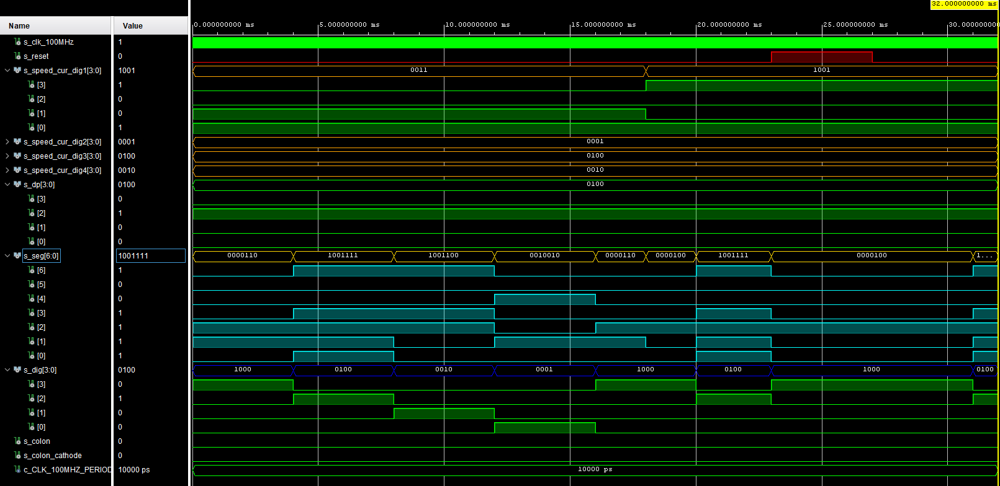

# driver_7seg_4digits_speed_cur

## Design

```vhdl
------------------------------------------------------------------------
-- Copyright (c) 2021-Present Michal Ruiner
-- This work is licensed under the terms of the MIT license.
------------------------------------------------------------------------

library ieee;
use ieee.std_logic_1164.all;
use ieee.numeric_std.all;

------------------------------------------------------------------------
-- Entity declaration for display driver
------------------------------------------------------------------------
entity driver_7seg_4digits_speed_cur is
    port(
        clk     : in  std_logic;        -- Main clock
        reset   : in  std_logic;        -- Synchronous reset
        -- 4-bit input values for individual digits
        speed_cur_dig1_i : in  std_logic_vector(4 - 1 downto 0);    -- Current speed value for 1. digit (tens of kilometers)
        speed_cur_dig2_i : in  std_logic_vector(4 - 1 downto 0);    -- Current speed value for 2. digit (kilometers)
        speed_cur_dig3_i : in  std_logic_vector(4 - 1 downto 0);    -- Current speed value for 3. digit (hundreds of meters)
        speed_cur_dig4_i : in  std_logic_vector(4 - 1 downto 0);    -- Current speed value for 4. digit (tens of meters)
        -- Cathode values for individual segments
        seg_o            : out std_logic_vector(7 - 1 downto 0);
        -- Common anode signals to individual displays
        dig_o            : out std_logic_vector(4 - 1 downto 0);
        -- Decimal point for specific digit
        dp_o             : out std_logic_vector(4 - 1 downto 0)
    );
end entity driver_7seg_4digits_speed_cur;

------------------------------------------------------------------------
-- Architecture declaration for display driver
------------------------------------------------------------------------
architecture Behavioral of driver_7seg_4digits_speed_cur is

    -- Internal clock enable
    signal s_en  : std_logic;
    -- Internal 2-bit counter for multiplexing 4 digits
    signal s_cnt : std_logic_vector(2 - 1 downto 0);
    -- Internal 4-bit value for 7-segment decoder
    signal s_hex : std_logic_vector(4 - 1 downto 0);

begin
    --------------------------------------------------------------------
    -- Instance (copy) of clock_enable entity generates an enable pulse
    -- every 4 ms
    clk_en0 : entity work.clock_enable
        generic map(
            g_MAX => 400000
        )
        port map(
            clk => clk,
            reset => reset,
            ce_o => s_en
        );

    --------------------------------------------------------------------
    -- Instance (copy) of cnt_up entity performs a 2-bit up
    -- counter
    bin_cnt0 : entity work.cnt_up
        generic map(
            g_CNT_WIDTH => 2
        )
        port map(
            clk         => clk,
            reset       => reset,
            en_i        => s_en,
            cnt_o       => s_cnt
        );

    --------------------------------------------------------------------
    -- Instance (copy) of hex_7seg entity performs a 7-segment display
    -- decoder
    hex2seg : entity work.hex_7seg
        port map(
            hex_i => s_hex,
            seg_o => seg_o
        );

    --------------------------------------------------------------------
    -- p_mux:
    -- A combinational process that implements a multiplexer for
    -- selecting data for a single digit, a decimal point signal and
    -- switches the common anodes of each display.
    --------------------------------------------------------------------
    p_mux : process(s_cnt, speed_cur_dig1_i, speed_cur_dig2_i, speed_cur_dig3_i, speed_cur_dig4_i)
    begin
        dp_o            <= "0100";
        case s_cnt is
            when "11" =>
                s_hex <= speed_cur_dig4_i;
                dig_o <= "0001";

            when "10" =>
                s_hex <= speed_cur_dig3_i;
                dig_o <= "0010";

            when "01" =>
                s_hex <= speed_cur_dig2_i;
                dig_o <= "0100";

            when others =>
                s_hex <= speed_cur_dig1_i;
                dig_o <= "1000";
        end case;
    end process p_mux;

end architecture Behavioral;
```

## Testbench

```vhdl
------------------------------------------------------------------------
-- Copyright (c) 2021-Present Michal Ruiner
-- This work is licensed under the terms of the MIT license.
------------------------------------------------------------------------

library ieee;
use ieee.std_logic_1164.all;

------------------------------------------------------------------------
-- Entity declaration for testbench
------------------------------------------------------------------------
entity tb_driver_7seg_4digits_speed_cur is
    -- Entity of testbench is always empty
end entity tb_driver_7seg_4digits_speed_cur;

------------------------------------------------------------------------
-- Architecture body for testbench
------------------------------------------------------------------------
architecture testbench of tb_driver_7seg_4digits_speed_cur is

    -- Local constants
    constant c_CLK_100MHZ_PERIOD : time    := 10 ns;

    --Local signals
    signal s_clk_100MHz      : std_logic;
    signal s_reset           : std_logic;

    signal s_speed_cur_dig1  : std_logic_vector(4 - 1 downto 0);
    signal s_speed_cur_dig2  : std_logic_vector(4 - 1 downto 0);
    signal s_speed_cur_dig3  : std_logic_vector(4 - 1 downto 0);
    signal s_speed_cur_dig4  : std_logic_vector(4 - 1 downto 0);    
    signal s_dp              : std_logic_vector(4 - 1 downto 0);  
    signal s_seg             : std_logic_vector(7 - 1 downto 0);   
    signal s_dig             : std_logic_vector(4 - 1 downto 0);

begin
    -- Connecting testbench signals with driver_7seg_4digits_speed_cur entity
    -- (Unit Under Test)
    uut_driver_7seg : entity work.driver_7seg_4digits_speed_cur
    port map(
        clk                => s_clk_100MHz,
        reset              => s_reset,
        speed_cur_dig1_i   => s_speed_cur_dig1,
        speed_cur_dig2_i   => s_speed_cur_dig2,
        speed_cur_dig3_i   => s_speed_cur_dig3,
        speed_cur_dig4_i   => s_speed_cur_dig4,
        dp_o               => s_dp,
        seg_o              => s_seg,
        dig_o              => s_dig
    );

    --------------------------------------------------------------------
    -- Clock generation process
    --------------------------------------------------------------------
    p_clk_gen : process
    begin
        while now < 32 ms loop
            s_clk_100MHz <= '0';
            wait for c_CLK_100MHZ_PERIOD / 2;
            s_clk_100MHz <= '1';
            wait for c_CLK_100MHZ_PERIOD / 2;
        end loop;
        wait;
    end process p_clk_gen;

    --------------------------------------------------------------------
    -- Reset generation process
    --------------------------------------------------------------------
    p_reset_gen : process
    begin
        s_reset <= '0';
        wait for 23 ms;

        -- Reset activated
        s_reset <= '1';
        wait for 4 ms;
        assert(s_seg = "0000100" and s_dig = "1000")
        report "Test failed for reset value 1" severity error;

        s_reset <= '0';
        wait;
    end process p_reset_gen;

    --------------------------------------------------------------------
    -- Data generation process
    --------------------------------------------------------------------
    p_stimulus : process
    begin
        report "Stimulus process started" severity note;

        s_speed_cur_dig1 <= "0011";
        s_speed_cur_dig2 <= "0001";
        s_speed_cur_dig3 <= "0100";
        s_speed_cur_dig4 <= "0010";

        wait for 4 ms;
        assert(s_seg = "0000110" and s_dig = "1000")
        report "Test failed for digit 1" severity error;

        wait for 4 ms;
        assert(s_seg = "1001111" and s_dig = "0100")
        report "Test failed for digit 2" severity error;

        wait for 4 ms;
        assert(s_seg = "1001100" and s_dig = "0010")
        report "Test failed for digit 3" severity error;

        wait for 4 ms;
        assert(s_seg = "0010010" and s_dig = "0001")
        report "Test failed for digit 4" severity error;

        wait for 2ms;
        assert(s_seg = "0000110" and s_dig = "1000")
        report "Test failed for digit 1 before change" severity error;

        s_speed_cur_dig1 <= "1001";
        wait for 2ms;
        assert(s_seg = "0000100" and s_dig = "1000")
        report "Test failed for digit 1 after change" severity error;

        report "Stimulus process finished" severity note;
        wait;
    end process p_stimulus;
end architecture testbench;
```

## Screenshot of the simulation


