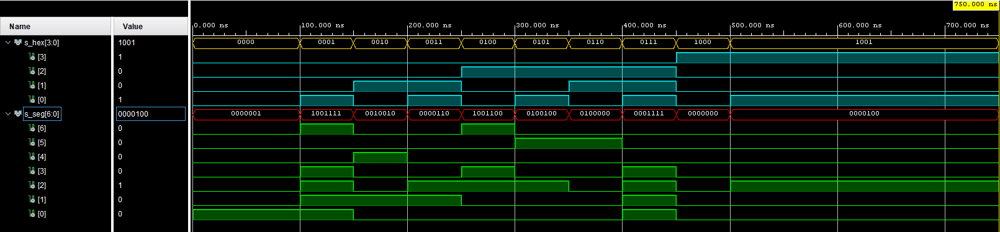

# hex_7seg

## Decoder truth table

| **Hex** | **Inputs** | **A** | **B** | **C** | **D** | **E** | **F** | **G** |
| :-: | :-: | :-: | :-: | :-: | :-: | :-: | :-: | :-: |
| 0 | 0000 | 0 | 0 | 0 | 0 | 0 | 0 | 1 |
| 1 | 0001 | 1 | 0 | 0 | 1 | 1 | 1 | 1 |
| 2 | 0010 | 0 | 0 | 1 | 0 | 0 | 1 | 0 |
| 3 | 0011 | 0 | 0 | 0 | 0 | 1 | 1 | 0 |
| 4 | 0100 | 1 | 0 | 0 | 1 | 1 | 0 | 0 |
| 5 | 0101 | 0 | 1 | 0 | 0 | 1 | 0 | 0 |
| 6 | 0110 | 0 | 1 | 0 | 0 | 0 | 0 | 0 |
| 7 | 0111 | 0 | 0 | 0 | 1 | 1 | 1 | 1 |
| 8 | 1000 | 0 | 0 | 0 | 0 | 0 | 0 | 0 |
| 9 | 1001 | 0 | 0 | 0 | 0 | 1 | 0 | 0 |

## Design

```vhdl
------------------------------------------------------------------------
-- Copyright (c) 2021-Present Michal Ruiner
-- This work is licensed under the terms of the MIT license.
------------------------------------------------------------------------

library IEEE;
use IEEE.STD_LOGIC_1164.ALL;

entity hex_7seg is
    Port
    (
        hex_i : in STD_LOGIC_VECTOR (4 - 1 downto 0);  -- Input binary data
        seg_o : out STD_LOGIC_VECTOR (7 - 1 downto 0)  -- Cathode values in the order A, B, C, D, E, F, G
    );
end hex_7seg;

architecture Behavioral of hex_7seg is

begin

    --------------------------------------------------------------------
    -- p_7seg_decoder:
    -- A combinational process for 7-segment display decoder.
    -- Any time "hex_i" is changed, the process is "executed".
    -- Output pin seg_o(6) corresponds to segment A, seg_o(5) to B, etc.
    --------------------------------------------------------------------
    p_7seg_decoder : process(hex_i)
    begin
        case hex_i is
            when "0000" =>
                seg_o <= "0000001";     -- 0
            when "0001" =>
                seg_o <= "1001111";     -- 1
            when "0010" =>
                seg_o <= "0010010";     -- 2
            when "0011" =>
                seg_o <= "0000110";     -- 3
            when "0100" =>
                seg_o <= "1001100";     -- 4        
            when "0101" =>
                seg_o <= "0100100";     -- 5
            when "0110" =>
                seg_o <= "0100000";     -- 6
            when "0111" =>
                seg_o <= "0001111";     -- 7
            when "1000" =>
                seg_o <= "0000000";     -- 8  
            when others =>
                seg_o <= "0000100";     -- 9
        end case;
    end process p_7seg_decoder;

end Behavioral;
```

## Testbench

```vhdl
------------------------------------------------------------------------
-- Copyright (c) 2021-Present Michal Ruiner
-- This work is licensed under the terms of the MIT license.
------------------------------------------------------------------------

library IEEE;
use IEEE.STD_LOGIC_1164.ALL;

entity tb_hex_7seg is
end tb_hex_7seg;

architecture Behavioral of tb_hex_7seg is

    -- Local signals
    signal s_hex       : std_logic_vector(4 - 1 downto 0);
    signal s_seg       : std_logic_vector(7 - 1 downto 0);

begin

    -- Connecting testbench signals with hex_7seg entity (Unit Under Test)
    uut_hex_7seg : entity work.hex_7seg
        port map(
            hex_i           => s_hex,
            seg_o           => s_seg
        );

    --------------------------------------------------------------------
    -- Data generation process
    --------------------------------------------------------------------
    p_stimulus : process
    begin
        -- Report a note at the begining of stimulus process
        report "Stimulus process started" severity note;


        -- First test values
        s_hex <= "0000";   -- 0
        wait for 100 ns;
        assert(s_seg = "0000001")
        report "Test failed for input data '0000'" severity error;

        s_hex <= "0001";   -- 1
        wait for 50 ns;
        assert(s_seg = "1001111")
        report "Test failed for input data '0001'" severity error;

        s_hex <= "0010";   -- 2
        wait for 50 ns;
        assert(s_seg = "0010010")
        report "Test failed for input data '0010'" severity error;

        s_hex <= "0011";   -- 3
        wait for 50 ns;
        assert(s_seg = "0000110")
        report "Test failed for input data '0011'" severity error;

        s_hex <= "0100";   -- 4
        wait for 50 ns;
        assert(s_seg = "1001100")
        report "Test failed for input data '0100'" severity error;

        s_hex <= "0101";   -- 5
        wait for 50 ns;
        assert(s_seg = "0100100")
        report "Test failed for input data '0101'" severity error;

        s_hex <= "0110";   -- 6
        wait for 50 ns;
        assert(s_seg = "0100000")
        report "Test failed for input data '0110'" severity error;

        s_hex <= "0111";   -- 7
        wait for 50 ns;
        assert(s_seg = "0001111")
        report "Test failed for input data '0111'" severity error;

        s_hex <= "1000";   -- 8
        wait for 50 ns;
        assert(s_seg = "0000000")
        report "Test failed for input data '1000'" severity error;

        s_hex <= "1001";   -- 9
        wait for 50 ns;
        assert(s_seg = "0000100")
        report "Test failed for input data '1001'" severity error;       

        -- Report a note at the end of stimulus process
        report "Stimulus process finished" severity note;
        wait;
    end process p_stimulus;    

end Behavioral;
```

## Screenshot of the simulation


