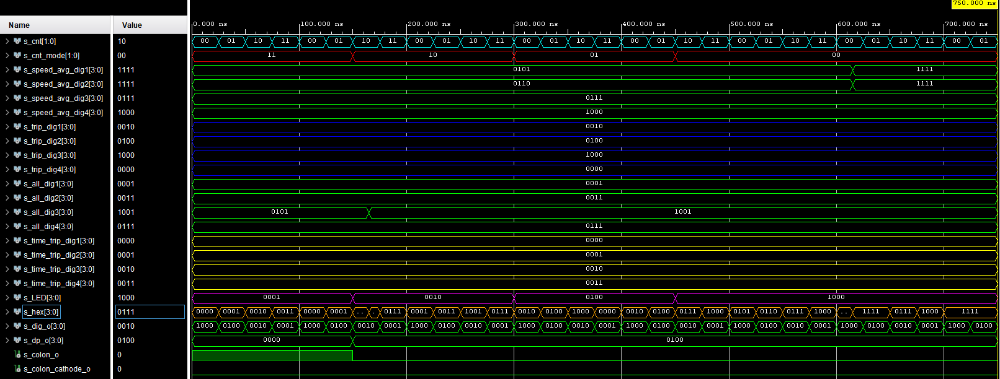
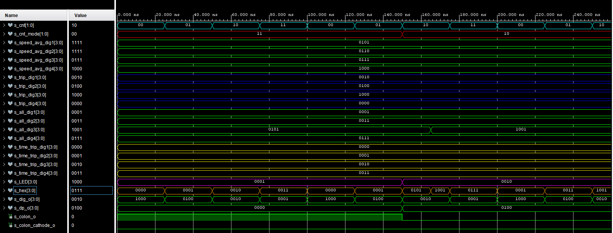
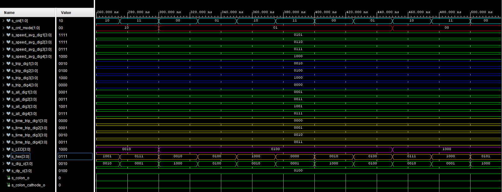
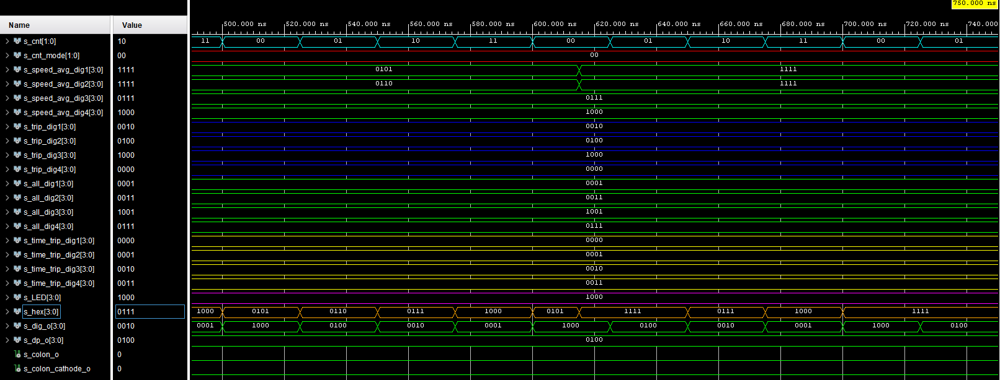

# multiplexer

## Design

```vhdl
------------------------------------------------------------------------
-- Copyright (c) 2021-Present Michal Ruiner
-- This work is licensed under the terms of the MIT license.
------------------------------------------------------------------------

library ieee;               -- Standard library
use ieee.std_logic_1164.all;-- Package for data types and logic operations
use ieee.numeric_std.all;   -- Package for arithmetic operations

entity multiplexer is
    Port (
           cnt_i              : in STD_LOGIC_VECTOR  (2 - 1 downto 0);     -- 4 ms for each digit
           cnt_mode_i         : in STD_LOGIC_VECTOR  (2 - 1 downto 0);     -- Value to choose what will be displayed on the 7 seg display
           speed_avg_dig1_i   : in STD_LOGIC_VECTOR  (4 - 1 downto 0);     -- Speed average value for 1. digit (tens of hours)
           speed_avg_dig2_i   : in STD_LOGIC_VECTOR  (4 - 1 downto 0);     -- Speed average value for 2. digit (hours)
           speed_avg_dig3_i   : in STD_LOGIC_VECTOR  (4 - 1 downto 0);     -- Speed average value for 3. digit (tens of minutes)
           speed_avg_dig4_i   : in STD_LOGIC_VECTOR  (4 - 1 downto 0);     -- Speed average value for 4. digit (minutes)
           trip_dig1_i        : in STD_LOGIC_VECTOR  (4 - 1 downto 0);     -- 1 trip distance value for 1. digit (tens of hours)
           trip_dig2_i        : in STD_LOGIC_VECTOR  (4 - 1 downto 0);     -- 1 trip distance value for 2. digit (hours)
           trip_dig3_i        : in STD_LOGIC_VECTOR  (4 - 1 downto 0);     -- 1 trip distance value for 3. digit (tens of minutes)
           trip_dig4_i        : in STD_LOGIC_VECTOR  (4 - 1 downto 0);     -- 1 trip distance value for 4. digit (minutes)
           all_dig1_i         : in STD_LOGIC_VECTOR  (4 - 1 downto 0);     -- Total distance value for 1. digit (tens of hours)
           all_dig2_i         : in STD_LOGIC_VECTOR  (4 - 1 downto 0);     -- Total distance value for 2. digit (hours)
           all_dig3_i         : in STD_LOGIC_VECTOR  (4 - 1 downto 0);     -- Total distance value for 3. digit (tens of minutes)
           all_dig4_i         : in STD_LOGIC_VECTOR  (4 - 1 downto 0);     -- Total distance value for 4. digit (minutes)
           time_trip_dig1_i   : in STD_LOGIC_VECTOR  (4 - 1 downto 0);     -- Current time of 1 trip value for 1. digit (tens of hours)
           time_trip_dig2_i   : in STD_LOGIC_VECTOR  (4 - 1 downto 0);     -- Current time of 1 trip value for 2. digit (hours)
           time_trip_dig3_i   : in STD_LOGIC_VECTOR  (4 - 1 downto 0);     -- Current time of 1 trip value for 3. digit (tens of minutes)
           time_trip_dig4_i   : in STD_LOGIC_VECTOR  (4 - 1 downto 0);     -- Current time of 1 trip value for 4. digit (minutes)
           LED_o              : out STD_LOGIC_VECTOR (4 - 1 downto 0);     -- LEDs on board to display which mode is selected
           hex_o              : out STD_LOGIC_VECTOR (4 - 1 downto 0);     -- Decimal value for 7 seg display digit
           dig_o              : out STD_LOGIC_VECTOR (4 - 1 downto 0);     -- Choose which digit will be active
           dp_o               : out STD_LOGIC_VECTOR (4 - 1 downto 0);     -- Choose decimal point of the digit
           colon_o            : out STD_LOGIC;                             -- Enable colon
           colon_cathode_o    : out STD_LOGIC                              -- Connect cathode of colon
    );
end multiplexer;

architecture Behavioral of multiplexer is

begin

    p_mux : process(cnt_i, cnt_mode_i,
                    speed_avg_dig1_i, speed_avg_dig2_i, speed_avg_dig3_i, speed_avg_dig4_i,
                    trip_dig1_i, trip_dig2_i, trip_dig3_i, trip_dig4_i,
                    all_dig1_i, all_dig2_i, all_dig3_i, all_dig4_i,
                    time_trip_dig1_i, time_trip_dig2_i, time_trip_dig3_i, time_trip_dig4_i)
    begin
        case cnt_mode_i is
            when "00" =>                            -- Average speed is assigned to the mode combination "00"
                colon_o <= '0';                     -- Disabled colon for average speed
                colon_cathode_o <= '0';             -- Logic 0 on the colon cathode
                dp_o    <= "0100";                  -- Enabled decimal point for average speed (second digit - kilometers)
                LED_o   <= "1000";                  -- Turn on LED 4
                if (cnt_i = "00") then
                    hex_o <= speed_avg_dig1_i;      -- Display tens of kilometers if counter combination is "00"
                    dig_o <= "1000";                -- Enable 1. digit from the left
                elsif (cnt_i = "01") then
                    hex_o <= speed_avg_dig2_i;      -- Display kilometers if counter combination is "01"
                    dig_o <= "0100";                -- Enable 2. digit from the left
                elsif (cnt_i = "10") then
                    hex_o <= speed_avg_dig3_i;      -- Display hundreds of meters if counter combination is "10"
                    dig_o <= "0010";                -- Enable 3. digit from the left
                else
                    hex_o <= speed_avg_dig4_i;      -- Display tens of meters if counter combination is "11"
                    dig_o <= "0001";                -- Enable 4. digit from the left
                end if;

            when "01" =>                            -- Trip distance is assigned to the mode combination "01"
                colon_o <= '0';                     -- Disabled colon for trip distance
                colon_cathode_o <= '0';             -- Logic 0 on the colon cathode
                dp_o    <= "0100";                  -- Enabled decimal point for trip distance (second digit - kilometers)
                LED_o   <= "0100";                  -- Turn on LED 5
                if (cnt_i = "00") then
                    hex_o <= trip_dig1_i;           -- Display tens of kilometers if counter combination is "00"
                    dig_o <= "1000";                -- Enable 1. digit from the left
                elsif (cnt_i = "01") then
                    hex_o <= trip_dig2_i;           -- Display kilometers if counter combination is "01"
                    dig_o <= "0100";                -- Enable 2. digit from the left
                elsif (cnt_i = "10") then
                    hex_o <= trip_dig3_i;           -- Display hundreds of meters if counter combination is "10"
                    dig_o <= "0010";                -- Enable 3. digit from the left
                else
                    hex_o <= trip_dig4_i;           -- Display tens of meters if counter combination is "11"
                    dig_o <= "0001";                -- Enable 4. digit from the left
                end if;

            when "10" =>                            -- Total distance is assigned to the mode combination "10"
                colon_o <= '0';                     -- Disabled colon for total distance
                colon_cathode_o <= '0';             -- Logic 0 on the colon cathode
                dp_o    <= "0100";                  -- Enabled decimal point for total distance (second digit - kilometers)
                LED_o   <= "0010";                  -- Turn on LED 6
                if (cnt_i = "00") then
                    hex_o <= all_dig1_i;            -- Display tens of kilometers if counter combination is "00"
                    dig_o <= "1000";                -- Enable 1. digit from the left
                elsif (cnt_i = "01") then
                    hex_o <= all_dig2_i;            -- Display kilometers if counter combination is "01"
                    dig_o <= "0100";                -- Enable 2. digit from the left
                elsif (cnt_i = "10") then
                    hex_o <= all_dig3_i;            -- Display hundreds of meters if counter combination is "10"
                    dig_o <= "0010";                -- Enable 3. digit from the left
                else
                    hex_o <= all_dig4_i;            -- Display tens of meters if counter combination is "11"
                    dig_o <= "0001";                -- Enable 4. digit from the left
                end if;

            when others =>                          -- Time trip is assigned to the mode combination "11"
                colon_o <= '1';                     -- Enabled colon for time trip
                colon_cathode_o <= '0';             -- Logic 0 on the colon cathode
                dp_o    <= "0000";                  -- Disabled decimal point for time trip
                LED_o   <= "0001";                  -- Turn on LED 7
                if (cnt_i = "00") then
                    hex_o <= time_trip_dig1_i;      -- Display tens of hours if counter combination is "00"
                    dig_o <= "1000";                -- Enable 1. digit from the left
                elsif (cnt_i = "01") then
                    hex_o <= time_trip_dig2_i;      -- Display hours if counter combination is "01"
                    dig_o <= "0100";                -- Enable 2. digit from the left
                elsif (cnt_i = "10") then
                    hex_o <= time_trip_dig3_i;      -- Display tens of minutes if counter combination is "10"
                    dig_o <= "0010";                -- Enable 3. digit from the left
                else
                    hex_o <= time_trip_dig4_i;      -- Display tens of hours if counter combination is "11"
                    dig_o <= "0001";                -- Enable 4. digit from the left
                end if;
        end case;
    end process p_mux;

end Behavioral;
```

## Testbench

```vhdl
------------------------------------------------------------------------
-- Copyright (c) 2021-Present Michal Ruiner
-- This work is licensed under the terms of the MIT license.
------------------------------------------------------------------------

library ieee;
use ieee.std_logic_1164.all;
use ieee.numeric_std.all;

entity tb_multiplexer is
end tb_multiplexer;

architecture testbench of tb_multiplexer is
    -- Local signals
    signal s_cnt                : STD_LOGIC_VECTOR  (2 - 1 downto 0);
    signal s_cnt_mode           : STD_LOGIC_VECTOR  (2 - 1 downto 0);
    signal s_speed_avg_dig1     : STD_LOGIC_VECTOR  (4 - 1 downto 0);
    signal s_speed_avg_dig2     : STD_LOGIC_VECTOR  (4 - 1 downto 0);
    signal s_speed_avg_dig3     : STD_LOGIC_VECTOR  (4 - 1 downto 0);
    signal s_speed_avg_dig4     : STD_LOGIC_VECTOR  (4 - 1 downto 0);
    signal s_trip_dig1          : STD_LOGIC_VECTOR  (4 - 1 downto 0);
    signal s_trip_dig2          : STD_LOGIC_VECTOR  (4 - 1 downto 0);
    signal s_trip_dig3          : STD_LOGIC_VECTOR  (4 - 1 downto 0);
    signal s_trip_dig4          : STD_LOGIC_VECTOR  (4 - 1 downto 0);
    signal s_all_dig1           : STD_LOGIC_VECTOR  (4 - 1 downto 0);
    signal s_all_dig2           : STD_LOGIC_VECTOR  (4 - 1 downto 0);
    signal s_all_dig3           : STD_LOGIC_VECTOR  (4 - 1 downto 0);
    signal s_all_dig4           : STD_LOGIC_VECTOR  (4 - 1 downto 0);
    signal s_time_trip_dig1     : STD_LOGIC_VECTOR  (4 - 1 downto 0);
    signal s_time_trip_dig2     : STD_LOGIC_VECTOR  (4 - 1 downto 0);
    signal s_time_trip_dig3     : STD_LOGIC_VECTOR  (4 - 1 downto 0);
    signal s_time_trip_dig4     : STD_LOGIC_VECTOR  (4 - 1 downto 0);
    signal s_LED                : STD_LOGIC_VECTOR  (4 - 1 downto 0);
    signal s_hex                : STD_LOGIC_VECTOR  (4 - 1 downto 0);
    signal s_dig_o              : STD_LOGIC_VECTOR  (4 - 1 downto 0);
    signal s_dp_o               : STD_LOGIC_VECTOR  (4 - 1 downto 0);
    signal s_colon_o            : STD_LOGIC;
    signal s_colon_cathode_o    : STD_LOGIC;                                  

begin
    -- Connecting testbench signals with multiplexer entity
    uut_mux : entity work.multiplexer
        port map(
            cnt_i                   => s_cnt,           
            cnt_mode_i              => s_cnt_mode,
            speed_avg_dig1_i        => s_speed_avg_dig1,
            speed_avg_dig2_i        => s_speed_avg_dig2,
            speed_avg_dig3_i        => s_speed_avg_dig3,
            speed_avg_dig4_i        => s_speed_avg_dig4,
            trip_dig1_i             => s_trip_dig1,   
            trip_dig2_i             => s_trip_dig2,  
            trip_dig3_i             => s_trip_dig3,  
            trip_dig4_i             => s_trip_dig4,  
            all_dig1_i              => s_all_dig1,
            all_dig2_i              => s_all_dig2,  
            all_dig3_i              => s_all_dig3,   
            all_dig4_i              => s_all_dig4,   
            time_trip_dig1_i        => s_time_trip_dig1,
            time_trip_dig2_i        => s_time_trip_dig2,
            time_trip_dig3_i        => s_time_trip_dig3,
            time_trip_dig4_i        => s_time_trip_dig4,
            LED_o                   => s_LED,
            hex_o                   => s_hex,
            dig_o                   => s_dig_o,   
            dp_o                    => s_dp_o,    
            colon_o                 => s_colon_o,
            colon_cathode_o         => s_colon_cathode_o     
        );

    -------------------------------------------------------------------
    -- Counter for chosing displays
    --------------------------------------------------------------------
    p_cnt_dis : process
    begin
        -- Set counter for switching displays
        ------------------------------------------------------------------------------ Time trip
        s_cnt <= "00";
        wait for 25 ns;
        assert(s_hex = "0000" and s_colon_o = '1' and s_dig_o = "1000")
        report "Test failed for time trip at first digit (value '0000')";

        s_cnt <= "01";
        wait for 25 ns;
        assert(s_hex = "0001" and s_colon_o = '1' and s_dig_o = "0100")
        report "Test failed for time trip at seond digit (value '0001')";

        s_cnt <= "10";
        wait for 25 ns;
        assert(s_hex = "0010" and s_colon_o = '1' and s_dig_o = "0010")
        report "Test failed for time trip at third digit (value '0010')";

        s_cnt <= "11";
        wait for 25 ns;
        assert(s_hex = "0011" and s_colon_o = '1' and s_dig_o = "0001")
        report "Test failed for time trip at fourth digit (value '0011')";

        s_cnt <= "00";
        wait for 25 ns;
        assert(s_hex = "0000" and s_colon_o = '1' and s_dig_o = "1000")
        report "Test failed for time trip at first digit (value '0000')";    

        s_cnt <= "01";
        wait for 25 ns;
        assert(s_hex = "0001" and s_colon_o = '1' and s_dig_o = "0100")
        report "Test failed for time trip at seond digit (value '0001')";
        ------------------------------------------------------------------------------
        ------------------------------------------------------------------------------ Total distance
        s_cnt <= "10";
        wait for 15 ns;
        assert(s_hex = "0101" and s_colon_o = '0' and s_dig_o = "0010")
        report "Test failed for total distance at third digit (value '0101')";
        wait for 10 ns;
        assert(s_hex = "1001" and s_colon_o = '0' and s_dig_o = "0010")
        report "Test failed for total distance at third digit (value '1001')";

        s_cnt <= "11";
        wait for 25 ns;
        assert(s_hex = "0111" and s_colon_o = '0' and s_dig_o = "0001")
        report "Test failed for total distance at fourth digit (value '0111')";

        s_cnt <= "00";
        wait for 25 ns;
        assert(s_hex = "0001" and s_colon_o = '0' and s_dig_o = "1000")
        report "Test failed for total distance at first digit (value '0001')";

        s_cnt <= "01";
        wait for 25 ns;
        assert(s_hex = "0011" and s_colon_o = '0' and s_dig_o = "0100")
        report "Test failed for total distance at second digit (value '0011')";

        s_cnt <= "10";
        wait for 25 ns;
        assert(s_hex = "1001" and s_colon_o = '0' and s_dig_o = "0010")
        report "Test failed for total distance at third digit (value '1001')";    

        s_cnt <= "11";
        wait for 25 ns;
        assert(s_hex = "0111" and s_colon_o = '0' and s_dig_o = "0001")
        report "Test failed for total distance at fourth digit (value '0111')";
        ------------------------------------------------------------------------------
        ------------------------------------------------------------------------------ Trip distance
        s_cnt <= "00";
        wait for 25 ns;
        assert(s_hex = "0010" and s_colon_o = '0' and s_dig_o = "1000")
        report "Test failed for trip distance at first digit (value '0010')";

        s_cnt <= "01";
        wait for 25 ns;
        assert(s_hex = "0100" and s_colon_o = '0' and s_dig_o = "0100")
        report "Test failed for trip distance at second digit (value '0100')";

        s_cnt <= "10";
        wait for 25 ns;
        assert(s_hex = "1000" and s_colon_o = '0' and s_dig_o = "0010")
        report "Test failed for trip distance at third digit (value '1000')";

        s_cnt <= "11";
        wait for 25 ns;
        assert(s_hex = "0000" and s_colon_o = '0' and s_dig_o = "0001")
        report "Test failed for trip distance at fourth digit (value '0000')";

        s_cnt <= "00";
        wait for 25 ns;
        assert(s_hex = "0010" and s_colon_o = '0' and s_dig_o = "1000")
        report "Test failed for trip distance at first digit (value '0010')";    

        s_cnt <= "01";
        wait for 25 ns;
        assert(s_hex = "0100" and s_colon_o = '0' and s_dig_o = "0100")
        report "Test failed for trip distance at second digit (value '0100')";
        ------------------------------------------------------------------------------
        ------------------------------------------------------------------------------ Average distance
        s_cnt <= "10";
        wait for 25 ns;
        assert(s_hex = "0111" and s_colon_o = '0' and s_dig_o = "0010")
        report "Test failed for average speed at third digit (value '0111')";

        s_cnt <= "11";
        wait for 25 ns;
        assert(s_hex = "1000" and s_colon_o = '0' and s_dig_o = "0001")
        report "Test failed for average speed at fourth digit (value '1000')";

        s_cnt <= "00";
        wait for 25 ns;
        assert(s_hex = "0101" and s_colon_o = '0' and s_dig_o = "1000")
        report "Test failed for average speed at first digit (value '0101')";

        s_cnt <= "01";
        wait for 25 ns;
        assert(s_hex = "0110" and s_colon_o = '0' and s_dig_o = "0100")
        report "Test failed for average speed at second digit (value '0110')";

        s_cnt <= "10";
        wait for 25 ns;
        assert(s_hex = "0111" and s_colon_o = '0' and s_dig_o = "0010")
        report "Test failed for average speed at third digit (value '0111')";    

        s_cnt <= "11";
        wait for 25 ns;
        assert(s_hex = "1000" and s_colon_o = '0' and s_dig_o = "0001")
        report "Test failed for average speed at fourth digit (value '1000')";

        --****************************************************************************
        s_cnt <= "00";
        wait for 15 ns;
        assert(s_hex = "0101" and s_colon_o = '0' and s_dig_o = "1000")
        report "Test failed for average speed at first digit (value '0101')";
        wait for 10 ns;
        assert(s_hex = "1111" and s_colon_o = '0' and s_dig_o = "1000")
        report "Test failed for average speed at first digit (value '1111')";

        s_cnt <= "01";
        wait for 25 ns;
        assert(s_hex = "1111" and s_colon_o = '0' and s_dig_o = "0100")
        report "Test failed for average speed at second digit (value '1111')";

        s_cnt <= "10";
        wait for 25 ns;
        assert(s_hex = "0111" and s_colon_o = '0' and s_dig_o = "0010")
        report "Test failed for average speed at third digit (value '0111')";    

        s_cnt <= "11";
        wait for 25 ns;
        assert(s_hex = "1000" and s_colon_o = '0' and s_dig_o = "0001")
        report "Test failed for average speed at fourth digit (value '1000')";

        s_cnt <= "00";
        wait for 25 ns;
        assert(s_hex = "1111" and s_colon_o = '0' and s_dig_o = "1000")
        report "Test failed for average speed at first digit (value '1111')";

        s_cnt <= "01";
        wait for 25 ns;
        assert(s_hex = "1111" and s_colon_o = '0' and s_dig_o = "0100")
        report "Test failed for average speed at second digit (value '1111')";

        s_cnt <= "10";
        wait for 25 ns;
        assert(s_hex = "0111" and s_colon_o = '0' and s_dig_o = "0010")
        report "Test failed for average speed at third digit (value '0111')";
        ------------------------------------------------------------------------------

        wait;    
    end process p_cnt_dis;

    -------------------------------------------------------------------
    -- Data generation process
    --------------------------------------------------------------------
    p_stimulus : process
    begin
        report "Stimulus process started" severity note;

        -- Set values time trip digits
        s_time_trip_dig1 <= "0000";
        s_time_trip_dig2 <= "0001";
        s_time_trip_dig3 <= "0010";
        s_time_trip_dig4 <= "0011";

        -- Set values for speed average digits
        s_speed_avg_dig1 <= "0101";
        s_speed_avg_dig2 <= "0110";
        s_speed_avg_dig3 <= "0111";
        s_speed_avg_dig4 <= "1000";

        -- Set values for total distance digits
        s_all_dig1 <= "0001";
        s_all_dig2 <= "0011";
        s_all_dig3 <= "0101";
        s_all_dig4 <= "0111";

        -- Set values for trip distance digits
        s_trip_dig1 <= "0010";
        s_trip_dig2 <= "0100";
        s_trip_dig3 <= "1000";
        s_trip_dig4 <= "0000";

        ------------------------------------------------

        -- Select mode for time trip
        s_cnt_mode <= "11";
        wait for 150 ns;
        assert(s_LED = "0001")
        report "Test failed for time trip mode" severity error;

        -- Select mode for total distance
        s_cnt_mode <= "10";
        wait for 15 ns;
        s_all_dig3 <= "1001";
        wait for 135 ns;
        assert(s_LED = "0010")
        report "Test failed for total distance mode" severity error;

        -- Select mode for trip distance
        s_cnt_mode <= "01";
        wait for 150 ns;
        assert(s_LED = "0100")
        report "Test failed for trip distance mode" severity error;

        -- Select mode for average speed
        s_cnt_mode <= "00";
        wait for 165 ns;
        assert(s_LED = "1000")
        report "Test failed for average speed mode" severity error;

        s_speed_avg_dig1 <= "1111";
        s_speed_avg_dig2 <= "1111";

        report "Stimulus process finished" severity note;
        wait;
    end process p_stimulus;
end architecture testbench;
```

## Screenshots of the simulation



  - 0-260 ns
    

  - 260-520 ns
    

  - 520-750 ns
    
