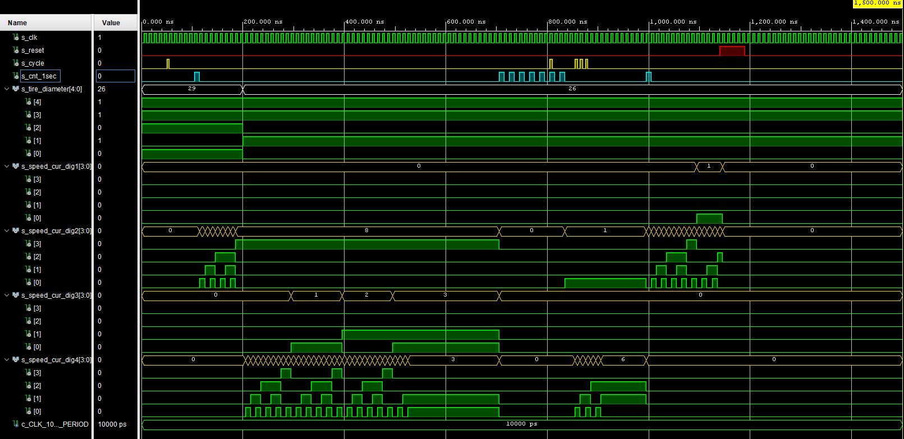
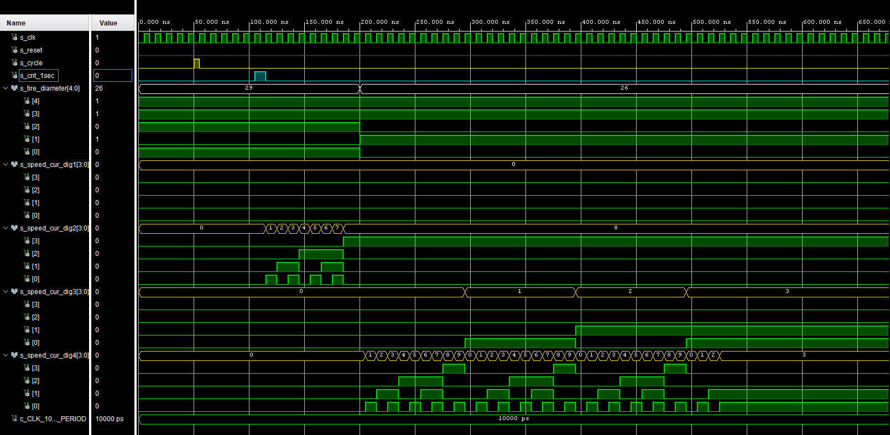

# speed_cur

## Design

```vhdl
------------------------------------------------------------------------
-- Copyright (c) 2021-Present Michal Ruiner
-- This work is licensed under the terms of the MIT license.
------------------------------------------------------------------------

library ieee;
use ieee.std_logic_1164.all;
use ieee.numeric_std.all;
use ieee.std_logic_unsigned.all;

entity speed_cur is
    port(
        clk                : in  std_logic;                             -- Main clock
        reset              : in  std_logic;                             -- Synchronous reset
        cycle_i            : in  std_logic;                             -- Distance input in kilometers
        cnt_1sec_i         : in  std_logic;                             -- Impulse to update speed on the 7 segment display
        tire_diameter_i    : in  std_logic_vector(5 - 1 downto 0);      -- Diameter in inches
        speed_cur_dig1_o   : out std_logic_vector(4 - 1 downto 0);      -- Tens of kilometers
        speed_cur_dig2_o   : out std_logic_vector(4 - 1 downto 0);      -- Kilometers
        speed_cur_dig3_o   : out std_logic_vector(4 - 1 downto 0);      -- Hundreds of meters
        speed_cur_dig4_o   : out std_logic_vector(4 - 1 downto 0)       -- Tens of meters
    );
end speed_cur;

architecture Behavioral of speed_cur is

    signal s_cnt_cycles         : unsigned(12 - 1 downto 0) := (others => '0');  -- Counter of cycles before 1 sec
    signal first2displays       : std_logic := '0';                              -- Signal to count values for first 2 digits
    signal last2displays        : std_logic := '0';                              -- Signal to count values for last 2 digits
    signal cycle_temp           : std_logic := '0';                              -- Control value for cycles
    signal tire_diameter_mm     : natural := 0;                                  -- Signal to hold tire diameter in milimeters
    signal calculation          : natural;                                       -- Signal for counting of first 2 digits
    signal remainder            : natural;                                       -- Signal for counting of last 2 digits
    signal s_cnt_seconds        : natural := 1;                                  -- Counter of seconds

    -- Local signals
    signal tens_of_kilometers   : unsigned(4 - 1 downto 0) := (others => '0');
    signal kilometers           : unsigned(4 - 1 downto 0) := (others => '0');
    signal hundreds_of_meters   : unsigned(4 - 1 downto 0) := (others => '0');
    signal tens_of_meters       : unsigned(4 - 1 downto 0) := (others => '0');    

begin

    p_speed_cur : process(clk, cycle_i)
    begin

        case tire_diameter_i is
            when "11101" =>                 -- Diameter of 29'' (737 mm)
                tire_diameter_mm <= 737;    
            when "11100" =>                 -- Diameter of 28'' (711 mm)
                tire_diameter_mm <= 711;
            when "11011" =>                 -- Diameter of 27,5'' (699 mm)
                tire_diameter_mm <= 699;
            when "11010" =>                 -- Diameter of 26'' (660 mm)
                tire_diameter_mm <= 660;
            when "11000" =>                 -- Diameter of 24'' (610 mm)
                tire_diameter_mm <= 610;
            when "10100" =>                 -- Diameter of 20'' (508 mm)
                tire_diameter_mm <= 508;
            when "10000" =>                 -- Diameter of 16'' (406 mm)
                tire_diameter_mm <= 406;
            when others =>                  -- Diameter of 12'' (305 mm)
                tire_diameter_mm <= 305;
        end case;

        if(cycle_i = '1' and cycle_temp = '0') then
           s_cnt_cycles <= s_cnt_cycles+1;
             cycle_temp   <= '1';
        elsif(cycle_i = '0' and cycle_temp = '1') then
            cycle_temp   <= '0';
        end if;

        if rising_edge(clk) then                            -- Increase local coutner of cycles if there is a cycle
            if (reset = '1') then                           -- Synchronous reset
                s_cnt_cycles        <= (others => '0');     -- Clear local counter of cycles
                first2displays      <= '0';                 -- Reset counting for first 2 displays
                last2displays       <= '0';                 -- Reset counting for last 2 displays
                calculation         <= 0;                   -- Reset signal for counting of first 2 digits
                remainder           <= 0;                   -- Reset signal for counting of last 2 digits
                tens_of_kilometers  <= (others => '0');     -- Reset tens of kilometers
                kilometers          <= (others => '0');     -- Reset kilometers
                hundreds_of_meters  <= (others => '0');     -- Reset hundrerds of meters
                tens_of_meters      <= (others => '0');     -- Reset tens of meters

            elsif (cnt_1sec_i = '1') then
                if (s_cnt_cycles = 0) then
                    s_cnt_seconds       <= s_cnt_seconds+1;
                    calculation         <= 0;
                    remainder           <= 0;
                    tens_of_kilometers  <= (others => '0');
                    kilometers          <= (others => '0');
                    hundreds_of_meters  <= (others => '0');
                    tens_of_meters      <= (others => '0');
                else
                    tens_of_kilometers  <= (others => '0');     -- Reset tens of kilometers every 1 sec time
                    kilometers          <= (others => '0');     -- Reset kilometers every 1 sec time
                    hundreds_of_meters  <= (others => '0');     -- Reset hundrerds of meters every 1 sec time
                    tens_of_meters      <= (others => '0');     -- Reset tens of meters every 1 sec time

                    -- The whole formula for calculation is 0,1885 * Wheel RPM * Diameter of the tire
                    -- 0,1885 -> 377/2000; s_cnt_cycles*60 -> Wheel rpm; tire_diameter_mm -> Diameter of the tire
                    calculation <= (to_integer(unsigned(s_cnt_cycles))*60*tire_diameter_mm*377);
                    s_cnt_cycles <= (others => '0');                                  -- Clear all bits
                    if(rising_edge(cycle_i)) then
                        s_cnt_cycles <= (s_cnt_cycles-s_cnt_cycles)+1;                -- Add 1 cycle if the cycle is generated at 1 sec rising edge
                    end if;
                    first2displays <= '1';                                            -- At the end of the counting enable signal for counting of first 2 digits
                end if;

            elsif (first2displays = '1') then
                if(calculation >= (2000000*s_cnt_seconds)) then                       -- Calculations to replace dividing operations
                   kilometers <= kilometers+1;
                   calculation <= calculation - (2000000*s_cnt_seconds);
                   if(kilometers = "1001") then
                        tens_of_kilometers <= tens_of_kilometers+1;
                        kilometers <= (others => '0');
                   end if;               
                else
                   remainder <= calculation*100;                                       -- Next counting will be for last 2 digits with 2 decimal places
                   first2displays <= '0';
                   last2displays <= '1';
                end if;

            elsif (last2displays = '1') then
               if(remainder >= (2000000*s_cnt_seconds)) then
                   tens_of_meters <= tens_of_meters+1;
                   remainder <= remainder - (2000000*s_cnt_seconds);
                   if(tens_of_meters = "1001") then
                       hundreds_of_meters <= hundreds_of_meters+1;
                       tens_of_meters <= (others => '0');
                   end if;         
               else
                   s_cnt_seconds <= 1;                                                 -- Reset seconds counter
                   last2displays <= '0';                                               -- End counting operations
               end if;
            end if;
        end if;
    end process p_speed_cur;

    speed_cur_dig1_o <= std_logic_vector(tens_of_kilometers);
    speed_cur_dig2_o <= std_logic_vector(kilometers);
    speed_cur_dig3_o <= std_logic_vector(hundreds_of_meters);
    speed_cur_dig4_o <= std_logic_vector(tens_of_meters);

end Behavioral;
```

## Testbench

```vhdl
------------------------------------------------------------------------
-- Copyright (c) 2021-Present Michal Ruiner
-- This work is licensed under the terms of the MIT license.
------------------------------------------------------------------------

library IEEE;
use IEEE.STD_LOGIC_1164.ALL;

entity tb_speed_cur is
end tb_speed_cur;

architecture testbench of tb_speed_cur is

        constant c_CLK_100MHZ_PERIOD : time    := 10 ns;

        signal s_clk              : std_logic;
        signal s_reset            : std_logic;
        signal s_cycle            : std_logic;                            
        signal s_cnt_1sec         : std_logic;
        signal s_tire_diameter    : std_logic_vector(5 - 1 downto 0);
        signal s_speed_cur_dig1   : std_logic_vector(4 - 1 downto 0);
        signal s_speed_cur_dig2   : std_logic_vector(4 - 1 downto 0);
        signal s_speed_cur_dig3   : std_logic_vector(4 - 1 downto 0);
        signal s_speed_cur_dig4   : std_logic_vector(4 - 1 downto 0);

begin

        uut_multiply : entity work.speed_cur
        port map(
            clk                =>   s_clk,
            cycle_i            =>   s_cycle,
            cnt_1sec_i         =>   s_cnt_1sec,
            reset              =>   s_reset,
            tire_diameter_i    =>   s_tire_diameter,
            speed_cur_dig1_o   =>   s_speed_cur_dig1,
            speed_cur_dig2_o   =>   s_speed_cur_dig2,
            speed_cur_dig3_o   =>   s_speed_cur_dig3,
            speed_cur_dig4_o   =>   s_speed_cur_dig4
        );

        --------------------------------------------------------------------
        -- Clock generation process
        --------------------------------------------------------------------
        p_clk_gen : process
        begin
            while now < 1500 ns loop
                s_clk <= '0';
                wait for c_CLK_100MHZ_PERIOD / 2;
                s_clk <= '1';
                wait for c_CLK_100MHZ_PERIOD / 2;
            end loop;
            wait;                           -- Process is suspended forever
        end process p_clk_gen;

        --------------------------------------------------------------------
        -- Reset generation process
        --------------------------------------------------------------------
        p_rst_gen : process
        begin
            s_reset <= '0';
            wait for 1140 ns;

            s_reset <= '1';
            wait for 50 ns;
            assert(s_speed_cur_dig1 = "0000" and s_speed_cur_dig2 = "0000"
                   and s_speed_cur_dig3 = "0000" and s_speed_cur_dig4 = "0000")
            report "Test failed for reset value '1'" severity error;

            s_reset <= '0';
            wait;                           -- Process is suspended forever
        end process p_rst_gen;

        --------------------------------------------------------------------
        -- 1 sec generation process
        --------------------------------------------------------------------
        p_1sec : process
        begin
            s_cnt_1sec <= '0';
            wait for 105 ns;

            s_cnt_1sec <= '1';
            wait for 10 ns;

            s_cnt_1sec <= '0';
            wait for 490ns;
            assert(s_speed_cur_dig1 = "0000" and s_speed_cur_dig2 = "1000"
                   and s_speed_cur_dig3 = "0011" and s_speed_cur_dig4 = "0011")
            report "Test failed for speed with the diameter of 29'" severity error;

            wait for 100 ns;

            s_cnt_1sec <= '1';
            wait for 10 ns;

            s_cnt_1sec <= '0';
            wait for 10 ns;

            s_cnt_1sec <= '1';
            wait for 10 ns;

            s_cnt_1sec <= '0';
            wait for 10 ns;

            s_cnt_1sec <= '1';
            wait for 10 ns;

            s_cnt_1sec <= '0';
            wait for 10 ns;

            s_cnt_1sec <= '1';
            wait for 10 ns;

            s_cnt_1sec <= '0';
            wait for 10 ns;

            s_cnt_1sec <= '1';
            wait for 10 ns;

            s_cnt_1sec <= '0';
            wait for 10 ns;

            s_cnt_1sec <= '1';
            wait for 10 ns;

            s_cnt_1sec <= '0';
            wait for 10 ns;

            s_cnt_1sec <= '1';
            wait for 10 ns;

            s_cnt_1sec <= '0';
            wait for 115 ns;
            assert(s_speed_cur_dig1 = "0000" and s_speed_cur_dig2 = "0001"
                   and s_speed_cur_dig3 = "0000" and s_speed_cur_dig4 = "0110")
            report "Test failed for speed with the diameter of 26'" severity error;

            wait for 45 ns;

            s_cnt_1sec <= '1';
            wait for 10 ns;

            s_cnt_1sec <= '0';
            wait;                           -- Process is suspended forever
        end process p_1sec;

        --------------------------------------------------------------------
        -- Cycles generation process
        --------------------------------------------------------------------
        p_cycle : process
        begin

            s_cycle <= '0';
            wait for 50 ns;

            s_cycle <= '1';
            wait for 5 ns;

            s_cycle <= '0';
            wait for 750 ns;

            s_cycle <= '1';
            wait for 5 ns;

            s_cycle <= '0';
            wait for 45 ns;

            s_cycle <= '1';
            wait for 5 ns;

            s_cycle <= '0';
            wait for 5 ns;

            s_cycle <= '1';
            wait for 5 ns;

            s_cycle <= '0';
            wait for 5 ns;

            s_cycle <= '1';
            wait for 5 ns;

            s_cycle <= '0';          
            wait;                           -- Process is suspended forever
        end process p_cycle;

        -------------------------------------------------------------------
        -- Data generation process
        --------------------------------------------------------------------
        p_stimulus : process
        begin
            report "Stimulus process started" severity note;

            -- Set diameter to 29'' (737 mm)
            s_tire_diameter <= "11101";
            wait for 200 ns;

            -- Set diameter to 26'' (660 mm)
            s_tire_diameter <= "11010";

            report "Stimulus process finished" severity note;
            wait;
        end process p_stimulus;
end architecture testbench;
```

## Screenshots of the simulation



  - Zoom on counting of speed with 1 rpm and 29'' diameter
    
