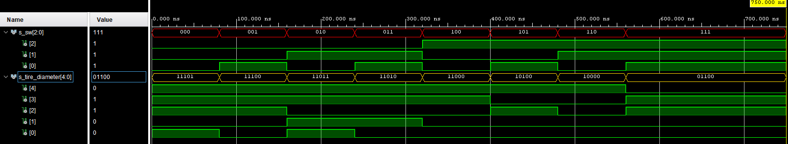

# tire_diameter

## Design

```vhdl
------------------------------------------------------------------------
-- Copyright (c) 2021-Present Michal Ruiner
-- This work is licensed under the terms of the MIT license.
------------------------------------------------------------------------

library IEEE;
use IEEE.STD_LOGIC_1164.ALL;

entity tire_diameter is
    port(
        sw_i             : in  std_logic_vector(3 - 1 downto 0);  -- Switches to select tire diameter                        
        tire_diameter_o  : out std_logic_vector(5 - 1 downto 0)   -- Output to send selected value
    );
end tire_diameter;

architecture testbench of tire_diameter is

begin

    p_diameter : process(sw_i)
    begin
        case sw_i is
            when "000"   =>      
                tire_diameter_o <= "11101";         -- Combination "00" corresponds to the diameter of 29''   (737 mm)
            when "001"   =>      
                tire_diameter_o <= "11100";         -- Combination "01" corresponds to the diameter of 28''   (711 mm)
            when "010"   =>      
                tire_diameter_o <= "11011";         -- Combination "10" corresponds to the diameter of 27,5'' (699 mm)
            when "011"   =>      
                tire_diameter_o <= "11010";         -- Combination "10" corresponds to the diameter of 26''   (660 mm)
            when "100"   =>      
                tire_diameter_o <= "11000";         -- Combination "10" corresponds to the diameter of 24''   (610 mm)
            when "101"   =>      
                tire_diameter_o <= "10100";         -- Combination "10" corresponds to the diameter of 20''   (508 mm)
            when "110"   =>      
                tire_diameter_o <= "10000";         -- Combination "10" corresponds to the diameter of 16''   (406 mm)        
            when others =>      
                tire_diameter_o <= "01100";         -- Combination "11" corresponds to the diameter of 12''   (305 mm)
        end case;
    end process p_diameter;

end architecture testbench;
```

## Testbench

```vhdl
------------------------------------------------------------------------
-- Copyright (c) 2021-Present Michal Ruiner
-- This work is licensed under the terms of the MIT license.
------------------------------------------------------------------------

library IEEE;
use IEEE.STD_LOGIC_1164.ALL;

entity tb_tire_diameter is
end tb_tire_diameter;

architecture testbench of tb_tire_diameter is

    signal s_sw              : std_logic_vector(3 - 1 downto 0);
    signal s_tire_diameter   : std_logic_vector(5 - 1 downto 0);

begin

    uut_ce : entity work.tire_diameter
        port map(
            sw_i            => s_sw,           
            tire_diameter_o => s_tire_diameter
        );

    --------------------------------------------------------------------
    -- Data generation process
    --------------------------------------------------------------------
    p_stimulus : process
    begin
        report "Stimulus process started" severity note;

        -- Enable combination 000
        s_sw <= "000";
        wait for 80ns;
        assert(s_tire_diameter = "11101")
        report "Test failed for the input combination '000'" severity error;

        -- Enable combination 001
        s_sw <= "001";
        wait for 80ns;
        assert(s_tire_diameter = "11100")
        report "Test failed for the input combination '001'" severity error;

        -- Enable combination 010
        s_sw <= "010";
        wait for 80ns;
        assert(s_tire_diameter = "11011")
        report "Test failed for the input combination '010'" severity error;

        -- Enable combination 011
        s_sw <= "011";
        wait for 80ns;
        assert(s_tire_diameter = "11010")
        report "Test failed for the input combination '011'" severity error;

        -- Enable combination 100
        s_sw <= "100";
        wait for 80ns;
        assert(s_tire_diameter = "11000")
        report "Test failed for the input combination '100'" severity error;

        -- Enable combination 101
        s_sw <= "101";
        wait for 80ns;
        assert(s_tire_diameter = "10100")
        report "Test failed for the input combination '101'" severity error;

        -- Enable combination 110
        s_sw <= "110";
        wait for 80ns;
        assert(s_tire_diameter = "10000")
        report "Test failed for the input combination '110'" severity error;

        -- Enable combination 111
        s_sw <= "111";
        wait for 80ns;
        assert(s_tire_diameter = "01100")
        report "Test failed for the input combination '111'" severity error;

        report "Stimulus process finished" severity note;
        wait;
    end process p_stimulus;
end architecture testbench;
```

## Screenshot of the simulation


