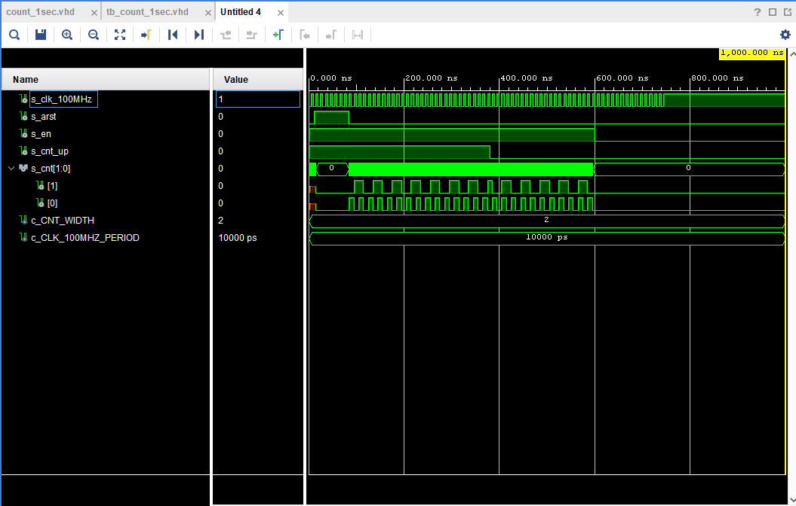

# count_1sec

##design

```vhdl
----------------------------------------------------------------------------------
-- Company: 
-- Engineer: 
-- 
-- Create Date: 19.04.2021 22:32:35
-- Design Name: 
-- Module Name: count_1sec - Behavioral
-- Project Name: 
-- Target Devices: 
-- Tool Versions: 
-- Description: 
-- 
-- Dependencies: 
-- 
-- Revision:
-- Revision 0.01 - File Created
-- Additional Comments:
-- 
----------------------------------------------------------------------------------

library ieee;
use ieee.std_logic_1164.all;
use ieee.numeric_std.all;

------------------------------------------------------------------------
-- Entity declaration for n-bit counter
------------------------------------------------------------------------
entity count_1sec is
    generic(
        g_CNT_WIDTH : natural := 2      -- Number of bits for counter
    );
    port(
        clk      : in  std_logic;       -- Main clock
        arst    : in  std_logic;       -- Asynchronous reset
       en_i     : in  std_logic;       -- Enable input
        cnt_up_i : in  std_logic;       -- Direction of the counter
        cnt_o    : out std_logic_vector(g_CNT_WIDTH - 1 downto 0)
    );
end entity count_1sec;

------------------------------------------------------------------------
-- Architecture body for n-bit counter
------------------------------------------------------------------------
architecture behavioral of count_1sec is

    -- Local counter
    signal s_cnt_local : unsigned(g_CNT_WIDTH - 1 downto 0);

begin
    --------------------------------------------------------------------
    -- p_cnt_up_down:
    -- Clocked process with synchronous reset which implements n-bit 
    -- up/down counter.
    --------------------------------------------------------------------
    p_count_1sec : process(clk)
    begin
        if rising_edge(clk) then
        
            if (arst = '1') then               -- Asynchronous reset
                s_cnt_local <= (others => '0'); -- Clear all bits

            elsif (en_i = '1') then       -- Test if counter is enabled


                -- TEST COUNTER DIRECTION HERE

                 if (cnt_up_i = '1') then
                s_cnt_local <= s_cnt_local + 1;
                else
                s_cnt_local <= s_cnt_local - 1;
            end if;
            end if;
        end if;
    end process p_count_1sec;

    -- Output must be retyped from "unsigned" to "std_logic_vector"
    cnt_o <= std_logic_vector(s_cnt_local);

end architecture behavioral;

```

## test bench

```vhdl
library ieee;
use ieee.std_logic_1164.all;

------------------------------------------------------------------------
-- Entity declaration for testbench
------------------------------------------------------------------------
entity tb_count_1sec is
    -- Entity of testbench is always empty
end entity tb_count_1sec; 

------------------------------------------------------------------------
-- Architecture body for testbench
------------------------------------------------------------------------
architecture testbench of tb_count_1sec is

    -- Number of bits for testbench counter
    constant c_CNT_WIDTH         : natural := 2;
    constant c_CLK_100MHZ_PERIOD : time    := 10 ns;

    --Local signals
    signal s_clk_100MHz : std_logic;
    signal s_arst      : std_logic;
    signal s_en         : std_logic;
    signal s_cnt_up     : std_logic;
    signal s_cnt        : std_logic_vector(c_CNT_WIDTH - 1 downto 0);

begin
    -- Connecting testbench signals with cnt_up_down entity
    -- (Unit Under Test)
    uut_cnt : entity work.count_1sec
        generic map(
            g_CNT_WIDTH  => c_CNT_WIDTH
        )
        port map(
            clk      => s_clk_100MHz,
            arst    => s_arst,
            en_i     => s_en,
            cnt_up_i => s_cnt_up,
            cnt_o    => s_cnt
        );

    --------------------------------------------------------------------
    -- Clock generation process
    --------------------------------------------------------------------
    p_clk_gen : process
    begin
        while now < 750 ns loop         -- 75 periods of 100MHz clock
            s_clk_100MHz <= '0';
            wait for c_CLK_100MHZ_PERIOD / 2;
            s_clk_100MHz <= '1';
            wait for c_CLK_100MHZ_PERIOD / 2;
        end loop;
        wait;
    end process p_clk_gen;

    --------------------------------------------------------------------
    -- Reset generation process
    --------------------------------------------------------------------
    p_reset_gen : process
    begin
        s_arst <= '0'; wait for 12 ns;
        -- Reset activated
        s_arst <= '1'; wait for 73 ns;
        -- Reset deactivated
        s_arst <= '0';
        wait;
    end process p_reset_gen;

    --------------------------------------------------------------------
    -- Data generation process
    --------------------------------------------------------------------
    p_stimulus : process
    begin
        report "Stimulus process started" severity note;

        -- Enable counting
       s_en     <= '1';
        
        -- Change counter direction
        s_cnt_up <= '1';
        wait for 380 ns;
        s_cnt_up <= '0';
        wait for 220 ns;

        -- Disable counting
        s_en     <= '0';

        report "Stimulus process finished" severity note;
        wait;
    end process p_stimulus;

end architecture testbench;

```

##simulation

