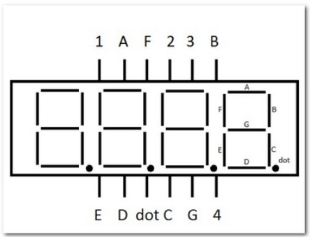

# Hardware

## deska

Arty A7 ( https://store.digilentinc.com/arty-a7-artix-7-fpga-development-board/ )

schematic ( https://reference.digilentinc.com/_media/reference/programmable-logic/arty-a7/arty_a7_sch.pdf )

## součástky

- 4-místný sedmisegmentový 0.56" displej HS410561K-32, společná anoda ( https://www.laskarduino.cz/4-mistny--sedmisegmentovy--0-56--displej-hs410561k-32--spolecna-anoda--cerveny/?gclid=Cj0KCQjw-LOEBhDCARIsABrC0TkHNEw1GL7z6yQH_oacR9Hl1ZPOSFJ3biUOZr_8lQqI0rBIFiMJ1xUaAt8FEALw_wcB )
- Hallův senzor 44E ( https://dratek.cz/arduino/7735-halluv-senzor-44e.html )
- 330 Ohm resistor ( https://dratek.cz/arduino/7655-rezistor-330r-0.25-w-1.html )
- 10kOhm resistor ( https://dratek.cz/arduino/7650-rezistor-10k-0.25-w-1.html )

## inspirace zapojení součástek

sedmisegmentový displaj

Hallův senzor

## zapojeni

diody u 7seg jsou ošetřené pomocí 200 Ohm rezistorů které jsou zabudované ve standartních Pmod konektorech na desce

## tabulka zapojení

### 7Segment

|Pmod JA (standard)|Connection|Cathodes | Pmod  JD (standard) | Connection |Cathodes| Pmod JB (High-Speed) | Connection | Anodes |
| :--: | :--: | :--: | :--: | :--: | :--: | :--: | :--: | :--: |
| Pin 1 | G13 | CA_1 | Pin 1 | D4 | CA_2 | Pin 1 | E15 | AN7 |
| Pin 2 | B11 | CB_1 | Pin 2 | D3 | CB_2 | Pin 2 | E16 | AN6 |
| Pin 3 | A11 | CC_1 | Pin 3 | F4 | CC_2 | Pin 3 | D15 | AN5 |
| Pin 4 | D12 | CD_1 | Pin 4 | F3 | CD_2 | Pin 4 | C15 | AN4 |
| Pin 7 | D13 | CE_1 | Pin 7 | E2 | CE_2 | Pin 7 | J17 | AN3 |
| Pin 8 | B18 | CF_1 | Pin 8 | D2 | CF_2 | Pin 8 | J18 | AN2 |
| Pin 9 | A18 | CG_1 | Pin 9 | H2 | CG_2 | Pin 9 | K15 | AN1 |
| Pin 10 | K16 | Cdot_1 | Pin 10 | G2 | Cdot_2 | Pin 10 | J15 | AN0 |

### Hall sensor

| Hall sensor | Connection |
| :---------: | :--------: |
|   Supply    |    5V0     |
|   Ground    |    GND     |
|   Output    |   I/O 0    |

